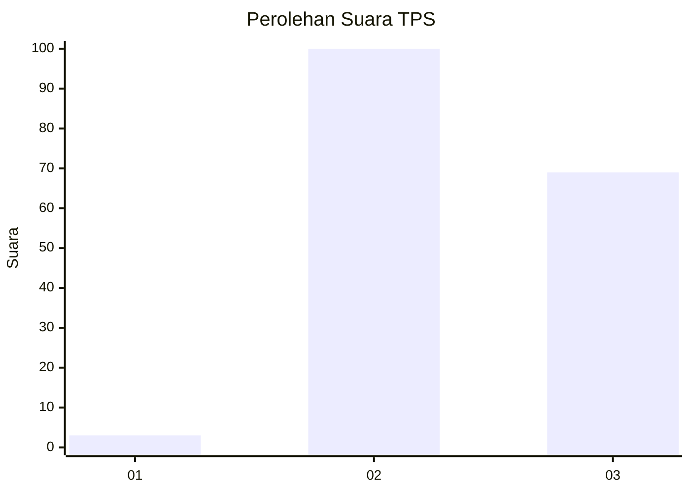
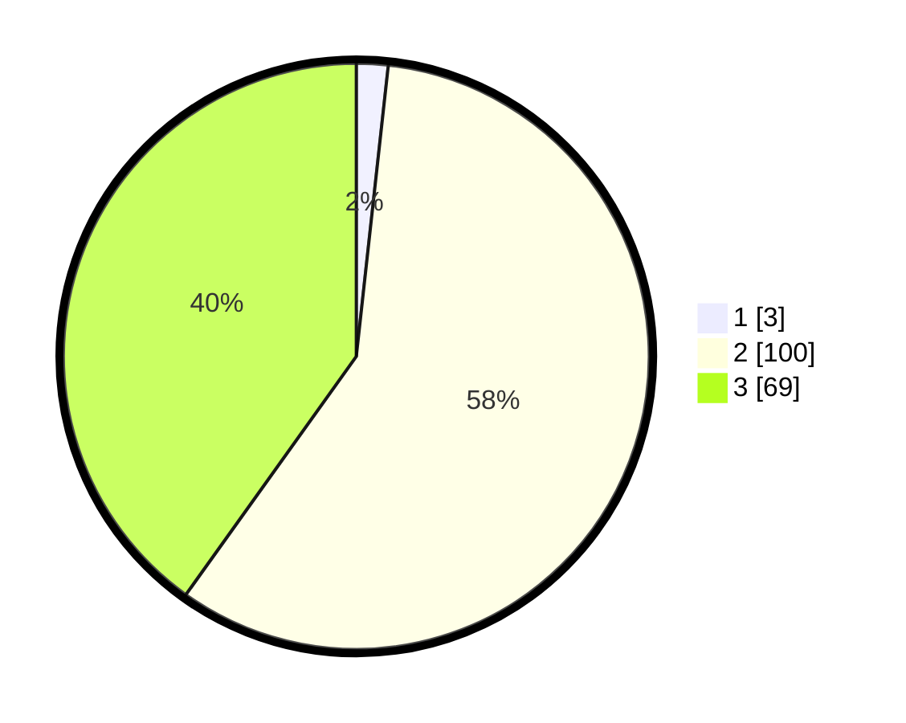

# Hasil

## Grafik

## Tabel

| No. | Nama Paslon    | Suara | Suara (raw) | Persentase |
|:--- |:-------------- | -----:| -----------:| ----------:|
| 1   | ANIES MUHAIMIN | 3     | [3][p-1]    | 1,74       |
| 2   | PRABOWO GIBRAN | 100   | [100][p-2]  | 58,14      |
| 3   | GANJAR MAHFUD  | 69    | [69][p-3]   | 40,12      |

[p-1]: https://github.com/gigit-pemilu/pemilu-2024-51-bali/blob/main/pilpres/hitung-suara/sub/51-bali/sub/08-buleleng/sub/08-kubutambahan/sub/2011-kubutambahan/sub/016-tps/sub/paslon-1.txt
[p-2]: https://github.com/gigit-pemilu/pemilu-2024-51-bali/blob/main/pilpres/hitung-suara/sub/51-bali/sub/08-buleleng/sub/08-kubutambahan/sub/2011-kubutambahan/sub/016-tps/sub/paslon-2.txt
[p-3]: https://github.com/gigit-pemilu/pemilu-2024-51-bali/blob/main/pilpres/hitung-suara/sub/51-bali/sub/08-buleleng/sub/08-kubutambahan/sub/2011-kubutambahan/sub/016-tps/sub/paslon-3.txt

## Foto C Plano

https://sirekap-obj-formc.kpu.go.id/2195/pemilu/ppwp/51/08/08/20/11/5108082011016-20240214-131713--a839e9e0-a15b-4973-ae5e-bdfeda2a4998.jpg

https://sirekap-obj-formc.kpu.go.id/2195/pemilu/ppwp/51/08/08/20/11/5108082011016-20240214-131755--5dc95b6a-165c-4a0a-b01a-675576b79196.jpg

https://sirekap-obj-formc.kpu.go.id/2195/pemilu/ppwp/51/08/08/20/11/5108082011016-20240214-131956--04bc862c-af27-4bfb-8555-52947111bde9.jpg

## Metadata

| Key        | Value               |
| ---------- | ------------------- |
| Time Stamp | 2024-02-24 22:31:28 |

