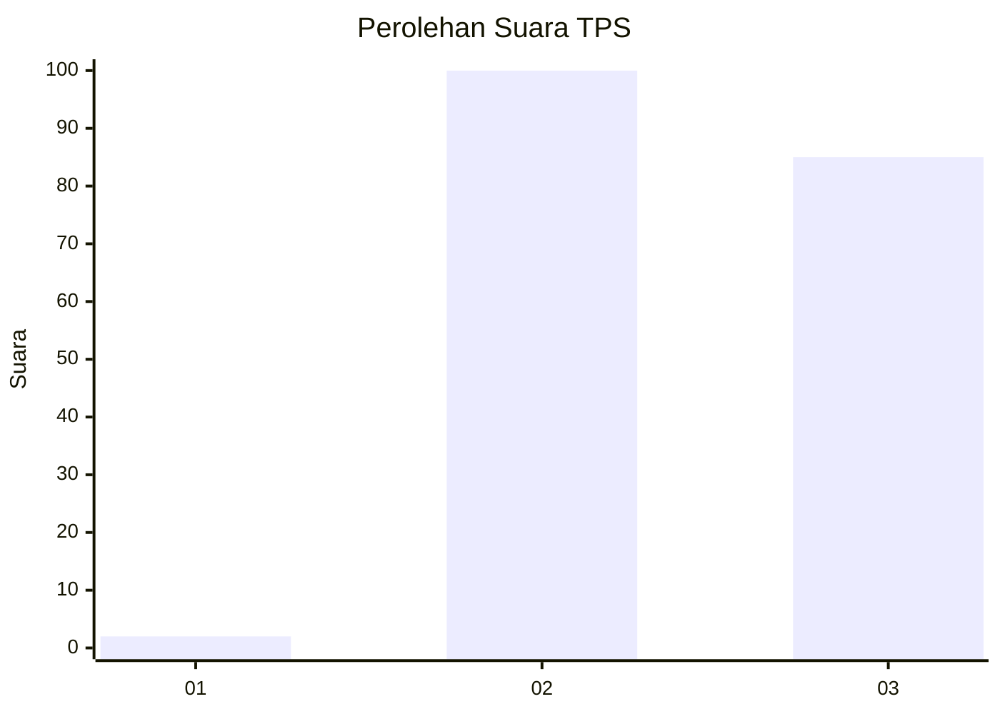
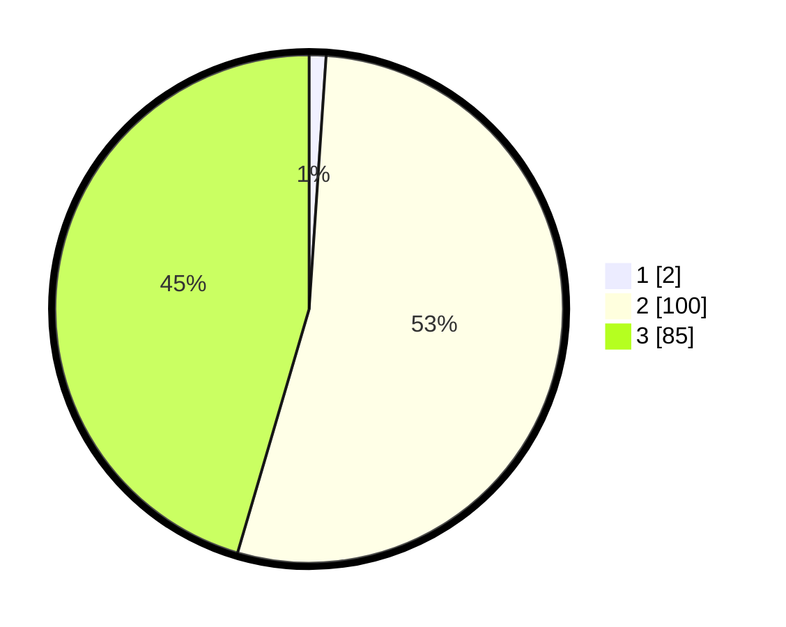

# Hasil

## Grafik

## Tabel

| No. | Nama Paslon    | Suara | Suara (raw) | Persentase |
|:--- |:-------------- | -----:| -----------:| ----------:|
| 1   | ANIES MUHAIMIN | 2     | [2][p-1]    | 1,07       |
| 2   | PRABOWO GIBRAN | 100   | [100][p-2]  | 53,48      |
| 3   | GANJAR MAHFUD  | 85    | [85][p-3]   | 45,45      |

[p-1]: https://github.com/gigit-pemilu/pemilu-2024-51-bali/blob/main/pilpres/hitung-suara/sub/51-bali/sub/08-buleleng/sub/08-kubutambahan/sub/2011-kubutambahan/sub/020-tps/sub/paslon-1.txt
[p-2]: https://github.com/gigit-pemilu/pemilu-2024-51-bali/blob/main/pilpres/hitung-suara/sub/51-bali/sub/08-buleleng/sub/08-kubutambahan/sub/2011-kubutambahan/sub/020-tps/sub/paslon-2.txt
[p-3]: https://github.com/gigit-pemilu/pemilu-2024-51-bali/blob/main/pilpres/hitung-suara/sub/51-bali/sub/08-buleleng/sub/08-kubutambahan/sub/2011-kubutambahan/sub/020-tps/sub/paslon-3.txt

## Foto C Plano

https://sirekap-obj-formc.kpu.go.id/7b95/pemilu/ppwp/51/08/08/20/11/5108082011020-20240214-132252--ca0fc6d7-fceb-4da6-b8b2-67c57a3b782a.jpg

https://sirekap-obj-formc.kpu.go.id/7b95/pemilu/ppwp/51/08/08/20/11/5108082011020-20240214-132515--871a1170-e9b8-410b-a072-f2dd6c75641b.jpg

https://sirekap-obj-formc.kpu.go.id/7b95/pemilu/ppwp/51/08/08/20/11/5108082011020-20240214-133131--df810970-7cfa-4f10-9ad5-d35d630c3d3e.jpg

## Metadata

| Key        | Value               |
| ---------- | ------------------- |
| Time Stamp | 2024-02-24 22:31:28 |

