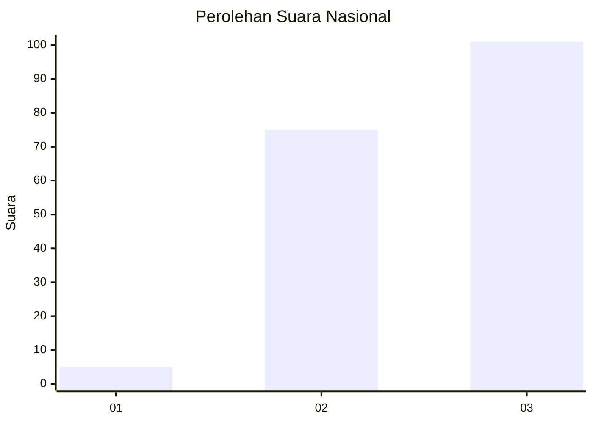
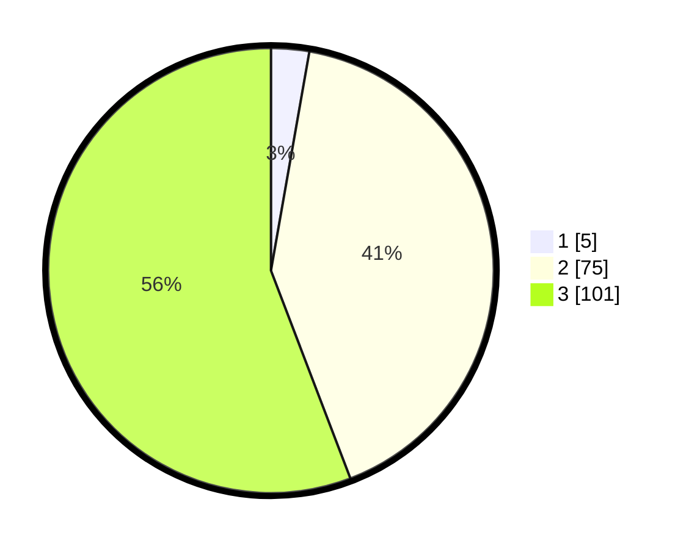

# Hasil

## Grafik

## Tabel

| No. | Nama Paslon    | Suara | Suara (raw) | Persentase |
|:--- |:-------------- | -----:| -----------:| ----------:|
| 1   | ANIES MUHAIMIN | 5     | [5][p-1]    | 2,76       |
| 2   | PRABOWO GIBRAN | 75    | [75][p-2]   | 41,44      |
| 3   | GANJAR MAHFUD  | 101   | [101][p-3]  | 55,80      |

[p-1]: https://github.com/gigit-pemilu/pemilu-2024/blob/main/pilpres/hitung-suara/sub/51-bali/sub/08-buleleng/sub/08-kubutambahan/sub/2011-kubutambahan/sub/030-tps/sub/paslon-1.txt
[p-2]: https://github.com/gigit-pemilu/pemilu-2024/blob/main/pilpres/hitung-suara/sub/51-bali/sub/08-buleleng/sub/08-kubutambahan/sub/2011-kubutambahan/sub/030-tps/sub/paslon-2.txt
[p-3]: https://github.com/gigit-pemilu/pemilu-2024/blob/main/pilpres/hitung-suara/sub/51-bali/sub/08-buleleng/sub/08-kubutambahan/sub/2011-kubutambahan/sub/030-tps/sub/paslon-3.txt

## Foto C Plano

https://sirekap-obj-formc.kpu.go.id/5b83/pemilu/ppwp/51/08/08/20/11/5108082011030-20240214-155242--1000b513-b259-4a0b-a858-b0c89ef7e0eb.jpg

https://sirekap-obj-formc.kpu.go.id/5b83/pemilu/ppwp/51/08/08/20/11/5108082011030-20240214-155308--4b417c1b-8019-4f53-840f-ed2df87e3cb3.jpg

https://sirekap-obj-formc.kpu.go.id/5b83/pemilu/ppwp/51/08/08/20/11/5108082011030-20240214-155327--e5dd12b7-b8e8-4a9f-b902-d099e723c3c6.jpg

## Metadata

| Key        | Value               |
| ---------- | ------------------- |
| Time Stamp | 2024-02-15 19:00:26 |

## DATA PEMILIH TETAP

Jumlah pemilih dalam DPT: **225**.
 * L: **648**.
 * P: **529**.

## DATA PENGGUNA HAK PILIH

Jumlah pengguna hak pilih dalam DPT: **193**.
 * L: **625**.
 * P: **888**.

Jumlah pengguna hak pilih dalam DPTb: **808**.
 * L: **338**.
 * P: **808**.

Jumlah pengguna hak pilih dalam DPK: **833**.
 * L: **882**.
 * P: **286**.

Jumlah pengguna hak pilih: **496**.
 * L: **897**.
 * P: **889**.

## JUMLAH SUARA SAH DAN TIDAK SAH

JUMLAH SELURUH SUARA SAH: **181**.

JUMLAH SUARA TIDAK SAH: **15**.

JUMLAH SELURUH SUARA SAH DAN SUARA TIDAK SAH: **196**.

