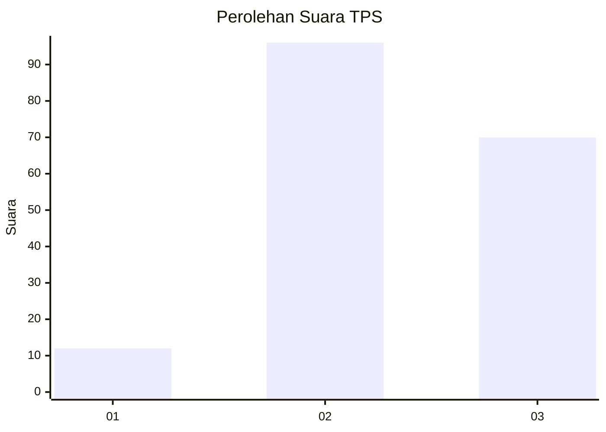
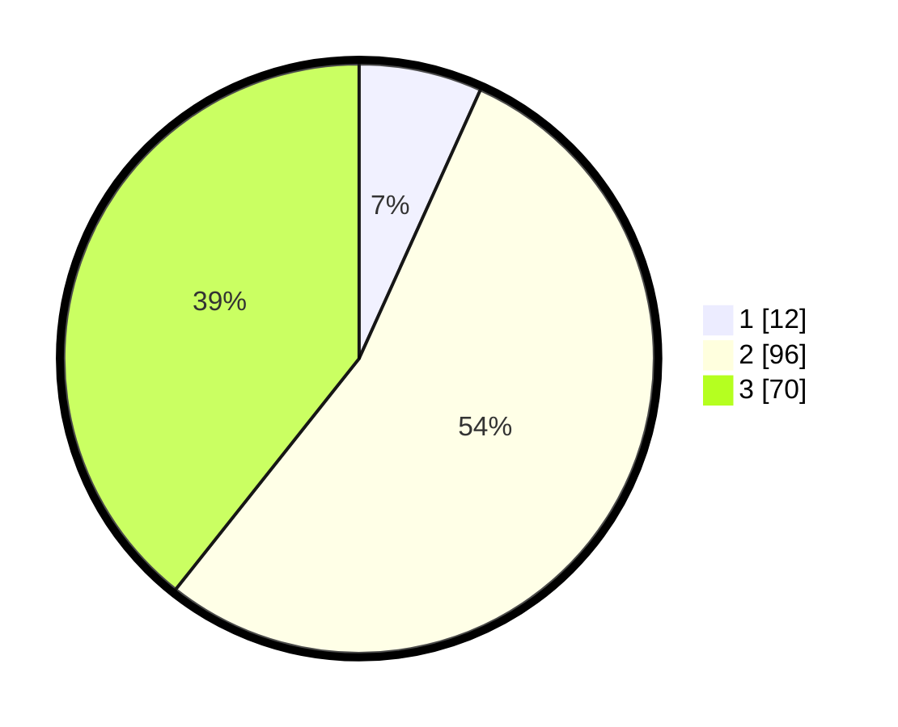

# Hasil

## Grafik

## Tabel

| No. | Nama Paslon    | Suara | Suara (raw) | Persentase |
|:--- |:-------------- | -----:| -----------:| ----------:|
| 1   | ANIES MUHAIMIN | 12    | [12][p-1]   | 6,74       |
| 2   | PRABOWO GIBRAN | 96    | [96][p-2]   | 53,93      |
| 3   | GANJAR MAHFUD  | 70    | [70][p-3]   | 39,33      |

[p-1]: https://github.com/gigit-pemilu/pemilu-2024-51-bali/blob/main/pilpres/hitung-suara/sub/51-bali/sub/08-buleleng/sub/08-kubutambahan/sub/2011-kubutambahan/sub/038-tps/sub/paslon-1.txt
[p-2]: https://github.com/gigit-pemilu/pemilu-2024-51-bali/blob/main/pilpres/hitung-suara/sub/51-bali/sub/08-buleleng/sub/08-kubutambahan/sub/2011-kubutambahan/sub/038-tps/sub/paslon-2.txt
[p-3]: https://github.com/gigit-pemilu/pemilu-2024-51-bali/blob/main/pilpres/hitung-suara/sub/51-bali/sub/08-buleleng/sub/08-kubutambahan/sub/2011-kubutambahan/sub/038-tps/sub/paslon-3.txt

## Foto C Plano

https://sirekap-obj-formc.kpu.go.id/b376/pemilu/ppwp/51/08/08/20/11/5108082011038-20240214-141820--926a180f-2f61-464e-a197-289d5372d44c.jpg

https://sirekap-obj-formc.kpu.go.id/b376/pemilu/ppwp/51/08/08/20/11/5108082011038-20240214-141424--6eac45d6-8c33-4fc0-aefe-849c9c4b7cdb.jpg

https://sirekap-obj-formc.kpu.go.id/b376/pemilu/ppwp/51/08/08/20/11/5108082011038-20240214-141655--46ce8694-dd61-4711-b9fa-7b499b09daa5.jpg

## Metadata

| Key        | Value               |
| ---------- | ------------------- |
| Time Stamp | 2024-02-24 22:31:28 |

