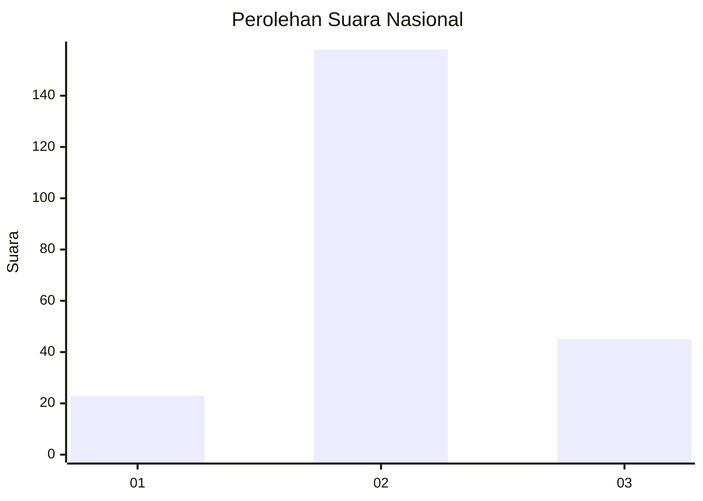
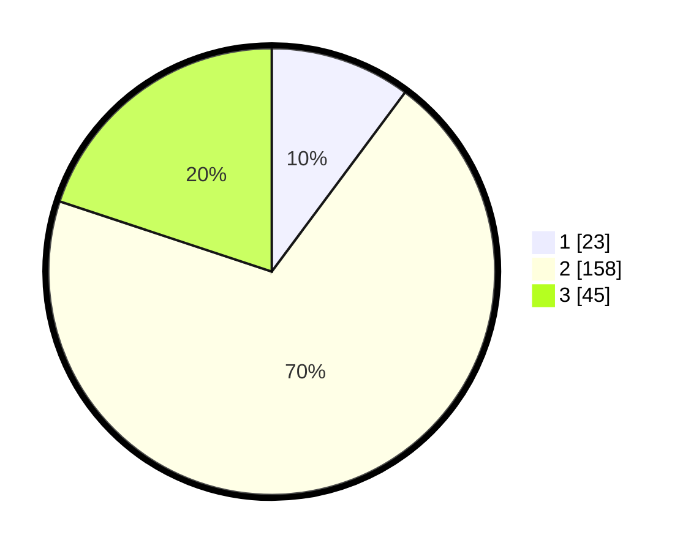

# Hasil

## Grafik

## Tabel

| No. | Nama Paslon    | Suara | Suara (raw) | Persentase |
|:--- |:-------------- | -----:| -----------:| ----------:|
| 1   | ANIES MUHAIMIN | 23    | [23][p-1]   | 10,18      |
| 2   | PRABOWO GIBRAN | 158   | [158][p-2]  | 69,91      |
| 3   | GANJAR MAHFUD  | 45    | [45][p-3]   | 19,91      |

[p-1]: https://github.com/gigit-pemilu/pemilu-2024/blob/main/pilpres/hitung-suara/sub/51-bali/sub/08-buleleng/sub/08-kubutambahan/sub/2012-bukti/sub/001-tps/sub/paslon-1.txt
[p-2]: https://github.com/gigit-pemilu/pemilu-2024/blob/main/pilpres/hitung-suara/sub/51-bali/sub/08-buleleng/sub/08-kubutambahan/sub/2012-bukti/sub/001-tps/sub/paslon-2.txt
[p-3]: https://github.com/gigit-pemilu/pemilu-2024/blob/main/pilpres/hitung-suara/sub/51-bali/sub/08-buleleng/sub/08-kubutambahan/sub/2012-bukti/sub/001-tps/sub/paslon-3.txt

## Foto C Plano

https://sirekap-obj-formc.kpu.go.id/401e/pemilu/ppwp/51/08/08/20/12/5108082012001-20240214-225010--f765b198-fea8-46d4-acdc-473e7e493e4f.jpg

https://sirekap-obj-formc.kpu.go.id/401e/pemilu/ppwp/51/08/08/20/12/5108082012001-20240214-132635--21ca3c80-fcce-4529-9862-2fa06b98c1f7.jpg

https://sirekap-obj-formc.kpu.go.id/401e/pemilu/ppwp/51/08/08/20/12/5108082012001-20240214-132854--2bad9c0d-84da-4929-b35a-1085f8c34dab.jpg

## Metadata

| Key        | Value               |
| ---------- | ------------------- |
| Time Stamp | 2024-02-24 22:31:28 |

