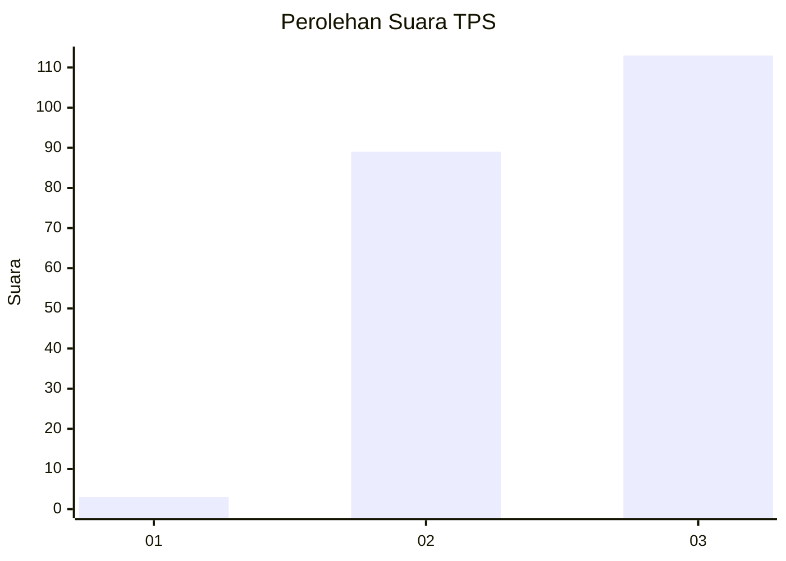
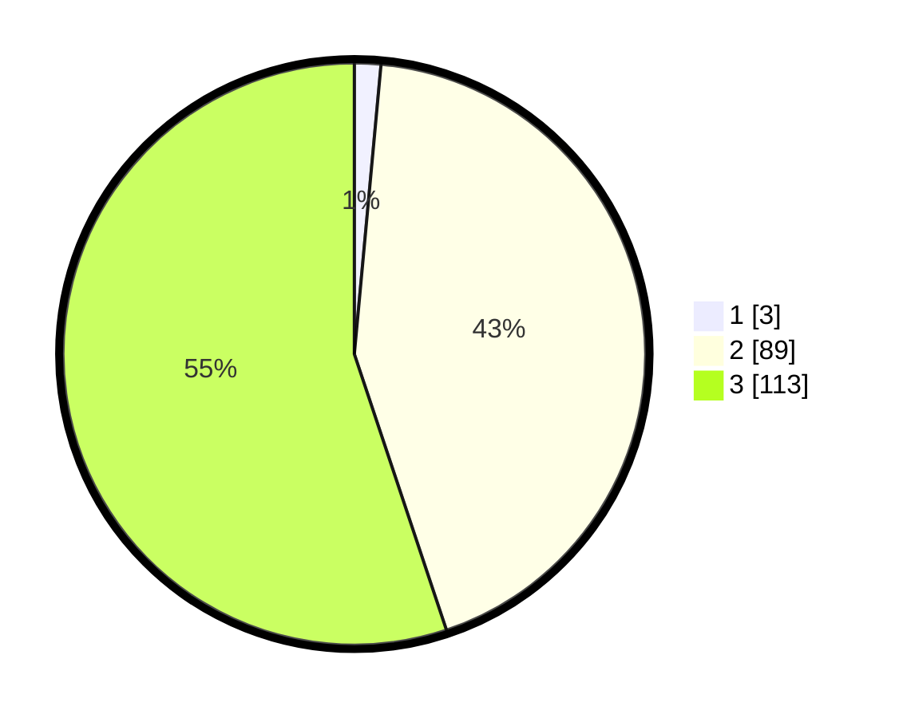

# Hasil

## Grafik

## Tabel

| No. | Nama Paslon    | Suara | Suara (raw) | Persentase |
|:--- |:-------------- | -----:| -----------:| ----------:|
| 1   | ANIES MUHAIMIN | 3     | [3][p-1]    | 1,46       |
| 2   | PRABOWO GIBRAN | 89    | [89][p-2]   | 43,41      |
| 3   | GANJAR MAHFUD  | 113   | [113][p-3]  | 55,12      |

[p-1]: https://github.com/gigit-pemilu/pemilu-2024-51-bali/blob/main/pilpres/hitung-suara/sub/51-bali/sub/08-buleleng/sub/08-kubutambahan/sub/2012-bukti/sub/009-tps/sub/paslon-1.txt
[p-2]: https://github.com/gigit-pemilu/pemilu-2024-51-bali/blob/main/pilpres/hitung-suara/sub/51-bali/sub/08-buleleng/sub/08-kubutambahan/sub/2012-bukti/sub/009-tps/sub/paslon-2.txt
[p-3]: https://github.com/gigit-pemilu/pemilu-2024-51-bali/blob/main/pilpres/hitung-suara/sub/51-bali/sub/08-buleleng/sub/08-kubutambahan/sub/2012-bukti/sub/009-tps/sub/paslon-3.txt

## Foto C Plano

https://sirekap-obj-formc.kpu.go.id/3702/pemilu/ppwp/51/08/08/20/12/5108082012009-20240214-232726--2f189df7-2045-4c8a-8f28-652aaa07c70a.jpg

https://sirekap-obj-formc.kpu.go.id/3702/pemilu/ppwp/51/08/08/20/12/5108082012009-20240214-232020--180ba7ef-6bf2-409b-a413-3319b2a380bd.jpg

https://sirekap-obj-formc.kpu.go.id/3702/pemilu/ppwp/51/08/08/20/12/5108082012009-20240214-215313--faf22d49-d0d6-4cb7-b49c-a9365ca89fba.jpg

## Metadata

| Key        | Value               |
| ---------- | ------------------- |
| Time Stamp | 2024-02-24 22:31:28 |

