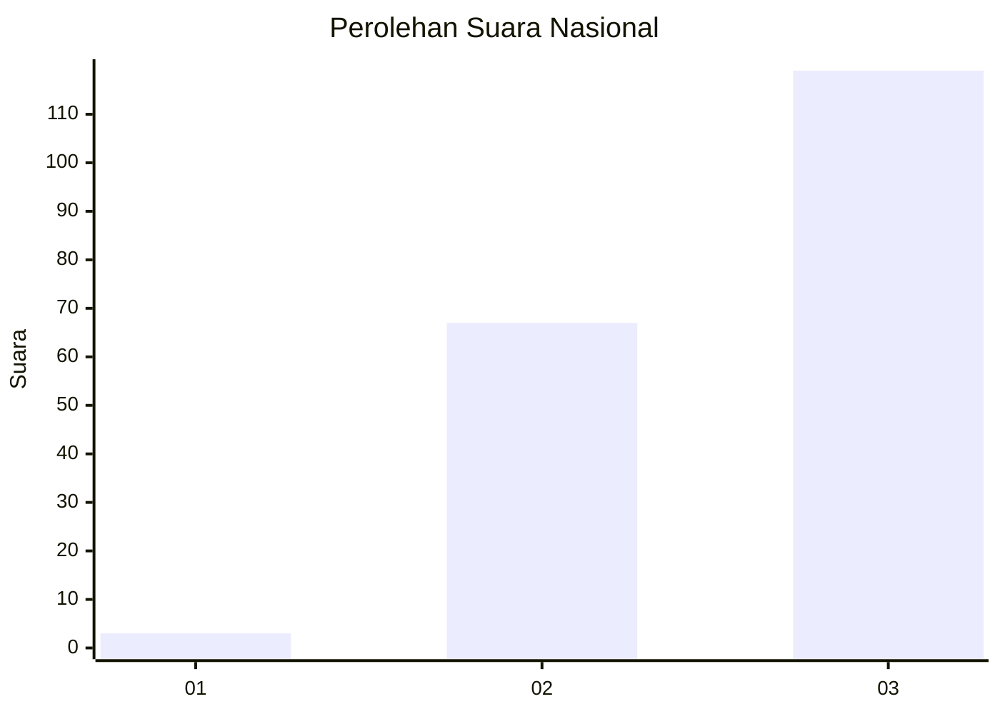
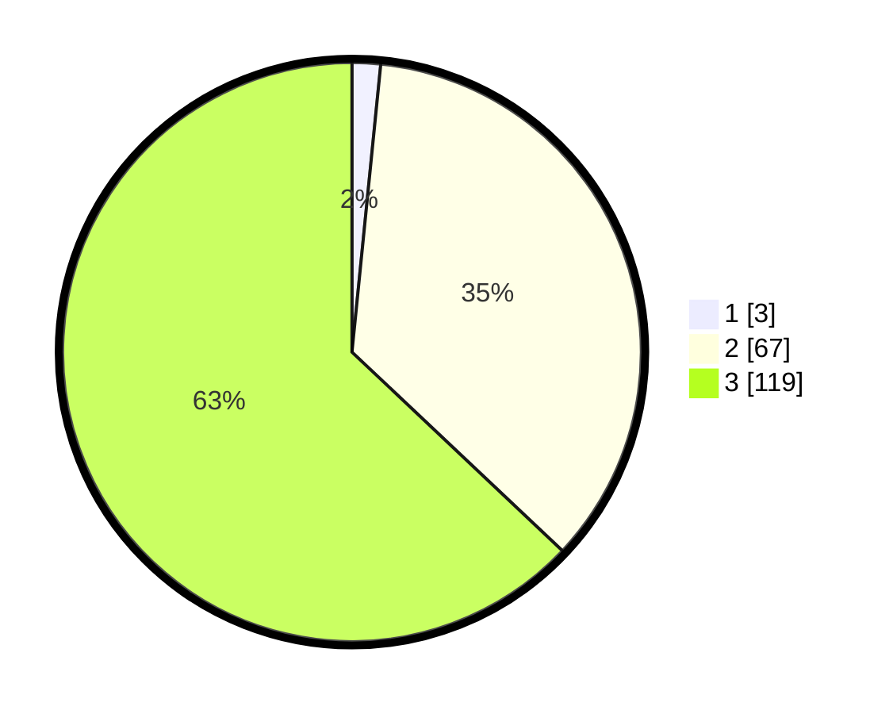

# Hasil

## Grafik

## Tabel

| No. | Nama Paslon    | Suara | Suara (raw) | Persentase |
|:--- |:-------------- | -----:| -----------:| ----------:|
| 1   | ANIES MUHAIMIN | 3     | [3][p-1]    | 1,59       |
| 2   | PRABOWO GIBRAN | 67    | [67][p-2]   | 35,45      |
| 3   | GANJAR MAHFUD  | 119   | [119][p-3]  | 62,96      |

[p-1]: https://github.com/gigit-pemilu/pemilu-2024/blob/main/pilpres/hitung-suara/sub/51-bali/sub/08-buleleng/sub/09-tejakula/sub/2001-sembiran/sub/001-tps/sub/paslon-1.txt
[p-2]: https://github.com/gigit-pemilu/pemilu-2024/blob/main/pilpres/hitung-suara/sub/51-bali/sub/08-buleleng/sub/09-tejakula/sub/2001-sembiran/sub/001-tps/sub/paslon-2.txt
[p-3]: https://github.com/gigit-pemilu/pemilu-2024/blob/main/pilpres/hitung-suara/sub/51-bali/sub/08-buleleng/sub/09-tejakula/sub/2001-sembiran/sub/001-tps/sub/paslon-3.txt

## Foto C Plano

https://sirekap-obj-formc.kpu.go.id/ee74/pemilu/ppwp/51/08/09/20/01/5108092001001-20240214-212911--39c2b9f8-03cf-4b98-b131-7e8ca5f837ce.jpg

https://sirekap-obj-formc.kpu.go.id/ee74/pemilu/ppwp/51/08/09/20/01/5108092001001-20240214-212925--94a8318b-0b5a-4457-b0cc-dfa6c74156bb.jpg

https://sirekap-obj-formc.kpu.go.id/ee74/pemilu/ppwp/51/08/09/20/01/5108092001001-20240214-213047--cb89e499-0818-4513-b694-b73f2c352532.jpg

## Metadata

| Key        | Value               |
| ---------- | ------------------- |
| Time Stamp | 2024-02-25 11:00:00 |

