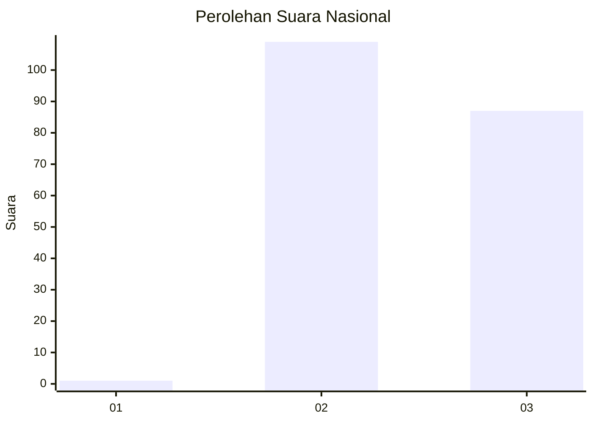
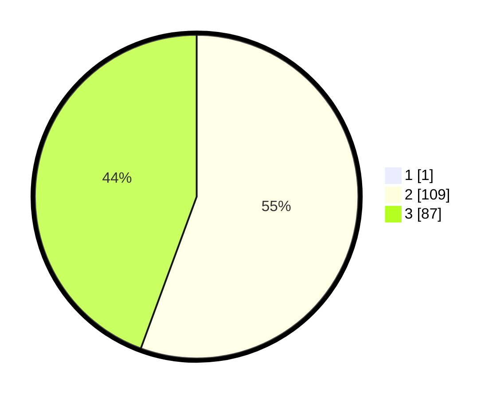

# Hasil

## Grafik

## Tabel

| No. | Nama Paslon    | Suara | Suara (raw) | Persentase |
|:--- |:-------------- | -----:| -----------:| ----------:|
| 1   | ANIES MUHAIMIN | 1     | [1][p-1]    | 0,51       |
| 2   | PRABOWO GIBRAN | 109   | [109][p-2]  | 55,33      |
| 3   | GANJAR MAHFUD  | 87    | [87][p-3]   | 44,16      |

[p-1]: https://github.com/gigit-pemilu/pemilu-2024/blob/main/pilpres/hitung-suara/sub/51-bali/sub/08-buleleng/sub/09-tejakula/sub/2001-sembiran/sub/002-tps/sub/paslon-1.txt
[p-2]: https://github.com/gigit-pemilu/pemilu-2024/blob/main/pilpres/hitung-suara/sub/51-bali/sub/08-buleleng/sub/09-tejakula/sub/2001-sembiran/sub/002-tps/sub/paslon-2.txt
[p-3]: https://github.com/gigit-pemilu/pemilu-2024/blob/main/pilpres/hitung-suara/sub/51-bali/sub/08-buleleng/sub/09-tejakula/sub/2001-sembiran/sub/002-tps/sub/paslon-3.txt

## Foto C Plano

https://sirekap-obj-formc.kpu.go.id/72e2/pemilu/ppwp/51/08/09/20/01/5108092001002-20240214-201558--255d3d77-18e3-4fe3-878a-65c8cd24001f.jpg

https://sirekap-obj-formc.kpu.go.id/72e2/pemilu/ppwp/51/08/09/20/01/5108092001002-20240214-204135--7833c946-7871-415c-8b8f-da9dfa72472b.jpg

https://sirekap-obj-formc.kpu.go.id/72e2/pemilu/ppwp/51/08/09/20/01/5108092001002-20240214-204214--4b2471eb-829c-4153-bde4-79c860632137.jpg

## Metadata

| Key        | Value               |
| ---------- | ------------------- |
| Time Stamp | 2024-02-15 00:41:44 |

## DATA PEMILIH TETAP

Jumlah pemilih dalam DPT: **262**.
 * L: **140**.
 * P: **122**.

## DATA PENGGUNA HAK PILIH

Jumlah pengguna hak pilih dalam DPT: **187**.
 * L: **101**.
 * P: **86**.

Jumlah pengguna hak pilih dalam DPTb: **0**.
 * L: **0**.
 * P: **0**.

Jumlah pengguna hak pilih dalam DPK: **11**.
 * L: **8**.
 * P: **3**.

Jumlah pengguna hak pilih: **198**.
 * L: **109**.
 * P: **89**.

## JUMLAH SUARA SAH DAN TIDAK SAH

JUMLAH SELURUH SUARA SAH: **197**.

JUMLAH SUARA TIDAK SAH: **1**.

JUMLAH SELURUH SUARA SAH DAN SUARA TIDAK SAH: **198**.

