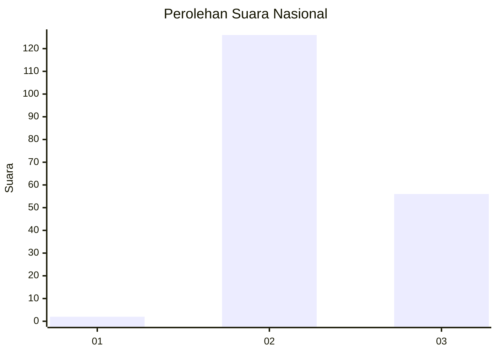
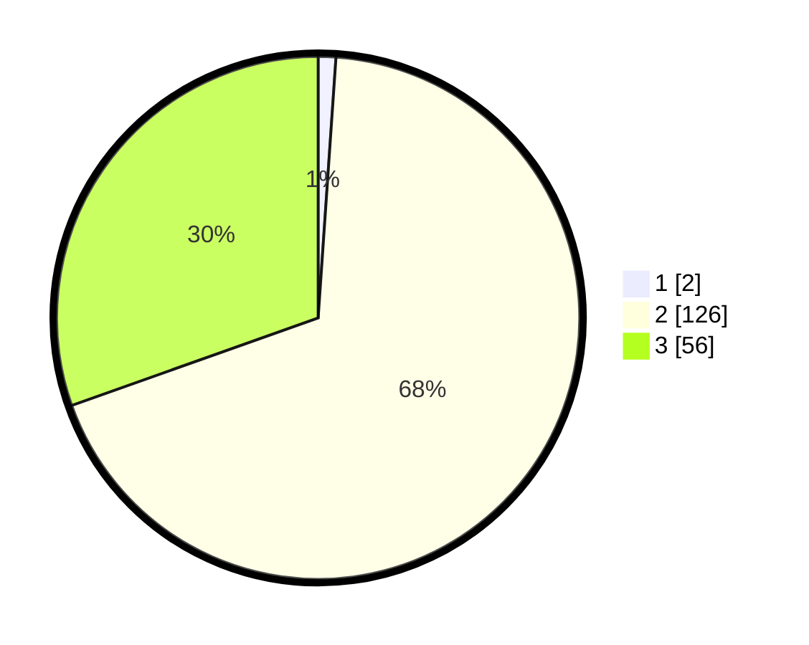

# Hasil

## Grafik

## Tabel

| No. | Nama Paslon    | Suara | Suara (raw) | Persentase |
|:--- |:-------------- | -----:| -----------:| ----------:|
| 1   | ANIES MUHAIMIN | 2     | [2][p-1]    | 1,09       |
| 2   | PRABOWO GIBRAN | 126   | [126][p-2]  | 68,48      |
| 3   | GANJAR MAHFUD  | 56    | [56][p-3]   | 30,43      |

[p-1]: https://github.com/gigit-pemilu/pemilu-2024/blob/main/pilpres/hitung-suara/sub/51-bali/sub/08-buleleng/sub/09-tejakula/sub/2001-sembiran/sub/006-tps/sub/paslon-1.txt
[p-2]: https://github.com/gigit-pemilu/pemilu-2024/blob/main/pilpres/hitung-suara/sub/51-bali/sub/08-buleleng/sub/09-tejakula/sub/2001-sembiran/sub/006-tps/sub/paslon-2.txt
[p-3]: https://github.com/gigit-pemilu/pemilu-2024/blob/main/pilpres/hitung-suara/sub/51-bali/sub/08-buleleng/sub/09-tejakula/sub/2001-sembiran/sub/006-tps/sub/paslon-3.txt

## Foto C Plano

https://sirekap-obj-formc.kpu.go.id/3240/pemilu/ppwp/51/08/09/20/01/5108092001006-20240214-132707--268c6bd2-ef12-41fb-a9f2-a9e6fc83215f.jpg

https://sirekap-obj-formc.kpu.go.id/3240/pemilu/ppwp/51/08/09/20/01/5108092001006-20240214-132757--d50ccd91-2dcf-4029-a8a5-503ca4bb6fb7.jpg

## Metadata

| Key        | Value               |
| ---------- | ------------------- |
| Time Stamp | 2024-02-15 07:00:44 |

