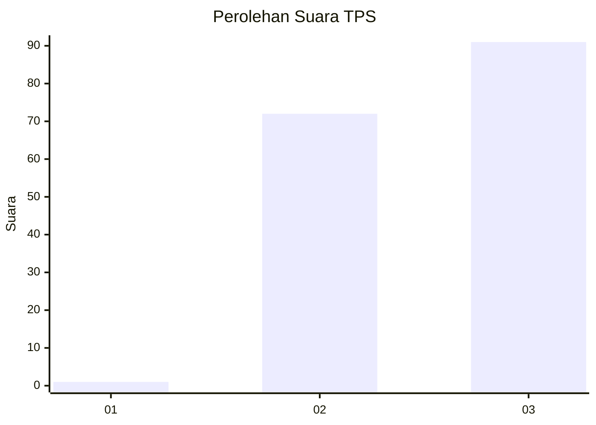
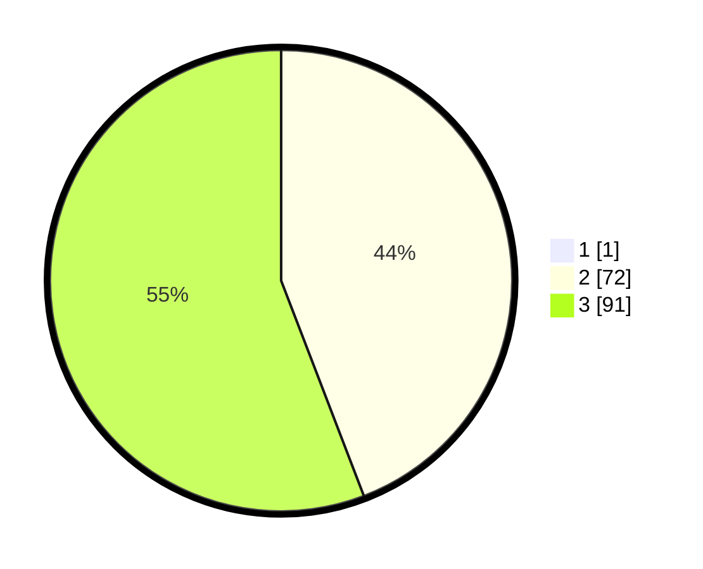

# Hasil

## Grafik

## Tabel

| No. | Nama Paslon    | Suara | Suara (raw) | Persentase |
|:--- |:-------------- | -----:| -----------:| ----------:|
| 1   | ANIES MUHAIMIN | 1     | [1][p-1]    | 0,61       |
| 2   | PRABOWO GIBRAN | 72    | [72][p-2]   | 43,90      |
| 3   | GANJAR MAHFUD  | 91    | [91][p-3]   | 55,49      |

[p-1]: https://github.com/gigit-pemilu/pemilu-2024-51-bali/blob/main/pilpres/hitung-suara/sub/51-bali/sub/08-buleleng/sub/09-tejakula/sub/2001-sembiran/sub/009-tps/sub/paslon-1.txt
[p-2]: https://github.com/gigit-pemilu/pemilu-2024-51-bali/blob/main/pilpres/hitung-suara/sub/51-bali/sub/08-buleleng/sub/09-tejakula/sub/2001-sembiran/sub/009-tps/sub/paslon-2.txt
[p-3]: https://github.com/gigit-pemilu/pemilu-2024-51-bali/blob/main/pilpres/hitung-suara/sub/51-bali/sub/08-buleleng/sub/09-tejakula/sub/2001-sembiran/sub/009-tps/sub/paslon-3.txt

## Foto C Plano

https://sirekap-obj-formc.kpu.go.id/bc9e/pemilu/ppwp/51/08/09/20/01/5108092001009-20240214-132754--0dc5fd38-7f7a-4f36-b344-30c275e1a43c.jpg

https://sirekap-obj-formc.kpu.go.id/bc9e/pemilu/ppwp/51/08/09/20/01/5108092001009-20240214-133026--38fa2a3d-4ab3-4c88-84a8-1f143227e27a.jpg

https://sirekap-obj-formc.kpu.go.id/bc9e/pemilu/ppwp/51/08/09/20/01/5108092001009-20240214-133106--20747fab-d859-478f-81a1-b19453c3a71c.jpg

## Metadata

| Key        | Value               |
| ---------- | ------------------- |
| Time Stamp | 2024-02-24 22:31:28 |

