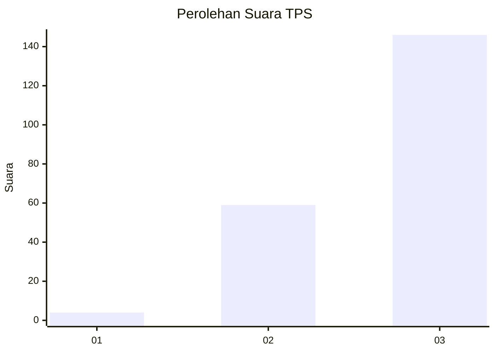
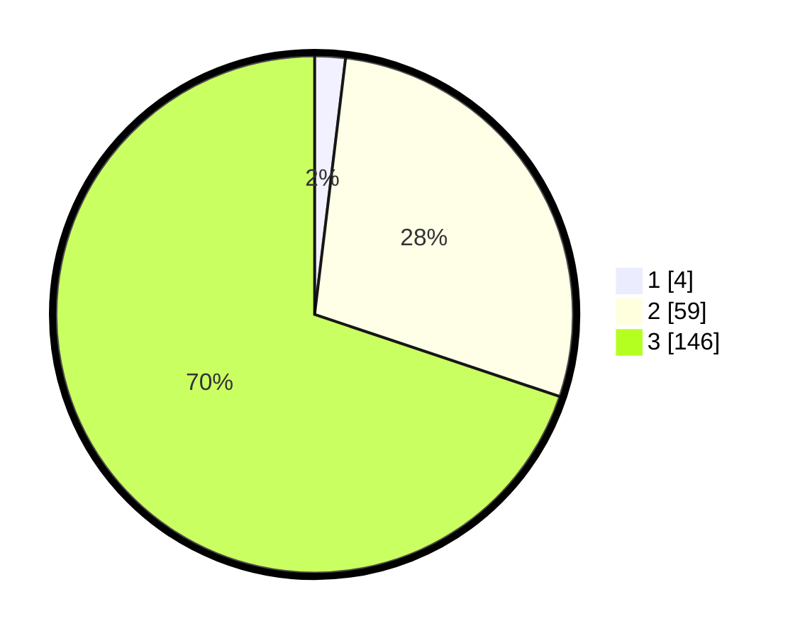

# Hasil

## Grafik

## Tabel

| No. | Nama Paslon    | Suara | Suara (raw) | Persentase |
|:--- |:-------------- | -----:| -----------:| ----------:|
| 1   | ANIES MUHAIMIN | 4     | [4][p-1]    | 1,91       |
| 2   | PRABOWO GIBRAN | 59    | [59][p-2]   | 28,23      |
| 3   | GANJAR MAHFUD  | 146   | [146][p-3]  | 69,86      |

[p-1]: https://github.com/gigit-pemilu/pemilu-2024-51-bali/blob/main/pilpres/hitung-suara/sub/51-bali/sub/08-buleleng/sub/09-tejakula/sub/2001-sembiran/sub/012-tps/sub/paslon-1.txt
[p-2]: https://github.com/gigit-pemilu/pemilu-2024-51-bali/blob/main/pilpres/hitung-suara/sub/51-bali/sub/08-buleleng/sub/09-tejakula/sub/2001-sembiran/sub/012-tps/sub/paslon-2.txt
[p-3]: https://github.com/gigit-pemilu/pemilu-2024-51-bali/blob/main/pilpres/hitung-suara/sub/51-bali/sub/08-buleleng/sub/09-tejakula/sub/2001-sembiran/sub/012-tps/sub/paslon-3.txt

## Foto C Plano

https://sirekap-obj-formc.kpu.go.id/7365/pemilu/ppwp/51/08/09/20/01/5108092001012-20240214-203503--3c11bbec-c344-4b77-bce1-f004cbf91aac.jpg

https://sirekap-obj-formc.kpu.go.id/7365/pemilu/ppwp/51/08/09/20/01/5108092001012-20240214-203549--abb345f4-ced3-43a8-8a43-18c52a337088.jpg

https://sirekap-obj-formc.kpu.go.id/7365/pemilu/ppwp/51/08/09/20/01/5108092001012-20240214-203617--988fb04a-a49b-46d7-8ce2-350fa46d76fc.jpg

## Metadata

| Key        | Value               |
| ---------- | ------------------- |
| Time Stamp | 2024-02-24 22:31:28 |

