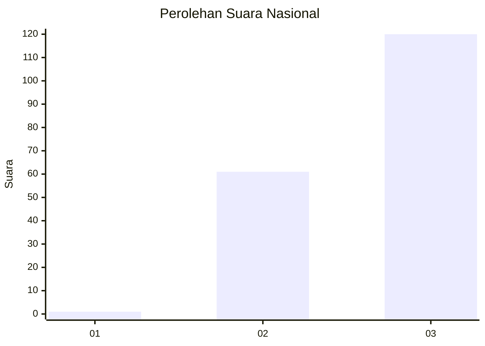
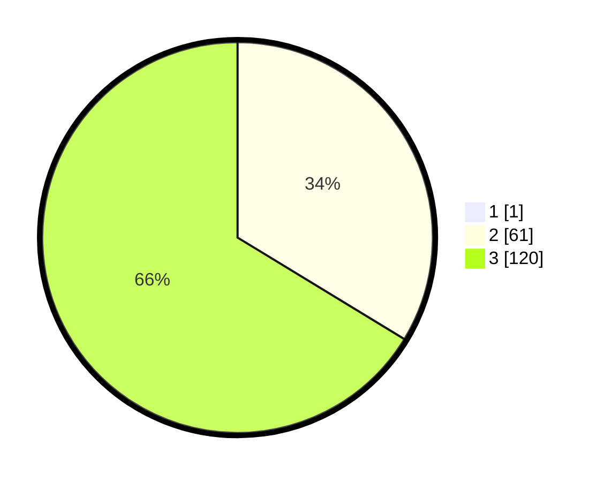

# Hasil

## Grafik

## Tabel

| No. | Nama Paslon    | Suara | Suara (raw) | Persentase |
|:--- |:-------------- | -----:| -----------:| ----------:|
| 1   | ANIES MUHAIMIN | 1     | [1][p-1]    | 0,55       |
| 2   | PRABOWO GIBRAN | 61    | [61][p-2]   | 33,52      |
| 3   | GANJAR MAHFUD  | 120   | [120][p-3]  | 65,93      |

[p-1]: https://github.com/gigit-pemilu/pemilu-2024/blob/main/pilpres/hitung-suara/sub/51-bali/sub/08-buleleng/sub/09-tejakula/sub/2001-sembiran/sub/013-tps/sub/paslon-1.txt
[p-2]: https://github.com/gigit-pemilu/pemilu-2024/blob/main/pilpres/hitung-suara/sub/51-bali/sub/08-buleleng/sub/09-tejakula/sub/2001-sembiran/sub/013-tps/sub/paslon-2.txt
[p-3]: https://github.com/gigit-pemilu/pemilu-2024/blob/main/pilpres/hitung-suara/sub/51-bali/sub/08-buleleng/sub/09-tejakula/sub/2001-sembiran/sub/013-tps/sub/paslon-3.txt

## Foto C Plano

https://sirekap-obj-formc.kpu.go.id/13e6/pemilu/ppwp/51/08/09/20/01/5108092001013-20240214-211052--9a3eb635-22ef-4559-ab25-94d6e7260ba1.jpg

https://sirekap-obj-formc.kpu.go.id/13e6/pemilu/ppwp/51/08/09/20/01/5108092001013-20240214-211204--a6a53c88-156e-44ec-8a95-7edd6881d0b1.jpg

https://sirekap-obj-formc.kpu.go.id/13e6/pemilu/ppwp/51/08/09/20/01/5108092001013-20240214-211339--ea2fc7e6-8a5f-4552-8ada-592c7139d233.jpg

## Metadata

| Key        | Value               |
| ---------- | ------------------- |
| Time Stamp | 2024-02-24 22:31:28 |

