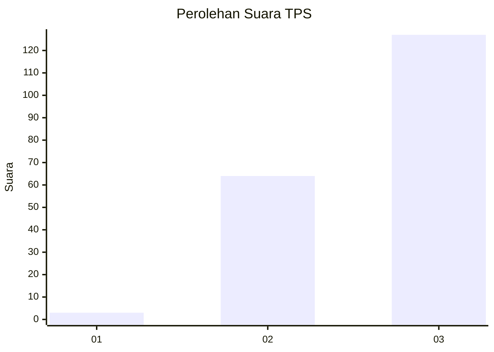
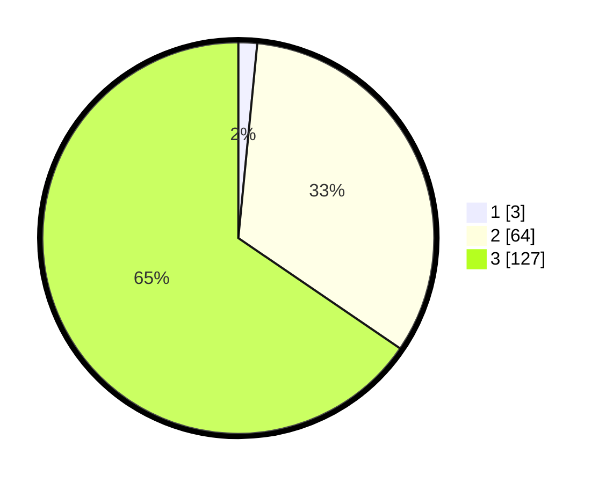

# Hasil

## Grafik

## Tabel

| No. | Nama Paslon    | Suara | Suara (raw) | Persentase |
|:--- |:-------------- | -----:| -----------:| ----------:|
| 1   | ANIES MUHAIMIN | 3     | [3][p-1]    | 1,55       |
| 2   | PRABOWO GIBRAN | 64    | [64][p-2]   | 32,99      |
| 3   | GANJAR MAHFUD  | 127   | [127][p-3]  | 65,46      |

[p-1]: https://github.com/gigit-pemilu/pemilu-2024-51-bali/blob/main/pilpres/hitung-suara/sub/51-bali/sub/08-buleleng/sub/09-tejakula/sub/2001-sembiran/sub/014-tps/sub/paslon-1.txt
[p-2]: https://github.com/gigit-pemilu/pemilu-2024-51-bali/blob/main/pilpres/hitung-suara/sub/51-bali/sub/08-buleleng/sub/09-tejakula/sub/2001-sembiran/sub/014-tps/sub/paslon-2.txt
[p-3]: https://github.com/gigit-pemilu/pemilu-2024-51-bali/blob/main/pilpres/hitung-suara/sub/51-bali/sub/08-buleleng/sub/09-tejakula/sub/2001-sembiran/sub/014-tps/sub/paslon-3.txt

## Foto C Plano

https://sirekap-obj-formc.kpu.go.id/7448/pemilu/ppwp/51/08/09/20/01/5108092001014-20240214-235023--cf3131a5-b3e9-47ba-9d5a-4af28503e915.jpg

https://sirekap-obj-formc.kpu.go.id/7448/pemilu/ppwp/51/08/09/20/01/5108092001014-20240214-235454--1f9485c0-86b0-44b5-9425-820083e52c38.jpg

https://sirekap-obj-formc.kpu.go.id/7448/pemilu/ppwp/51/08/09/20/01/5108092001014-20240214-235717--5b7f445d-dc01-4d94-b968-3b7b1b1c7710.jpg

## Metadata

| Key        | Value               |
| ---------- | ------------------- |
| Time Stamp | 2024-02-24 22:31:28 |

