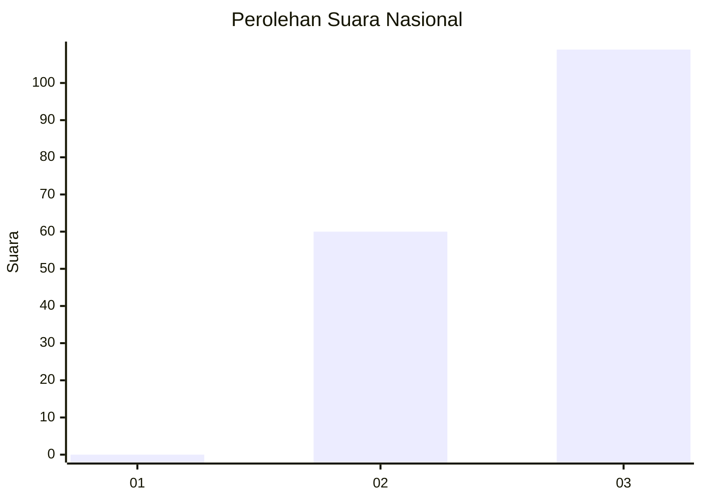
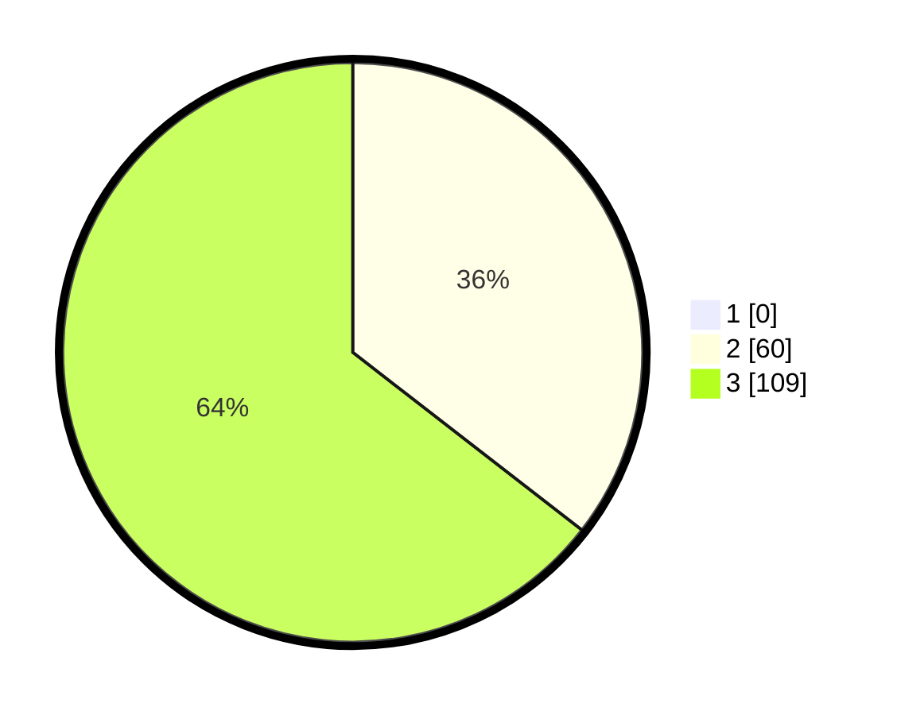

# Hasil

## Grafik

## Tabel

| No. | Nama Paslon    | Suara | Suara (raw) | Persentase |
|:--- |:-------------- | -----:| -----------:| ----------:|
| 1   | ANIES MUHAIMIN | 0     | [0][p-1]    | 0,00       |
| 2   | PRABOWO GIBRAN | 60    | [60][p-2]   | 35,50      |
| 3   | GANJAR MAHFUD  | 109   | [109][p-3]  | 64,50      |

[p-1]: https://github.com/gigit-pemilu/pemilu-2024/blob/main/pilpres/hitung-suara/sub/51-bali/sub/08-buleleng/sub/09-tejakula/sub/2001-sembiran/sub/017-tps/sub/paslon-1.txt
[p-2]: https://github.com/gigit-pemilu/pemilu-2024/blob/main/pilpres/hitung-suara/sub/51-bali/sub/08-buleleng/sub/09-tejakula/sub/2001-sembiran/sub/017-tps/sub/paslon-2.txt
[p-3]: https://github.com/gigit-pemilu/pemilu-2024/blob/main/pilpres/hitung-suara/sub/51-bali/sub/08-buleleng/sub/09-tejakula/sub/2001-sembiran/sub/017-tps/sub/paslon-3.txt

## Foto C Plano

https://sirekap-obj-formc.kpu.go.id/0f5a/pemilu/ppwp/51/08/09/20/01/5108092001017-20240214-131855--c0d0bebf-2e87-499c-8881-2db4beda80e2.jpg

https://sirekap-obj-formc.kpu.go.id/0f5a/pemilu/ppwp/51/08/09/20/01/5108092001017-20240214-132351--3ece0e8d-4f6b-426e-bafa-0b48e29ecb90.jpg

https://sirekap-obj-formc.kpu.go.id/0f5a/pemilu/ppwp/51/08/09/20/01/5108092001017-20240214-132520--6f15c0f2-2b4c-4f23-b117-750dc00f1ed4.jpg

## Metadata

| Key        | Value               |
| ---------- | ------------------- |
| Time Stamp | 2024-02-14 21:46:01 |

