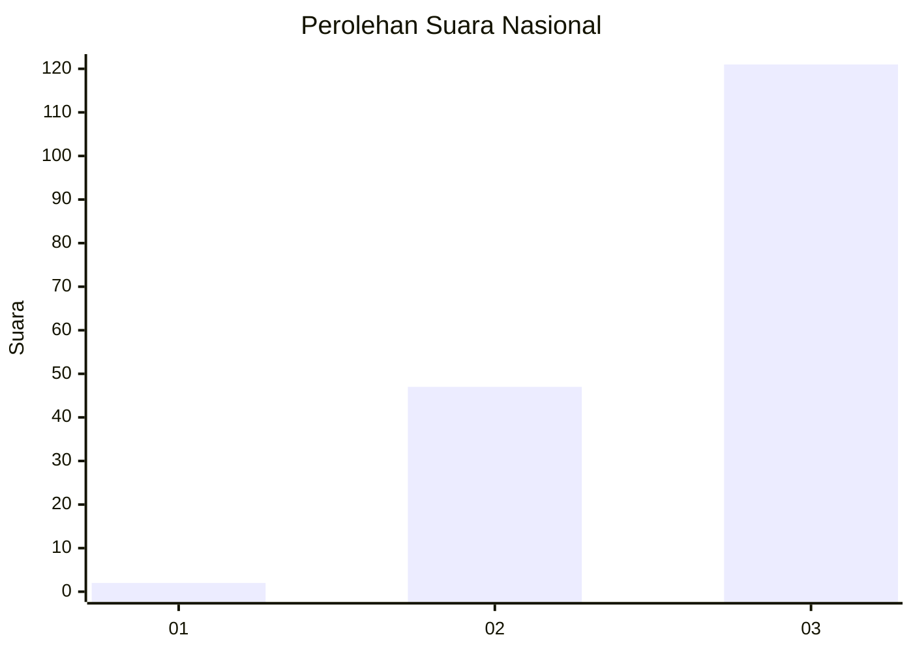
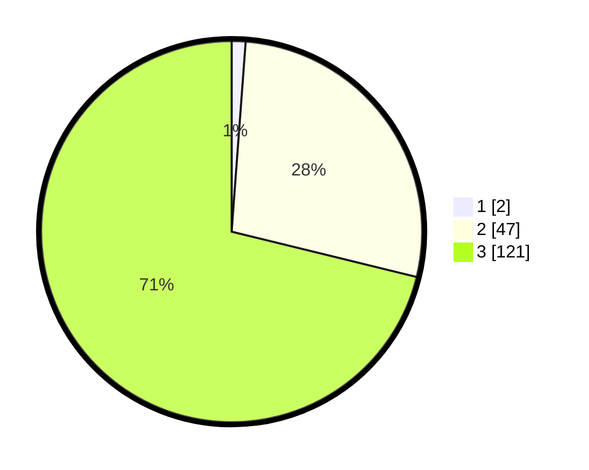

# Hasil

## Grafik

## Tabel

| No. | Nama Paslon    | Suara | Suara (raw) | Persentase |
|:--- |:-------------- | -----:| -----------:| ----------:|
| 1   | ANIES MUHAIMIN | 2     | [2][p-1]    | 1,18       |
| 2   | PRABOWO GIBRAN | 47    | [47][p-2]   | 27,65      |
| 3   | GANJAR MAHFUD  | 121   | [121][p-3]  | 71,18      |

[p-1]: https://github.com/gigit-pemilu/pemilu-2024/blob/main/pilpres/hitung-suara/sub/51-bali/sub/08-buleleng/sub/09-tejakula/sub/2002-pacung/sub/001-tps/sub/paslon-1.txt
[p-2]: https://github.com/gigit-pemilu/pemilu-2024/blob/main/pilpres/hitung-suara/sub/51-bali/sub/08-buleleng/sub/09-tejakula/sub/2002-pacung/sub/001-tps/sub/paslon-2.txt
[p-3]: https://github.com/gigit-pemilu/pemilu-2024/blob/main/pilpres/hitung-suara/sub/51-bali/sub/08-buleleng/sub/09-tejakula/sub/2002-pacung/sub/001-tps/sub/paslon-3.txt

## Foto C Plano

https://sirekap-obj-formc.kpu.go.id/441c/pemilu/ppwp/51/08/09/20/02/5108092002001-20240214-220247--54118449-d065-427e-8dab-afa526c821f0.jpg

https://sirekap-obj-formc.kpu.go.id/441c/pemilu/ppwp/51/08/09/20/02/5108092002001-20240214-220439--fbe40505-196d-4680-8ae1-0ded96f207c3.jpg

https://sirekap-obj-formc.kpu.go.id/441c/pemilu/ppwp/51/08/09/20/02/5108092002001-20240214-220604--53443948-5b23-44c6-8ac3-5d858de706da.jpg

## Metadata

| Key        | Value               |
| ---------- | ------------------- |
| Time Stamp | 2024-02-24 22:31:28 |

