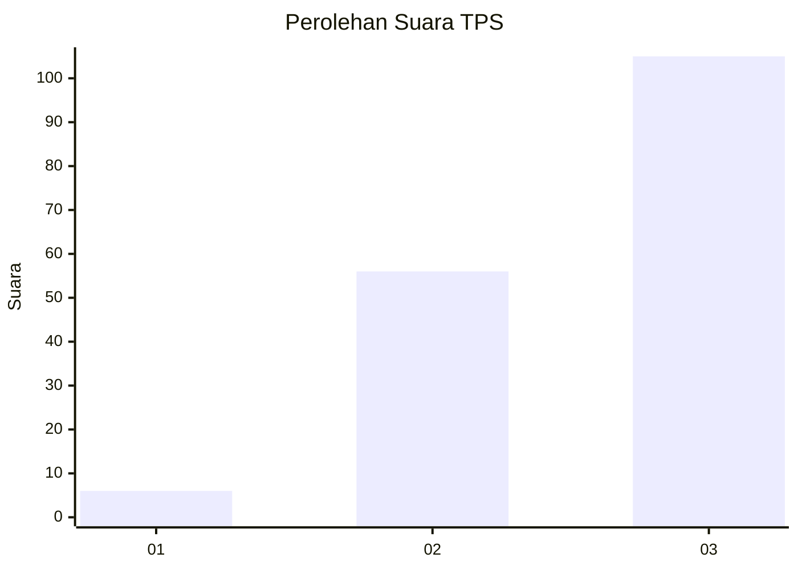
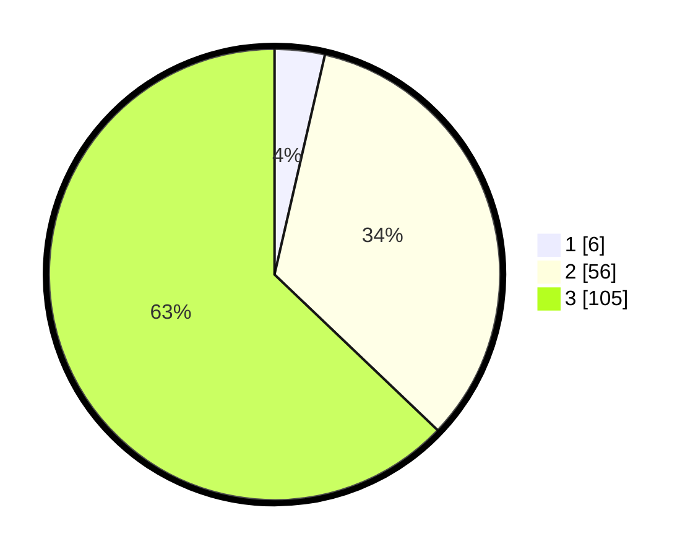

# Hasil

## Grafik

## Tabel

| No. | Nama Paslon    | Suara | Suara (raw) | Persentase |
|:--- |:-------------- | -----:| -----------:| ----------:|
| 1   | ANIES MUHAIMIN | 6     | [6][p-1]    | 3,59       |
| 2   | PRABOWO GIBRAN | 56    | [56][p-2]   | 33,53      |
| 3   | GANJAR MAHFUD  | 105   | [105][p-3]  | 62,87      |

[p-1]: https://github.com/gigit-pemilu/pemilu-2024-51-bali/blob/main/pilpres/hitung-suara/sub/51-bali/sub/08-buleleng/sub/09-tejakula/sub/2002-pacung/sub/002-tps/sub/paslon-1.txt
[p-2]: https://github.com/gigit-pemilu/pemilu-2024-51-bali/blob/main/pilpres/hitung-suara/sub/51-bali/sub/08-buleleng/sub/09-tejakula/sub/2002-pacung/sub/002-tps/sub/paslon-2.txt
[p-3]: https://github.com/gigit-pemilu/pemilu-2024-51-bali/blob/main/pilpres/hitung-suara/sub/51-bali/sub/08-buleleng/sub/09-tejakula/sub/2002-pacung/sub/002-tps/sub/paslon-3.txt

## Foto C Plano

https://sirekap-obj-formc.kpu.go.id/7478/pemilu/ppwp/51/08/09/20/02/5108092002002-20240214-222907--4c783000-5326-432a-80f8-5b75baed054d.jpg

https://sirekap-obj-formc.kpu.go.id/7478/pemilu/ppwp/51/08/09/20/02/5108092002002-20240214-223047--d0a448a6-67c2-46dd-8ccf-2b8af6023cf9.jpg

https://sirekap-obj-formc.kpu.go.id/7478/pemilu/ppwp/51/08/09/20/02/5108092002002-20240214-223352--febd8892-cc77-4cd8-aa41-d4f713606ccc.jpg

## Metadata

| Key        | Value               |
| ---------- | ------------------- |
| Time Stamp | 2024-02-25 12:00:00 |

