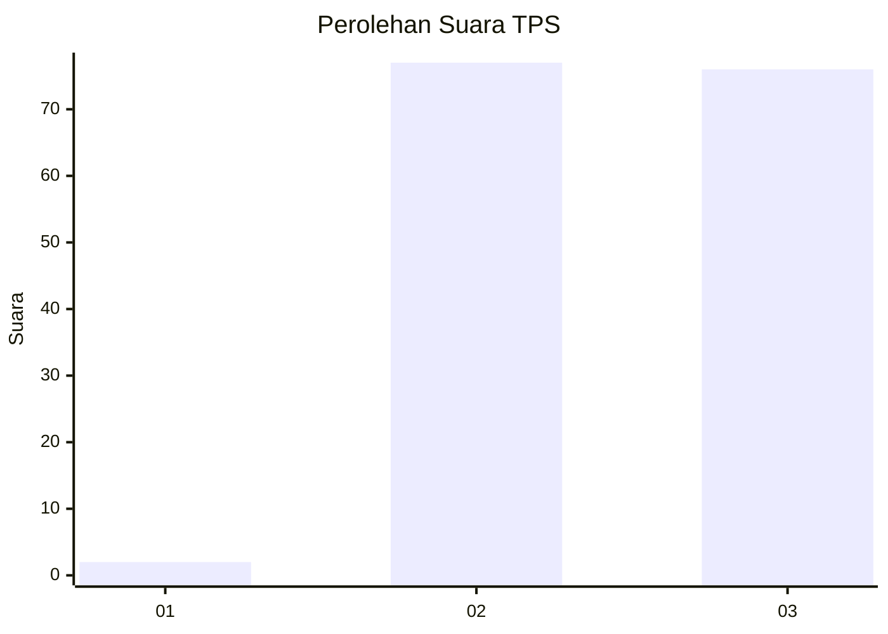
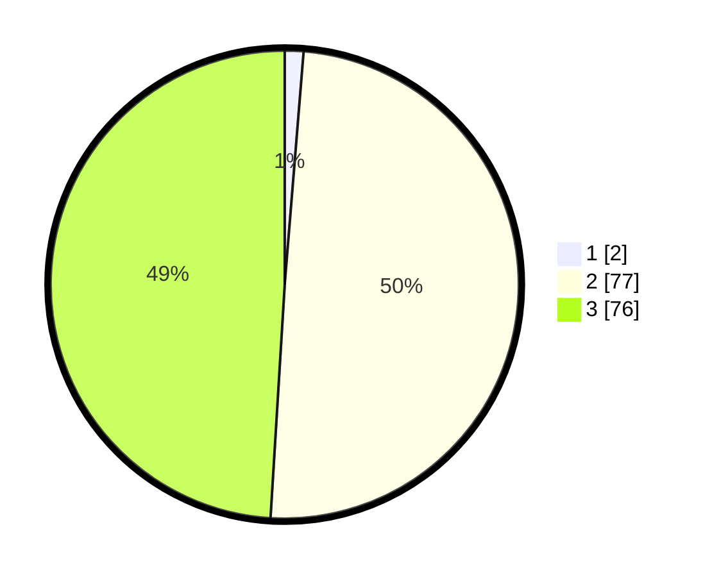

# Hasil

## Grafik

## Tabel

| No. | Nama Paslon    | Suara | Suara (raw) | Persentase |
|:--- |:-------------- | -----:| -----------:| ----------:|
| 1   | ANIES MUHAIMIN | 2     | [2][p-1]    | 1,29       |
| 2   | PRABOWO GIBRAN | 77    | [77][p-2]   | 49,68      |
| 3   | GANJAR MAHFUD  | 76    | [76][p-3]   | 49,03      |

[p-1]: https://github.com/gigit-pemilu/pemilu-2024-51-bali/blob/main/pilpres/hitung-suara/sub/51-bali/sub/08-buleleng/sub/09-tejakula/sub/2002-pacung/sub/003-tps/sub/paslon-1.txt
[p-2]: https://github.com/gigit-pemilu/pemilu-2024-51-bali/blob/main/pilpres/hitung-suara/sub/51-bali/sub/08-buleleng/sub/09-tejakula/sub/2002-pacung/sub/003-tps/sub/paslon-2.txt
[p-3]: https://github.com/gigit-pemilu/pemilu-2024-51-bali/blob/main/pilpres/hitung-suara/sub/51-bali/sub/08-buleleng/sub/09-tejakula/sub/2002-pacung/sub/003-tps/sub/paslon-3.txt

## Foto C Plano

https://sirekap-obj-formc.kpu.go.id/8036/pemilu/ppwp/51/08/09/20/02/5108092002003-20240214-195208--0703ed4a-a073-4a64-bfbc-c17cb4f7ed35.jpg

https://sirekap-obj-formc.kpu.go.id/8036/pemilu/ppwp/51/08/09/20/02/5108092002003-20240214-195412--41ae395a-a96b-424a-975b-54d0c9ba18f4.jpg

## Metadata

| Key        | Value               |
| ---------- | ------------------- |
| Time Stamp | 2024-02-15 07:00:44 |

