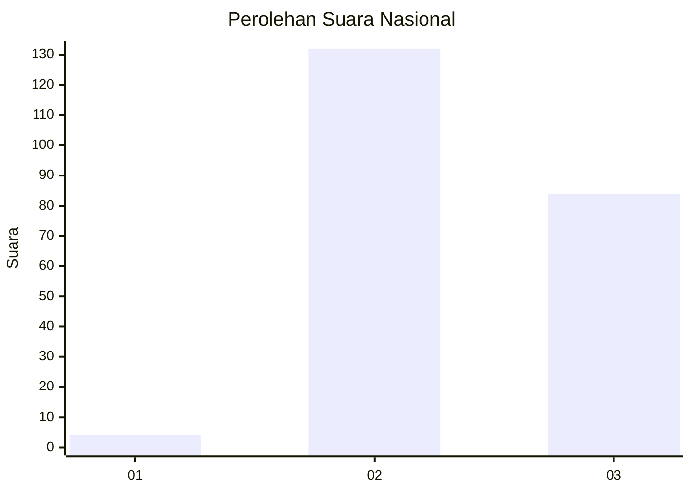
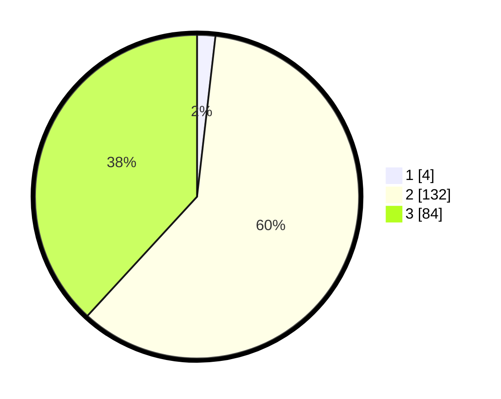

# Hasil

## Grafik

## Tabel

| No. | Nama Paslon    | Suara | Suara (raw) | Persentase |
|:--- |:-------------- | -----:| -----------:| ----------:|
| 1   | ANIES MUHAIMIN | 4     | [4][p-1]    | 1,82       |
| 2   | PRABOWO GIBRAN | 132   | [132][p-2]  | 60,00      |
| 3   | GANJAR MAHFUD  | 84    | [84][p-3]   | 38,18      |

[p-1]: https://github.com/gigit-pemilu/pemilu-2024/blob/main/pilpres/hitung-suara/sub/51-bali/sub/08-buleleng/sub/09-tejakula/sub/2002-pacung/sub/008-tps/sub/paslon-1.txt
[p-2]: https://github.com/gigit-pemilu/pemilu-2024/blob/main/pilpres/hitung-suara/sub/51-bali/sub/08-buleleng/sub/09-tejakula/sub/2002-pacung/sub/008-tps/sub/paslon-2.txt
[p-3]: https://github.com/gigit-pemilu/pemilu-2024/blob/main/pilpres/hitung-suara/sub/51-bali/sub/08-buleleng/sub/09-tejakula/sub/2002-pacung/sub/008-tps/sub/paslon-3.txt

## Foto C Plano

https://sirekap-obj-formc.kpu.go.id/0a25/pemilu/ppwp/51/08/09/20/02/5108092002008-20240214-204055--c6e7a3e6-216a-47ab-900b-7144a8491f56.jpg

https://sirekap-obj-formc.kpu.go.id/0a25/pemilu/ppwp/51/08/09/20/02/5108092002008-20240214-204212--3cabbbe4-b79f-4db5-92cb-7890b2e0576a.jpg

https://sirekap-obj-formc.kpu.go.id/0a25/pemilu/ppwp/51/08/09/20/02/5108092002008-20240214-204302--4a403567-a33d-4db8-af65-e373d3f6df6b.jpg

## Metadata

| Key        | Value               |
| ---------- | ------------------- |
| Time Stamp | 2024-02-24 22:31:28 |

