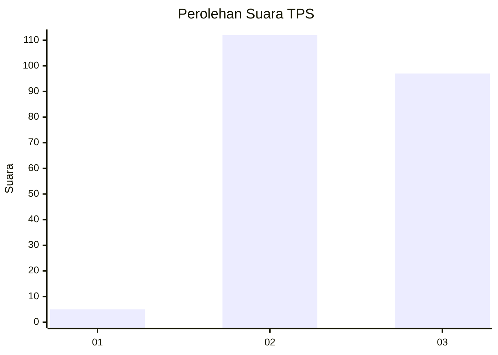
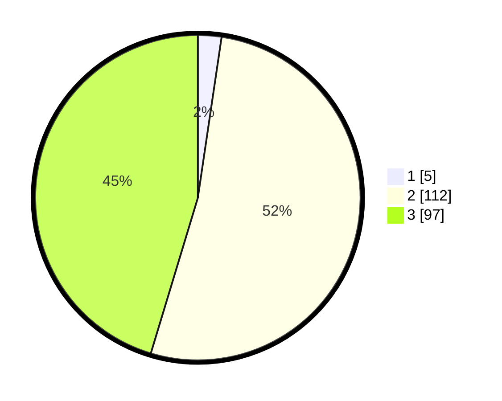

# Hasil

## Grafik

## Tabel

| No. | Nama Paslon    | Suara | Suara (raw) | Persentase |
|:--- |:-------------- | -----:| -----------:| ----------:|
| 1   | ANIES MUHAIMIN | 5     | [5][p-1]    | 2,34       |
| 2   | PRABOWO GIBRAN | 112   | [112][p-2]  | 52,34      |
| 3   | GANJAR MAHFUD  | 97    | [97][p-3]   | 45,33      |

[p-1]: https://github.com/gigit-pemilu/pemilu-2024-51-bali/blob/main/pilpres/hitung-suara/sub/51-bali/sub/08-buleleng/sub/09-tejakula/sub/2002-pacung/sub/010-tps/sub/paslon-1.txt
[p-2]: https://github.com/gigit-pemilu/pemilu-2024-51-bali/blob/main/pilpres/hitung-suara/sub/51-bali/sub/08-buleleng/sub/09-tejakula/sub/2002-pacung/sub/010-tps/sub/paslon-2.txt
[p-3]: https://github.com/gigit-pemilu/pemilu-2024-51-bali/blob/main/pilpres/hitung-suara/sub/51-bali/sub/08-buleleng/sub/09-tejakula/sub/2002-pacung/sub/010-tps/sub/paslon-3.txt

## Foto C Plano

https://sirekap-obj-formc.kpu.go.id/fd2e/pemilu/ppwp/51/08/09/20/02/5108092002010-20240214-221550--e5ea90cd-f098-4683-9d77-24a9a596ca2e.jpg

https://sirekap-obj-formc.kpu.go.id/fd2e/pemilu/ppwp/51/08/09/20/02/5108092002010-20240215-000311--890b42e8-0e94-4427-a7bb-9146f6b13483.jpg

https://sirekap-obj-formc.kpu.go.id/fd2e/pemilu/ppwp/51/08/09/20/02/5108092002010-20240215-000630--33e94aa2-b04e-4daa-9482-112081fe672e.jpg

## Metadata

| Key        | Value               |
| ---------- | ------------------- |
| Time Stamp | 2024-02-24 22:31:28 |

