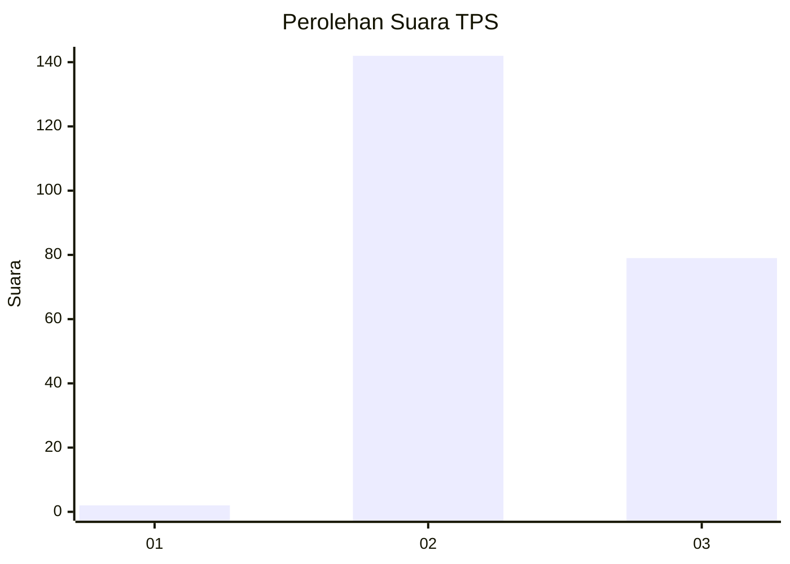
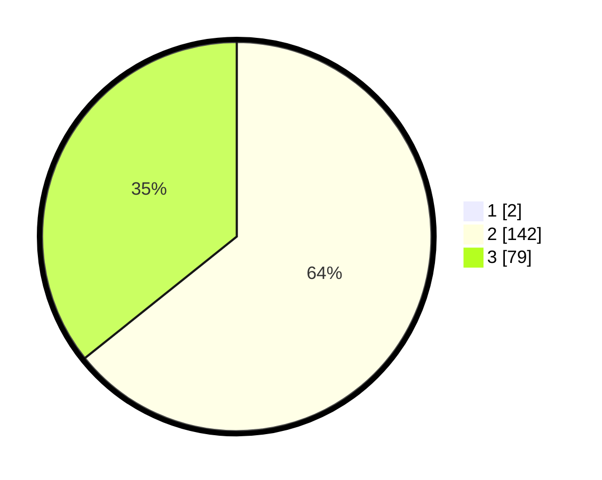

# Hasil

## Grafik

## Tabel

| No. | Nama Paslon    | Suara | Suara (raw) | Persentase |
|:--- |:-------------- | -----:| -----------:| ----------:|
| 1   | ANIES MUHAIMIN | 2     | [2][p-1]    | 0,90       |
| 2   | PRABOWO GIBRAN | 142   | [142][p-2]  | 63,68      |
| 3   | GANJAR MAHFUD  | 79    | [79][p-3]   | 35,43      |

[p-1]: https://github.com/gigit-pemilu/pemilu-2024-51-bali/blob/main/pilpres/hitung-suara/sub/51-bali/sub/08-buleleng/sub/09-tejakula/sub/2002-pacung/sub/011-tps/sub/paslon-1.txt
[p-2]: https://github.com/gigit-pemilu/pemilu-2024-51-bali/blob/main/pilpres/hitung-suara/sub/51-bali/sub/08-buleleng/sub/09-tejakula/sub/2002-pacung/sub/011-tps/sub/paslon-2.txt
[p-3]: https://github.com/gigit-pemilu/pemilu-2024-51-bali/blob/main/pilpres/hitung-suara/sub/51-bali/sub/08-buleleng/sub/09-tejakula/sub/2002-pacung/sub/011-tps/sub/paslon-3.txt

## Foto C Plano

https://sirekap-obj-formc.kpu.go.id/ac93/pemilu/ppwp/51/08/09/20/02/5108092002011-20240214-214652--3ddf1824-8908-40bd-944e-e3641623ea3b.jpg

https://sirekap-obj-formc.kpu.go.id/ac93/pemilu/ppwp/51/08/09/20/02/5108092002011-20240214-233704--60270169-3aef-435b-96f4-49d2e114c27f.jpg

https://sirekap-obj-formc.kpu.go.id/ac93/pemilu/ppwp/51/08/09/20/02/5108092002011-20240214-233821--e95ae7ce-7ecc-4a67-8bda-cdc6234eeec0.jpg

## Metadata

| Key        | Value               |
| ---------- | ------------------- |
| Time Stamp | 2024-02-24 22:31:28 |

