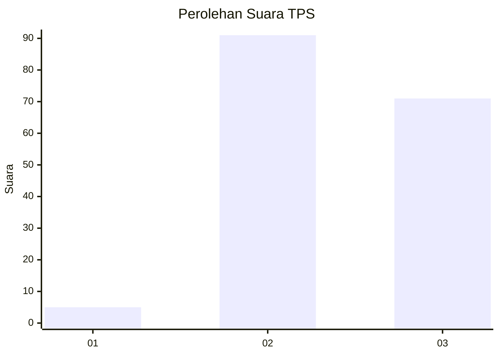
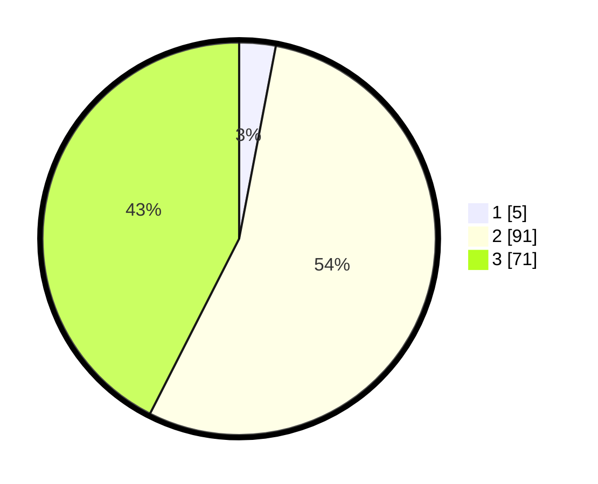

# Hasil

## Grafik

## Tabel

| No. | Nama Paslon    | Suara | Suara (raw) | Persentase |
|:--- |:-------------- | -----:| -----------:| ----------:|
| 1   | ANIES MUHAIMIN | 5     | [5][p-1]    | 2,99       |
| 2   | PRABOWO GIBRAN | 91    | [91][p-2]   | 54,49      |
| 3   | GANJAR MAHFUD  | 71    | [71][p-3]   | 42,51      |

[p-1]: https://github.com/gigit-pemilu/pemilu-2024-51-bali/blob/main/pilpres/hitung-suara/sub/51-bali/sub/08-buleleng/sub/09-tejakula/sub/2003-julah/sub/002-tps/sub/paslon-1.txt
[p-2]: https://github.com/gigit-pemilu/pemilu-2024-51-bali/blob/main/pilpres/hitung-suara/sub/51-bali/sub/08-buleleng/sub/09-tejakula/sub/2003-julah/sub/002-tps/sub/paslon-2.txt
[p-3]: https://github.com/gigit-pemilu/pemilu-2024-51-bali/blob/main/pilpres/hitung-suara/sub/51-bali/sub/08-buleleng/sub/09-tejakula/sub/2003-julah/sub/002-tps/sub/paslon-3.txt

## Foto C Plano

https://sirekap-obj-formc.kpu.go.id/6a7b/pemilu/ppwp/51/08/09/20/03/5108092003002-20240215-000122--15510d3e-d010-4b1b-96e5-e5de5263b1f5.jpg

https://sirekap-obj-formc.kpu.go.id/6a7b/pemilu/ppwp/51/08/09/20/03/5108092003002-20240215-000553--e01571e1-3690-4ebc-943a-88444b1ccc34.jpg

https://sirekap-obj-formc.kpu.go.id/6a7b/pemilu/ppwp/51/08/09/20/03/5108092003002-20240215-000830--c84513c2-64a3-48a0-ab21-4768ce5bfcc8.jpg

## Metadata

| Key        | Value               |
| ---------- | ------------------- |
| Time Stamp | 2024-02-24 22:31:28 |

