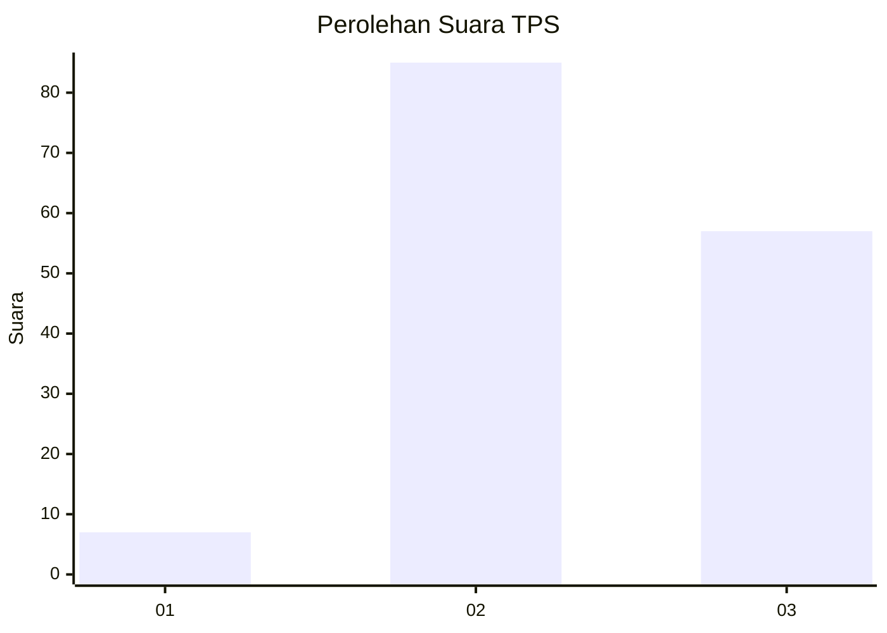
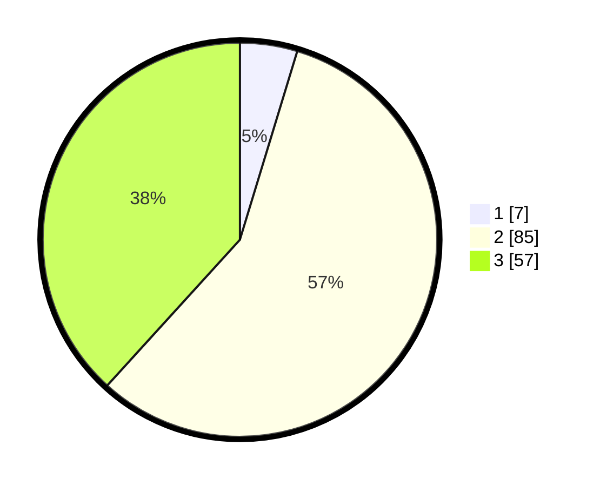

# Hasil

## Grafik

## Tabel

| No. | Nama Paslon    | Suara | Suara (raw) | Persentase |
|:--- |:-------------- | -----:| -----------:| ----------:|
| 1   | ANIES MUHAIMIN | 7     | [7][p-1]    | 4,70       |
| 2   | PRABOWO GIBRAN | 85    | [85][p-2]   | 57,05      |
| 3   | GANJAR MAHFUD  | 57    | [57][p-3]   | 38,26      |

[p-1]: https://github.com/gigit-pemilu/pemilu-2024-51-bali/blob/main/pilpres/hitung-suara/sub/51-bali/sub/08-buleleng/sub/09-tejakula/sub/2003-julah/sub/007-tps/sub/paslon-1.txt
[p-2]: https://github.com/gigit-pemilu/pemilu-2024-51-bali/blob/main/pilpres/hitung-suara/sub/51-bali/sub/08-buleleng/sub/09-tejakula/sub/2003-julah/sub/007-tps/sub/paslon-2.txt
[p-3]: https://github.com/gigit-pemilu/pemilu-2024-51-bali/blob/main/pilpres/hitung-suara/sub/51-bali/sub/08-buleleng/sub/09-tejakula/sub/2003-julah/sub/007-tps/sub/paslon-3.txt

## Foto C Plano

https://sirekap-obj-formc.kpu.go.id/467d/pemilu/ppwp/51/08/09/20/03/5108092003007-20240214-232954--bb651a94-88f2-4913-8af4-2f92473487af.jpg

https://sirekap-obj-formc.kpu.go.id/467d/pemilu/ppwp/51/08/09/20/03/5108092003007-20240214-233139--77fb7fa1-d006-4de8-9f07-d774a9f60b8a.jpg

https://sirekap-obj-formc.kpu.go.id/467d/pemilu/ppwp/51/08/09/20/03/5108092003007-20240214-233241--05e5d5a0-fc0d-46dc-9d30-f485576d624c.jpg

## Metadata

| Key        | Value               |
| ---------- | ------------------- |
| Time Stamp | 2024-02-24 22:31:28 |

