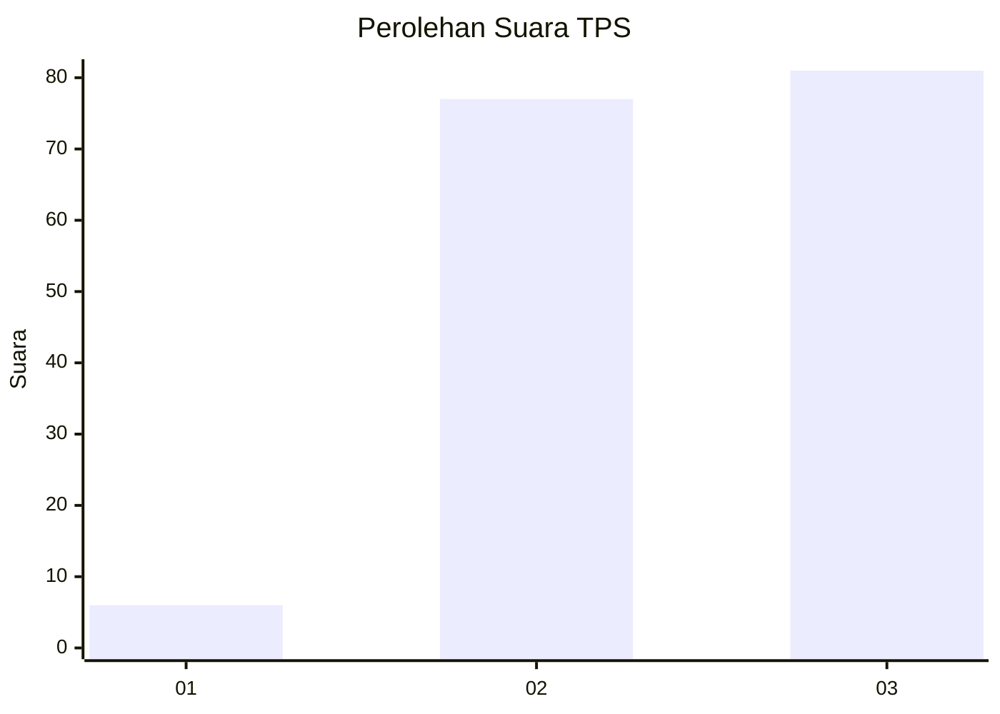
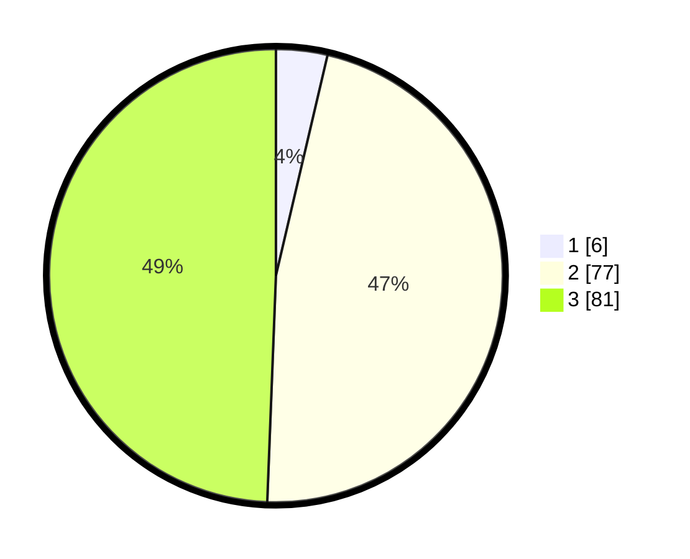

# Hasil

## Grafik

## Tabel

| No. | Nama Paslon    | Suara | Suara (raw) | Persentase |
|:--- |:-------------- | -----:| -----------:| ----------:|
| 1   | ANIES MUHAIMIN | 6     | [6][p-1]    | 3,66       |
| 2   | PRABOWO GIBRAN | 77    | [77][p-2]   | 46,95      |
| 3   | GANJAR MAHFUD  | 81    | [81][p-3]   | 49,39      |

[p-1]: https://github.com/gigit-pemilu/pemilu-2024-51-bali/blob/main/pilpres/hitung-suara/sub/51-bali/sub/08-buleleng/sub/09-tejakula/sub/2004-madenan/sub/001-tps/sub/paslon-1.txt
[p-2]: https://github.com/gigit-pemilu/pemilu-2024-51-bali/blob/main/pilpres/hitung-suara/sub/51-bali/sub/08-buleleng/sub/09-tejakula/sub/2004-madenan/sub/001-tps/sub/paslon-2.txt
[p-3]: https://github.com/gigit-pemilu/pemilu-2024-51-bali/blob/main/pilpres/hitung-suara/sub/51-bali/sub/08-buleleng/sub/09-tejakula/sub/2004-madenan/sub/001-tps/sub/paslon-3.txt

## Foto C Plano

https://sirekap-obj-formc.kpu.go.id/ea81/pemilu/ppwp/51/08/09/20/04/5108092004001-20240214-131303--687331cc-9734-4c81-b9dd-13de56deac51.jpg

https://sirekap-obj-formc.kpu.go.id/ea81/pemilu/ppwp/51/08/09/20/04/5108092004001-20240214-133004--7d8538e6-ad15-401a-ada4-0b8fe290ba7c.jpg

## Metadata

| Key        | Value               |
| ---------- | ------------------- |
| Time Stamp | 2024-02-24 22:31:28 |

