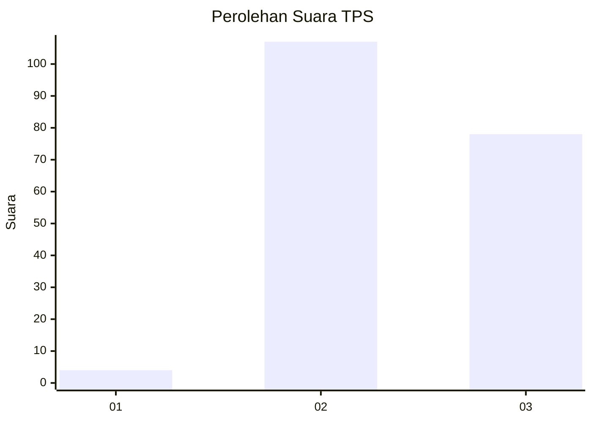
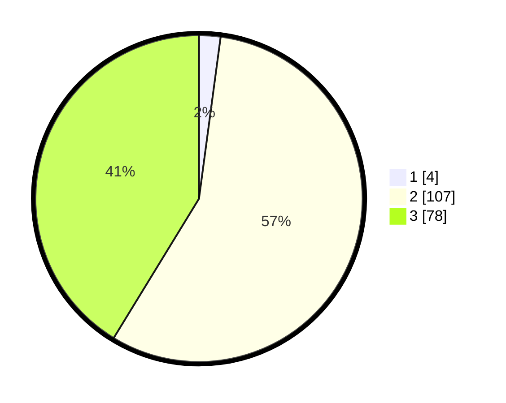

# Hasil

## Grafik

## Tabel

| No. | Nama Paslon    | Suara | Suara (raw) | Persentase |
|:--- |:-------------- | -----:| -----------:| ----------:|
| 1   | ANIES MUHAIMIN | 4     | [4][p-1]    | 2,12       |
| 2   | PRABOWO GIBRAN | 107   | [107][p-2]  | 56,61      |
| 3   | GANJAR MAHFUD  | 78    | [78][p-3]   | 41,27      |

[p-1]: https://github.com/gigit-pemilu/pemilu-2024-51-bali/blob/main/pilpres/hitung-suara/sub/51-bali/sub/08-buleleng/sub/09-tejakula/sub/2004-madenan/sub/002-tps/sub/paslon-1.txt
[p-2]: https://github.com/gigit-pemilu/pemilu-2024-51-bali/blob/main/pilpres/hitung-suara/sub/51-bali/sub/08-buleleng/sub/09-tejakula/sub/2004-madenan/sub/002-tps/sub/paslon-2.txt
[p-3]: https://github.com/gigit-pemilu/pemilu-2024-51-bali/blob/main/pilpres/hitung-suara/sub/51-bali/sub/08-buleleng/sub/09-tejakula/sub/2004-madenan/sub/002-tps/sub/paslon-3.txt

## Foto C Plano

https://sirekap-obj-formc.kpu.go.id/9283/pemilu/ppwp/51/08/09/20/04/5108092004002-20240214-203733--293700c0-678f-4f9b-9d98-24b5691e594a.jpg

https://sirekap-obj-formc.kpu.go.id/9283/pemilu/ppwp/51/08/09/20/04/5108092004002-20240214-203920--94af3aef-f893-4855-a695-46c90437d04d.jpg

## Metadata

| Key        | Value               |
| ---------- | ------------------- |
| Time Stamp | 2024-02-24 22:31:28 |

