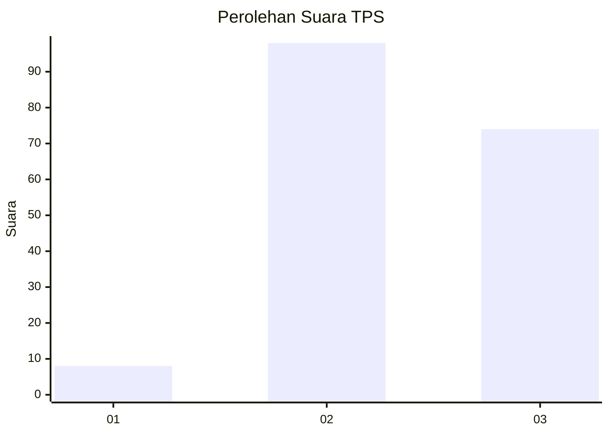
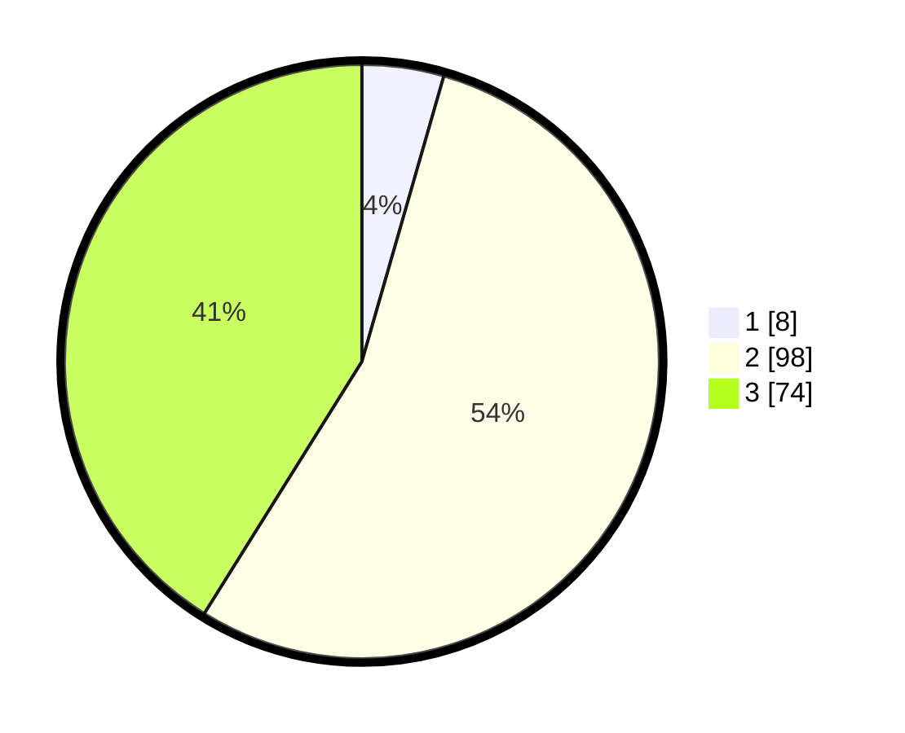

# Hasil

## Grafik

## Tabel

| No. | Nama Paslon    | Suara | Suara (raw) | Persentase |
|:--- |:-------------- | -----:| -----------:| ----------:|
| 1   | ANIES MUHAIMIN | 8     | [8][p-1]    | 4,44       |
| 2   | PRABOWO GIBRAN | 98    | [98][p-2]   | 54,44      |
| 3   | GANJAR MAHFUD  | 74    | [74][p-3]   | 41,11      |

[p-1]: https://github.com/gigit-pemilu/pemilu-2024-51-bali/blob/main/pilpres/hitung-suara/sub/51-bali/sub/08-buleleng/sub/09-tejakula/sub/2004-madenan/sub/003-tps/sub/paslon-1.txt
[p-2]: https://github.com/gigit-pemilu/pemilu-2024-51-bali/blob/main/pilpres/hitung-suara/sub/51-bali/sub/08-buleleng/sub/09-tejakula/sub/2004-madenan/sub/003-tps/sub/paslon-2.txt
[p-3]: https://github.com/gigit-pemilu/pemilu-2024-51-bali/blob/main/pilpres/hitung-suara/sub/51-bali/sub/08-buleleng/sub/09-tejakula/sub/2004-madenan/sub/003-tps/sub/paslon-3.txt

## Foto C Plano

https://sirekap-obj-formc.kpu.go.id/18ae/pemilu/ppwp/51/08/09/20/04/5108092004003-20240214-203954--5a834318-4c5c-4d64-99e5-14caaa7ffba8.jpg

https://sirekap-obj-formc.kpu.go.id/18ae/pemilu/ppwp/51/08/09/20/04/5108092004003-20240214-204346--58e43666-b4a4-4bfd-bbe5-502ed4842dc5.jpg

https://sirekap-obj-formc.kpu.go.id/18ae/pemilu/ppwp/51/08/09/20/04/5108092004003-20240214-204732--6569c690-4708-438a-8d8b-31efaa731084.jpg

## Metadata

| Key        | Value               |
| ---------- | ------------------- |
| Time Stamp | 2024-02-24 22:31:28 |

