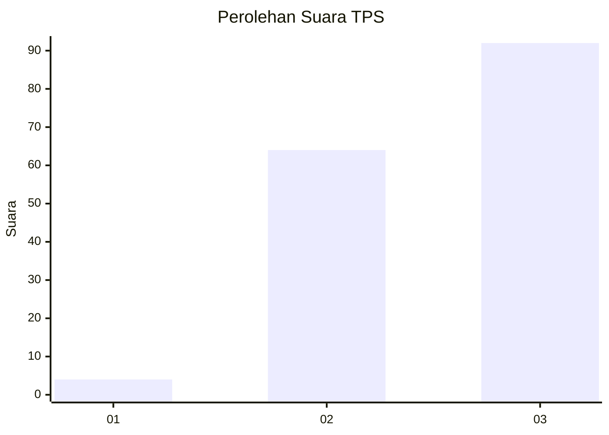
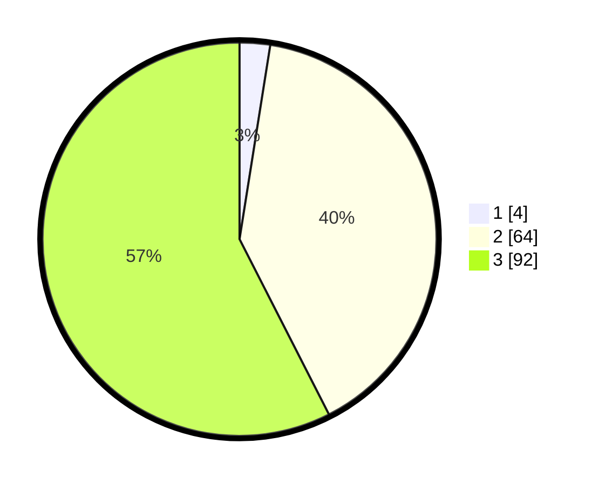

# Hasil

## Grafik

## Tabel

| No. | Nama Paslon    | Suara | Suara (raw) | Persentase |
|:--- |:-------------- | -----:| -----------:| ----------:|
| 1   | ANIES MUHAIMIN | 4     | [4][p-1]    | 2,50       |
| 2   | PRABOWO GIBRAN | 64    | [64][p-2]   | 40,00      |
| 3   | GANJAR MAHFUD  | 92    | [92][p-3]   | 57,50      |

[p-1]: https://github.com/gigit-pemilu/pemilu-2024-51-bali/blob/main/pilpres/hitung-suara/sub/51-bali/sub/08-buleleng/sub/09-tejakula/sub/2004-madenan/sub/010-tps/sub/paslon-1.txt
[p-2]: https://github.com/gigit-pemilu/pemilu-2024-51-bali/blob/main/pilpres/hitung-suara/sub/51-bali/sub/08-buleleng/sub/09-tejakula/sub/2004-madenan/sub/010-tps/sub/paslon-2.txt
[p-3]: https://github.com/gigit-pemilu/pemilu-2024-51-bali/blob/main/pilpres/hitung-suara/sub/51-bali/sub/08-buleleng/sub/09-tejakula/sub/2004-madenan/sub/010-tps/sub/paslon-3.txt

## Foto C Plano

https://sirekap-obj-formc.kpu.go.id/9311/pemilu/ppwp/51/08/09/20/04/5108092004010-20240214-195511--44f15ad3-381b-4ea0-a254-9d2ccc6499c5.jpg

https://sirekap-obj-formc.kpu.go.id/9311/pemilu/ppwp/51/08/09/20/04/5108092004010-20240214-195606--1a61ab59-8ec3-4f8a-924a-9e68b0b903b1.jpg

https://sirekap-obj-formc.kpu.go.id/9311/pemilu/ppwp/51/08/09/20/04/5108092004010-20240214-195703--c7271119-28d9-4aab-9b56-8f6cf807e9da.jpg

## Metadata

| Key        | Value               |
| ---------- | ------------------- |
| Time Stamp | 2024-02-24 22:31:28 |

