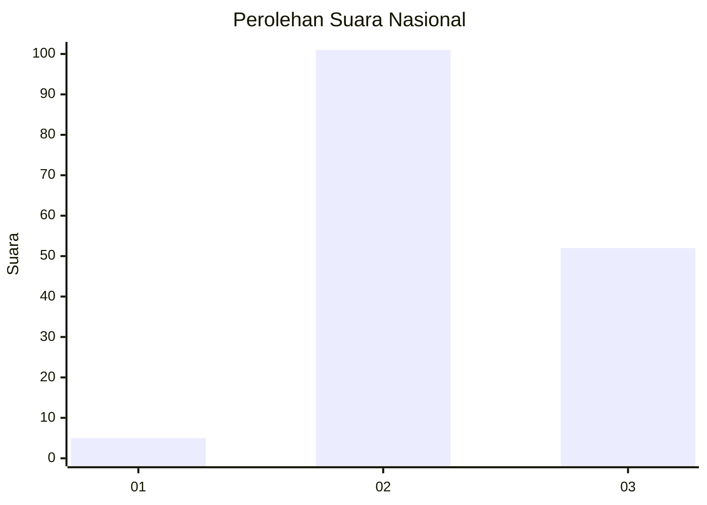
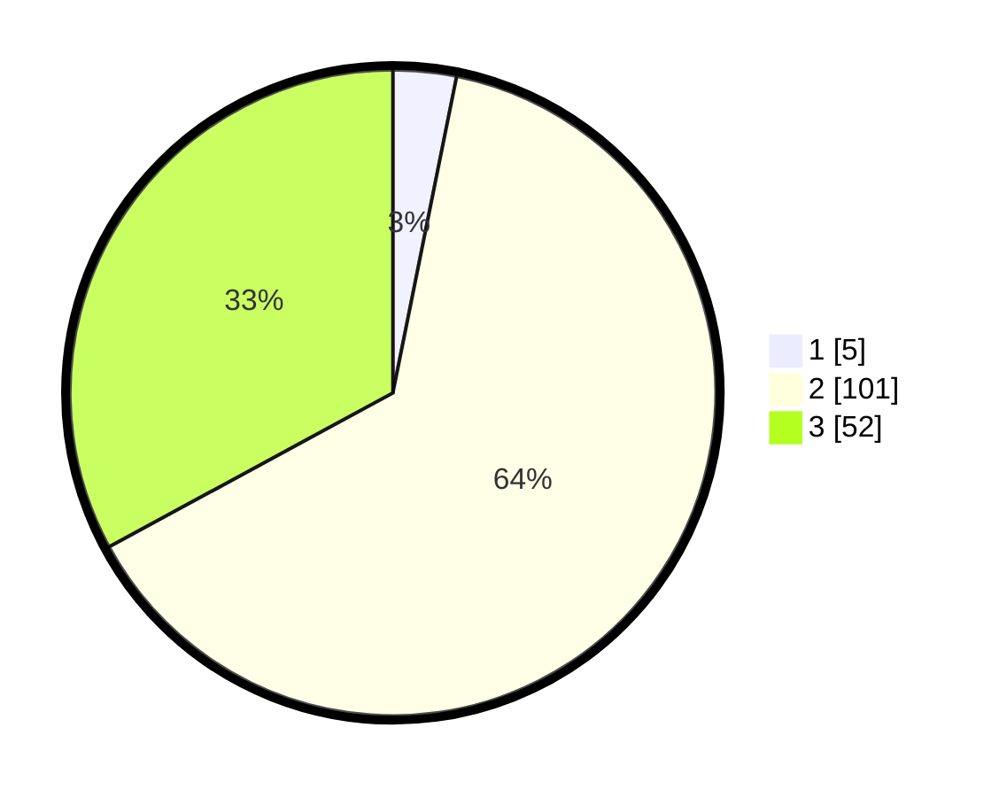

# Hasil

## Grafik

## Tabel

| No. | Nama Paslon    | Suara | Suara (raw) | Persentase |
|:--- |:-------------- | -----:| -----------:| ----------:|
| 1   | ANIES MUHAIMIN | 5     | [5][p-1]    | 3,16       |
| 2   | PRABOWO GIBRAN | 101   | [101][p-2]  | 63,92      |
| 3   | GANJAR MAHFUD  | 52    | [52][p-3]   | 32,91      |

[p-1]: https://github.com/gigit-pemilu/pemilu-2024/blob/main/pilpres/hitung-suara/sub/51-bali/sub/08-buleleng/sub/09-tejakula/sub/2005-bondalem/sub/003-tps/sub/paslon-1.txt
[p-2]: https://github.com/gigit-pemilu/pemilu-2024/blob/main/pilpres/hitung-suara/sub/51-bali/sub/08-buleleng/sub/09-tejakula/sub/2005-bondalem/sub/003-tps/sub/paslon-2.txt
[p-3]: https://github.com/gigit-pemilu/pemilu-2024/blob/main/pilpres/hitung-suara/sub/51-bali/sub/08-buleleng/sub/09-tejakula/sub/2005-bondalem/sub/003-tps/sub/paslon-3.txt

## Foto C Plano

https://sirekap-obj-formc.kpu.go.id/2cea/pemilu/ppwp/51/08/09/20/05/5108092005003-20240214-212325--64bcc816-8eba-421f-88d0-576ee33e58a4.jpg

https://sirekap-obj-formc.kpu.go.id/2cea/pemilu/ppwp/51/08/09/20/05/5108092005003-20240214-212956--ab318d2b-f86b-49a1-9f47-e8c872e3b97d.jpg

## Metadata

| Key        | Value               |
| ---------- | ------------------- |
| Time Stamp | 2024-02-24 22:31:28 |

