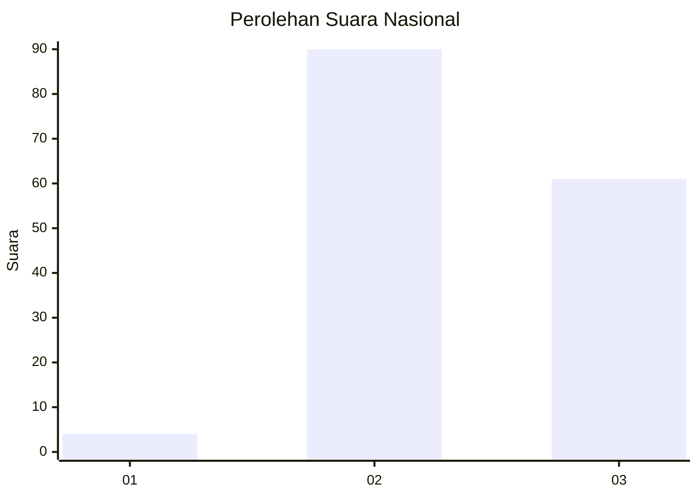
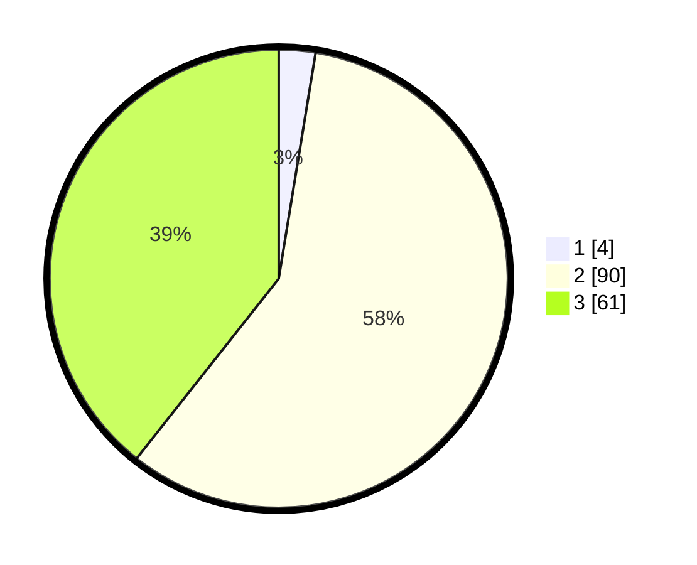

# Hasil

## Grafik

## Tabel

| No. | Nama Paslon    | Suara | Suara (raw) | Persentase |
|:--- |:-------------- | -----:| -----------:| ----------:|
| 1   | ANIES MUHAIMIN | 4     | [4][p-1]    | 2,58       |
| 2   | PRABOWO GIBRAN | 90    | [90][p-2]   | 58,06      |
| 3   | GANJAR MAHFUD  | 61    | [61][p-3]   | 39,35      |

[p-1]: https://github.com/gigit-pemilu/pemilu-2024/blob/main/pilpres/hitung-suara/sub/51-bali/sub/08-buleleng/sub/09-tejakula/sub/2005-bondalem/sub/009-tps/sub/paslon-1.txt
[p-2]: https://github.com/gigit-pemilu/pemilu-2024/blob/main/pilpres/hitung-suara/sub/51-bali/sub/08-buleleng/sub/09-tejakula/sub/2005-bondalem/sub/009-tps/sub/paslon-2.txt
[p-3]: https://github.com/gigit-pemilu/pemilu-2024/blob/main/pilpres/hitung-suara/sub/51-bali/sub/08-buleleng/sub/09-tejakula/sub/2005-bondalem/sub/009-tps/sub/paslon-3.txt

## Foto C Plano

https://sirekap-obj-formc.kpu.go.id/8f78/pemilu/ppwp/51/08/09/20/05/5108092005009-20240214-220824--47bd8fe7-e51b-40c2-bb74-156b8583cbd8.jpg

https://sirekap-obj-formc.kpu.go.id/8f78/pemilu/ppwp/51/08/09/20/05/5108092005009-20240214-221123--7ae71437-c447-4a04-832c-3e17336137d8.jpg

https://sirekap-obj-formc.kpu.go.id/8f78/pemilu/ppwp/51/08/09/20/05/5108092005009-20240214-221337--e621c1ed-21cb-4c01-9068-d617377f3545.jpg

## Metadata

| Key        | Value               |
| ---------- | ------------------- |
| Time Stamp | 2024-02-24 22:31:28 |

