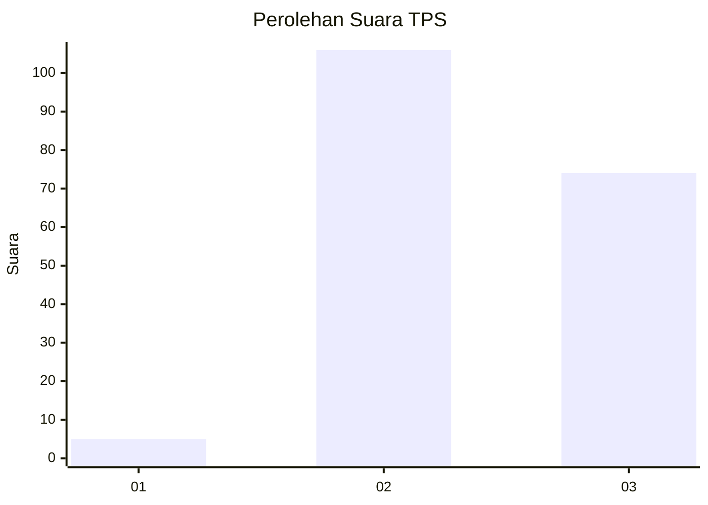
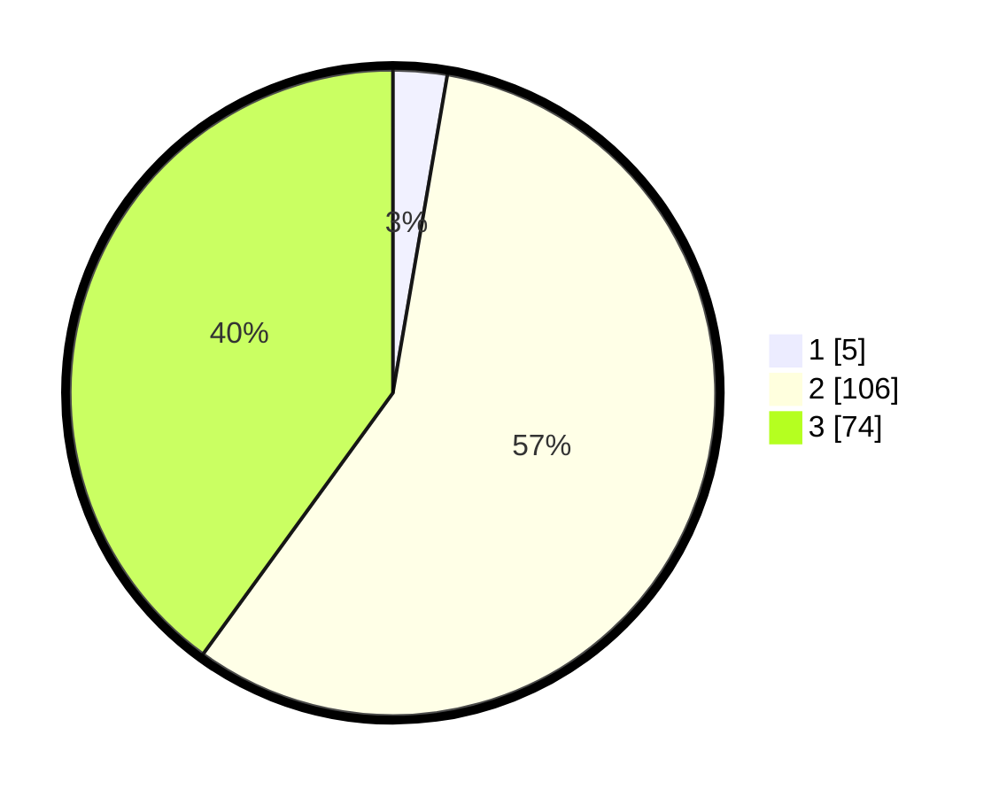

# Hasil

## Grafik

## Tabel

| No. | Nama Paslon    | Suara | Suara (raw) | Persentase |
|:--- |:-------------- | -----:| -----------:| ----------:|
| 1   | ANIES MUHAIMIN | 5     | [5][p-1]    | 2,70       |
| 2   | PRABOWO GIBRAN | 106   | [106][p-2]  | 57,30      |
| 3   | GANJAR MAHFUD  | 74    | [74][p-3]   | 40,00      |

[p-1]: https://github.com/gigit-pemilu/pemilu-2024-51-bali/blob/main/pilpres/hitung-suara/sub/51-bali/sub/08-buleleng/sub/09-tejakula/sub/2005-bondalem/sub/012-tps/sub/paslon-1.txt
[p-2]: https://github.com/gigit-pemilu/pemilu-2024-51-bali/blob/main/pilpres/hitung-suara/sub/51-bali/sub/08-buleleng/sub/09-tejakula/sub/2005-bondalem/sub/012-tps/sub/paslon-2.txt
[p-3]: https://github.com/gigit-pemilu/pemilu-2024-51-bali/blob/main/pilpres/hitung-suara/sub/51-bali/sub/08-buleleng/sub/09-tejakula/sub/2005-bondalem/sub/012-tps/sub/paslon-3.txt

## Foto C Plano

https://sirekap-obj-formc.kpu.go.id/b22f/pemilu/ppwp/51/08/09/20/05/5108092005012-20240214-211052--7fded8b4-8522-46ed-ae76-846d9c4296a2.jpg

https://sirekap-obj-formc.kpu.go.id/b22f/pemilu/ppwp/51/08/09/20/05/5108092005012-20240214-211506--fd38ac92-873c-4ef7-ba36-03bdd68e3c3e.jpg

https://sirekap-obj-formc.kpu.go.id/b22f/pemilu/ppwp/51/08/09/20/05/5108092005012-20240214-211702--bf52cf63-e6c0-40a1-85a3-95cb19b5aa79.jpg

## Metadata

| Key        | Value               |
| ---------- | ------------------- |
| Time Stamp | 2024-02-24 22:31:28 |

