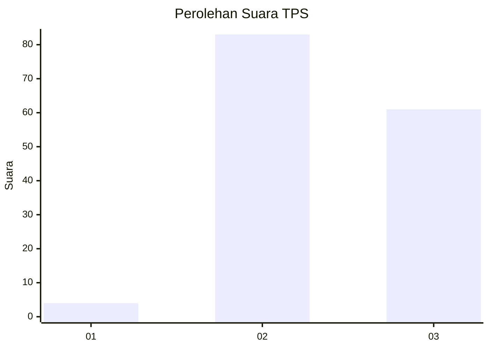
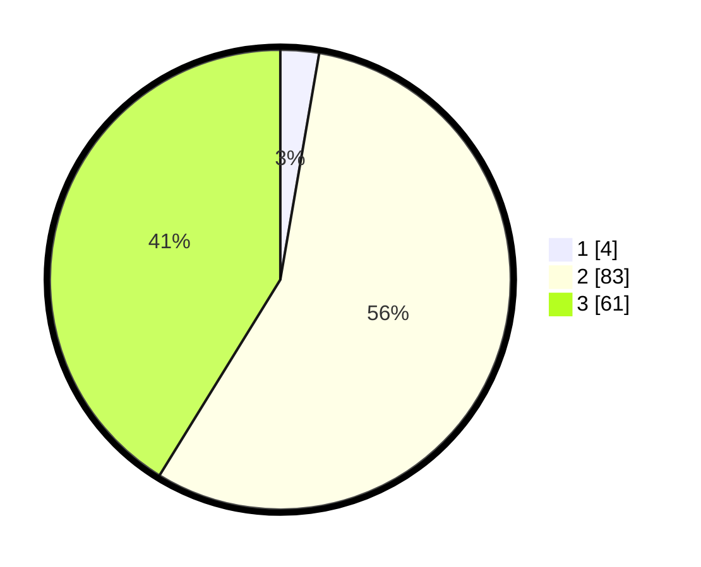

# Hasil

## Grafik

## Tabel

| No. | Nama Paslon    | Suara | Suara (raw) | Persentase |
|:--- |:-------------- | -----:| -----------:| ----------:|
| 1   | ANIES MUHAIMIN | 4     | [4][p-1]    | 2,70       |
| 2   | PRABOWO GIBRAN | 83    | [83][p-2]   | 56,08      |
| 3   | GANJAR MAHFUD  | 61    | [61][p-3]   | 41,22      |

[p-1]: https://github.com/gigit-pemilu/pemilu-2024-51-bali/blob/main/pilpres/hitung-suara/sub/51-bali/sub/08-buleleng/sub/09-tejakula/sub/2005-bondalem/sub/013-tps/sub/paslon-1.txt
[p-2]: https://github.com/gigit-pemilu/pemilu-2024-51-bali/blob/main/pilpres/hitung-suara/sub/51-bali/sub/08-buleleng/sub/09-tejakula/sub/2005-bondalem/sub/013-tps/sub/paslon-2.txt
[p-3]: https://github.com/gigit-pemilu/pemilu-2024-51-bali/blob/main/pilpres/hitung-suara/sub/51-bali/sub/08-buleleng/sub/09-tejakula/sub/2005-bondalem/sub/013-tps/sub/paslon-3.txt

## Foto C Plano

https://sirekap-obj-formc.kpu.go.id/c3fc/pemilu/ppwp/51/08/09/20/05/5108092005013-20240214-220625--16df14b8-67bb-4fc9-8e86-31792d0c70ab.jpg

https://sirekap-obj-formc.kpu.go.id/c3fc/pemilu/ppwp/51/08/09/20/05/5108092005013-20240214-230244--8679a5dd-407a-4fd7-b964-6499db015fc9.jpg

https://sirekap-obj-formc.kpu.go.id/c3fc/pemilu/ppwp/51/08/09/20/05/5108092005013-20240214-230352--6d3ab24c-0285-42eb-89b9-ca5e4e578ec7.jpg

## Metadata

| Key        | Value               |
| ---------- | ------------------- |
| Time Stamp | 2024-02-24 22:31:28 |

