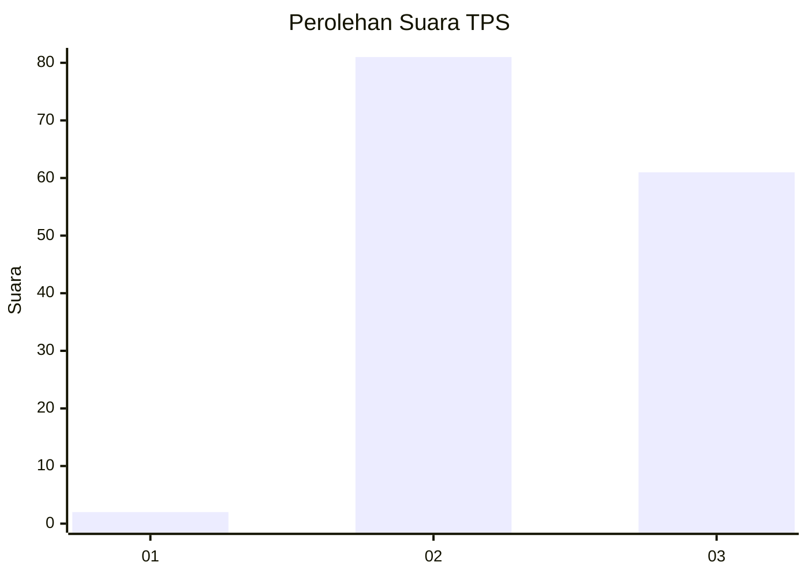
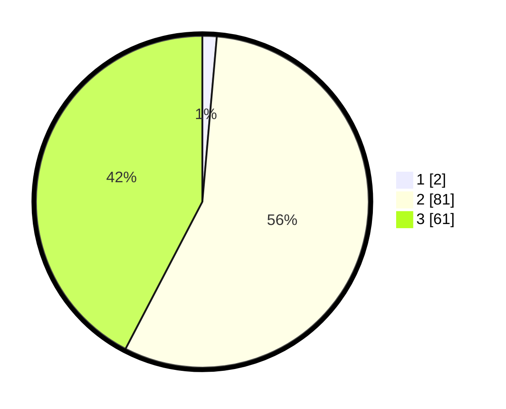

# Hasil

## Grafik

## Tabel

| No. | Nama Paslon    | Suara | Suara (raw) | Persentase |
|:--- |:-------------- | -----:| -----------:| ----------:|
| 1   | ANIES MUHAIMIN | 2     | [2][p-1]    | 1,39       |
| 2   | PRABOWO GIBRAN | 81    | [81][p-2]   | 56,25      |
| 3   | GANJAR MAHFUD  | 61    | [61][p-3]   | 42,36      |

[p-1]: https://github.com/gigit-pemilu/pemilu-2024-51-bali/blob/main/pilpres/hitung-suara/sub/51-bali/sub/08-buleleng/sub/09-tejakula/sub/2005-bondalem/sub/017-tps/sub/paslon-1.txt
[p-2]: https://github.com/gigit-pemilu/pemilu-2024-51-bali/blob/main/pilpres/hitung-suara/sub/51-bali/sub/08-buleleng/sub/09-tejakula/sub/2005-bondalem/sub/017-tps/sub/paslon-2.txt
[p-3]: https://github.com/gigit-pemilu/pemilu-2024-51-bali/blob/main/pilpres/hitung-suara/sub/51-bali/sub/08-buleleng/sub/09-tejakula/sub/2005-bondalem/sub/017-tps/sub/paslon-3.txt

## Foto C Plano

https://sirekap-obj-formc.kpu.go.id/db07/pemilu/ppwp/51/08/09/20/05/5108092005017-20240214-225427--3d21a229-3e8f-4509-ab25-e3819ef181f3.jpg

https://sirekap-obj-formc.kpu.go.id/db07/pemilu/ppwp/51/08/09/20/05/5108092005017-20240214-225512--3bf8ad99-b879-4e92-bf3c-e422fe1684af.jpg

https://sirekap-obj-formc.kpu.go.id/db07/pemilu/ppwp/51/08/09/20/05/5108092005017-20240214-225629--3b1ab4ec-a2b8-4957-8fec-8d979c2b1e00.jpg

## Metadata

| Key        | Value               |
| ---------- | ------------------- |
| Time Stamp | 2024-02-25 16:00:00 |

