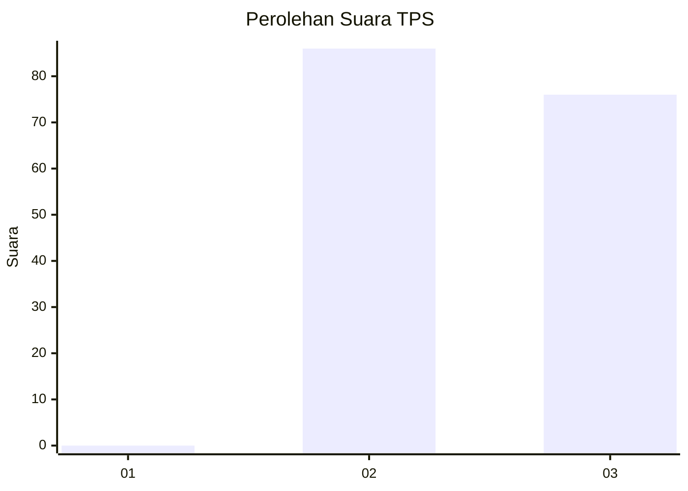
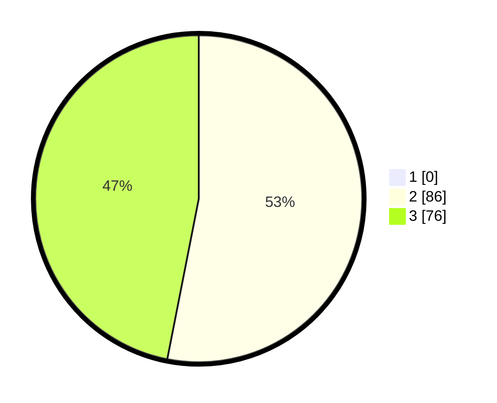

# Hasil

## Grafik

## Tabel

| No. | Nama Paslon    | Suara | Suara (raw) | Persentase |
|:--- |:-------------- | -----:| -----------:| ----------:|
| 1   | ANIES MUHAIMIN | 0     | [0][p-1]    | 0,00       |
| 2   | PRABOWO GIBRAN | 86    | [86][p-2]   | 53,09      |
| 3   | GANJAR MAHFUD  | 76    | [76][p-3]   | 46,91      |

[p-1]: https://github.com/gigit-pemilu/pemilu-2024-51-bali/blob/main/pilpres/hitung-suara/sub/51-bali/sub/08-buleleng/sub/09-tejakula/sub/2005-bondalem/sub/018-tps/sub/paslon-1.txt
[p-2]: https://github.com/gigit-pemilu/pemilu-2024-51-bali/blob/main/pilpres/hitung-suara/sub/51-bali/sub/08-buleleng/sub/09-tejakula/sub/2005-bondalem/sub/018-tps/sub/paslon-2.txt
[p-3]: https://github.com/gigit-pemilu/pemilu-2024-51-bali/blob/main/pilpres/hitung-suara/sub/51-bali/sub/08-buleleng/sub/09-tejakula/sub/2005-bondalem/sub/018-tps/sub/paslon-3.txt

## Foto C Plano

https://sirekap-obj-formc.kpu.go.id/9644/pemilu/ppwp/51/08/09/20/05/5108092005018-20240214-220540--c1e1ac1a-58c4-4f5e-8176-b28071bc2f0e.jpg

https://sirekap-obj-formc.kpu.go.id/9644/pemilu/ppwp/51/08/09/20/05/5108092005018-20240214-220629--95073be1-205a-4976-9e1e-5c5720fcaa55.jpg

https://sirekap-obj-formc.kpu.go.id/9644/pemilu/ppwp/51/08/09/20/05/5108092005018-20240214-220700--da1fa329-4752-41a3-9095-62c17c7452c8.jpg

## Metadata

| Key        | Value               |
| ---------- | ------------------- |
| Time Stamp | 2024-02-25 11:00:00 |

