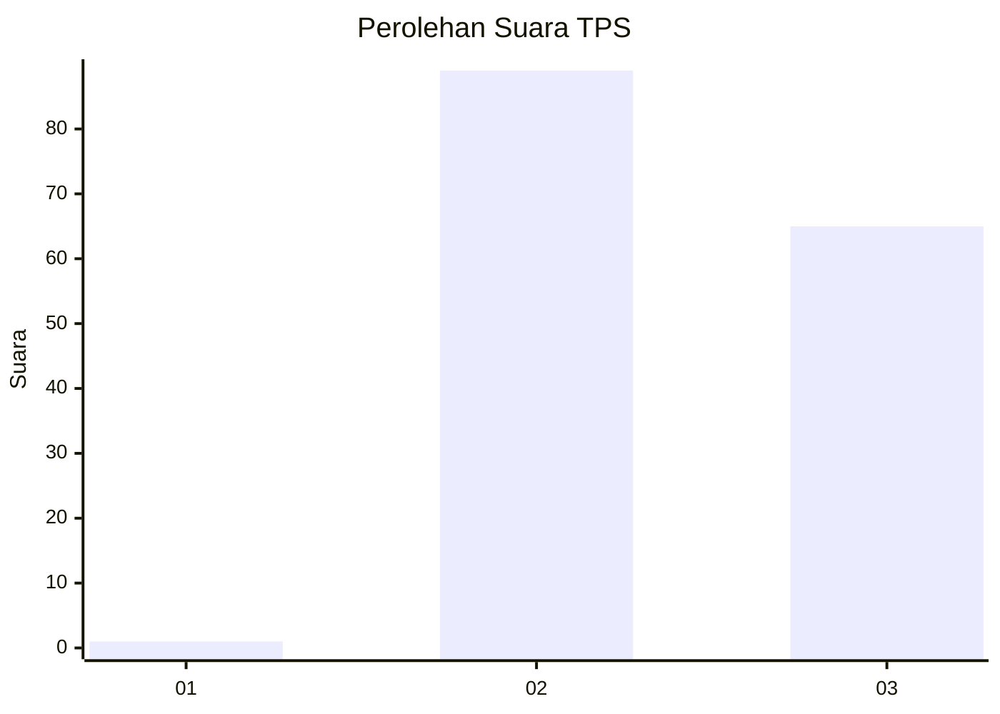
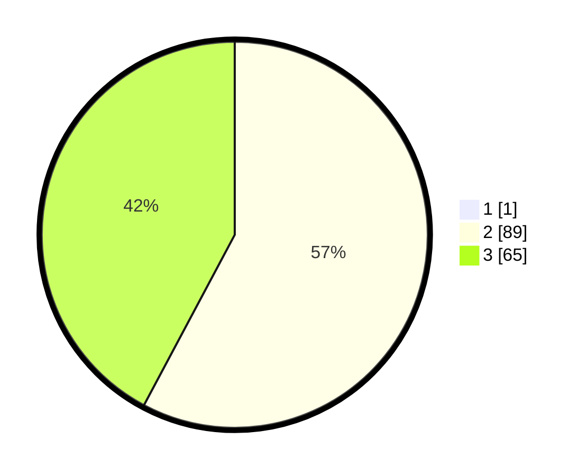

# Hasil

## Grafik

## Tabel

| No. | Nama Paslon    | Suara | Suara (raw) | Persentase |
|:--- |:-------------- | -----:| -----------:| ----------:|
| 1   | ANIES MUHAIMIN | 1     | [1][p-1]    | 0,65       |
| 2   | PRABOWO GIBRAN | 89    | [89][p-2]   | 57,42      |
| 3   | GANJAR MAHFUD  | 65    | [65][p-3]   | 41,94      |

[p-1]: https://github.com/gigit-pemilu/pemilu-2024-51-bali/blob/main/pilpres/hitung-suara/sub/51-bali/sub/08-buleleng/sub/09-tejakula/sub/2005-bondalem/sub/019-tps/sub/paslon-1.txt
[p-2]: https://github.com/gigit-pemilu/pemilu-2024-51-bali/blob/main/pilpres/hitung-suara/sub/51-bali/sub/08-buleleng/sub/09-tejakula/sub/2005-bondalem/sub/019-tps/sub/paslon-2.txt
[p-3]: https://github.com/gigit-pemilu/pemilu-2024-51-bali/blob/main/pilpres/hitung-suara/sub/51-bali/sub/08-buleleng/sub/09-tejakula/sub/2005-bondalem/sub/019-tps/sub/paslon-3.txt

## Foto C Plano

https://sirekap-obj-formc.kpu.go.id/265e/pemilu/ppwp/51/08/09/20/05/5108092005019-20240214-220927--5595d2ec-388d-4212-8ece-8d5a65950b21.jpg

https://sirekap-obj-formc.kpu.go.id/265e/pemilu/ppwp/51/08/09/20/05/5108092005019-20240214-221046--3cb7a462-f262-4f20-8e3c-167257cbbb87.jpg

https://sirekap-obj-formc.kpu.go.id/265e/pemilu/ppwp/51/08/09/20/05/5108092005019-20240214-221203--32942c41-2a93-47dc-84d6-c397a7d6ade0.jpg

## Metadata

| Key        | Value               |
| ---------- | ------------------- |
| Time Stamp | 2024-02-24 22:31:28 |

