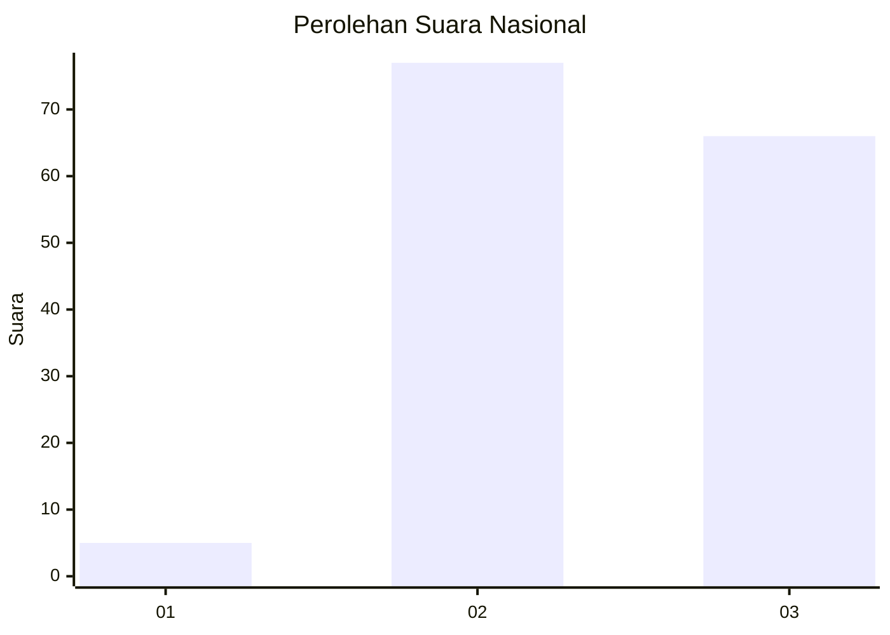
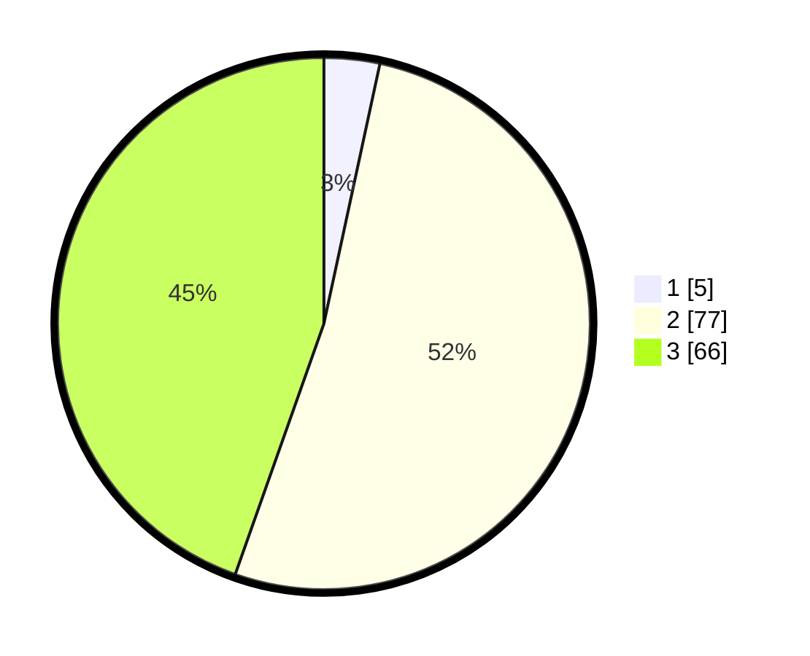

# Hasil

## Grafik

## Tabel

| No. | Nama Paslon    | Suara | Suara (raw) | Persentase |
|:--- |:-------------- | -----:| -----------:| ----------:|
| 1   | ANIES MUHAIMIN | 5     | [5][p-1]    | 3,38       |
| 2   | PRABOWO GIBRAN | 77    | [77][p-2]   | 52,03      |
| 3   | GANJAR MAHFUD  | 66    | [66][p-3]   | 44,59      |

[p-1]: https://github.com/gigit-pemilu/pemilu-2024/blob/main/pilpres/hitung-suara/sub/51-bali/sub/08-buleleng/sub/09-tejakula/sub/2005-bondalem/sub/021-tps/sub/paslon-1.txt
[p-2]: https://github.com/gigit-pemilu/pemilu-2024/blob/main/pilpres/hitung-suara/sub/51-bali/sub/08-buleleng/sub/09-tejakula/sub/2005-bondalem/sub/021-tps/sub/paslon-2.txt
[p-3]: https://github.com/gigit-pemilu/pemilu-2024/blob/main/pilpres/hitung-suara/sub/51-bali/sub/08-buleleng/sub/09-tejakula/sub/2005-bondalem/sub/021-tps/sub/paslon-3.txt

## Foto C Plano

https://sirekap-obj-formc.kpu.go.id/5349/pemilu/ppwp/51/08/09/20/05/5108092005021-20240214-213959--3fee18c0-1221-4154-94d1-7687bcf46f3a.jpg

https://sirekap-obj-formc.kpu.go.id/5349/pemilu/ppwp/51/08/09/20/05/5108092005021-20240214-214105--46a92d7a-3c05-407d-b5a2-07bd46372e6a.jpg

https://sirekap-obj-formc.kpu.go.id/5349/pemilu/ppwp/51/08/09/20/05/5108092005021-20240214-214201--f87ac44d-010a-4cb6-b623-71ee433f3033.jpg

## Metadata

| Key        | Value               |
| ---------- | ------------------- |
| Time Stamp | 2024-02-24 22:31:28 |

