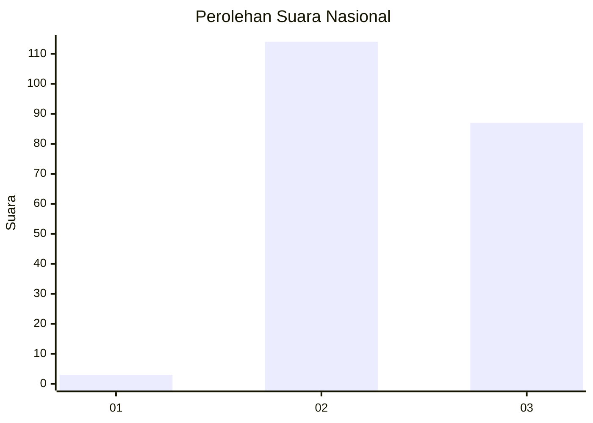
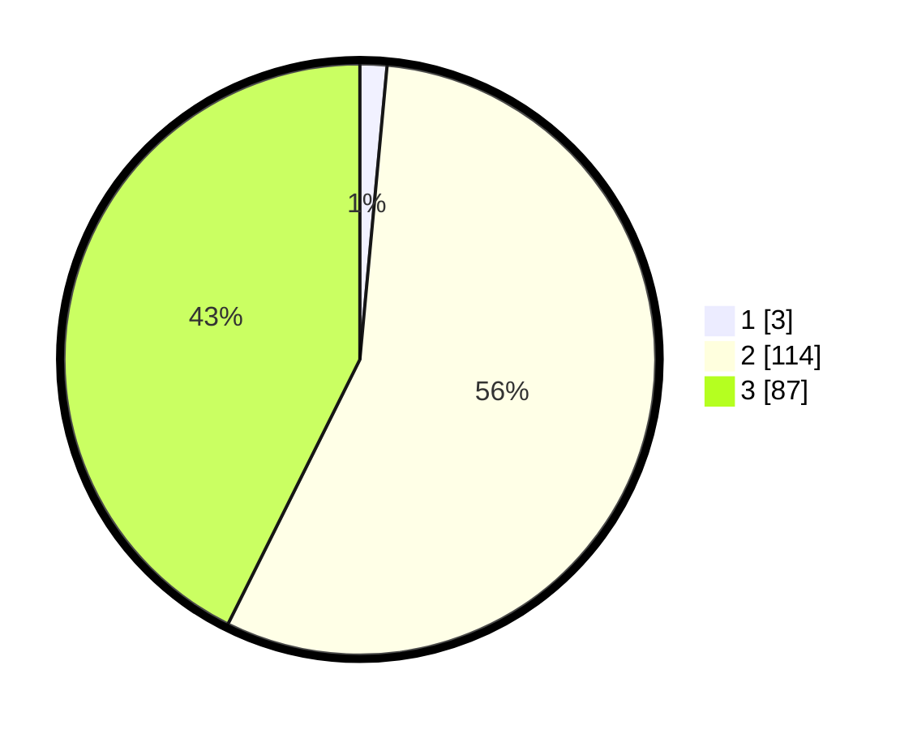

# Hasil

## Grafik

## Tabel

| No. | Nama Paslon    | Suara | Suara (raw) | Persentase |
|:--- |:-------------- | -----:| -----------:| ----------:|
| 1   | ANIES MUHAIMIN | 3     | [3][p-1]    | 1,47       |
| 2   | PRABOWO GIBRAN | 114   | [114][p-2]  | 55,88      |
| 3   | GANJAR MAHFUD  | 87    | [87][p-3]   | 42,65      |

[p-1]: https://github.com/gigit-pemilu/pemilu-2024/blob/main/pilpres/hitung-suara/sub/51-bali/sub/08-buleleng/sub/09-tejakula/sub/2005-bondalem/sub/022-tps/sub/paslon-1.txt
[p-2]: https://github.com/gigit-pemilu/pemilu-2024/blob/main/pilpres/hitung-suara/sub/51-bali/sub/08-buleleng/sub/09-tejakula/sub/2005-bondalem/sub/022-tps/sub/paslon-2.txt
[p-3]: https://github.com/gigit-pemilu/pemilu-2024/blob/main/pilpres/hitung-suara/sub/51-bali/sub/08-buleleng/sub/09-tejakula/sub/2005-bondalem/sub/022-tps/sub/paslon-3.txt

## Foto C Plano

https://sirekap-obj-formc.kpu.go.id/6f6b/pemilu/ppwp/51/08/09/20/05/5108092005022-20240214-232712--3b3f7bda-36be-420b-8d8e-caa576874215.jpg

https://sirekap-obj-formc.kpu.go.id/6f6b/pemilu/ppwp/51/08/09/20/05/5108092005022-20240214-232900--5183627b-cbc0-4cee-ba4e-02641a7c627a.jpg

https://sirekap-obj-formc.kpu.go.id/6f6b/pemilu/ppwp/51/08/09/20/05/5108092005022-20240214-210346--c4487c53-6c0b-4acc-92d9-719e25cc0e02.jpg

## Metadata

| Key        | Value               |
| ---------- | ------------------- |
| Time Stamp | 2024-02-24 22:31:28 |

