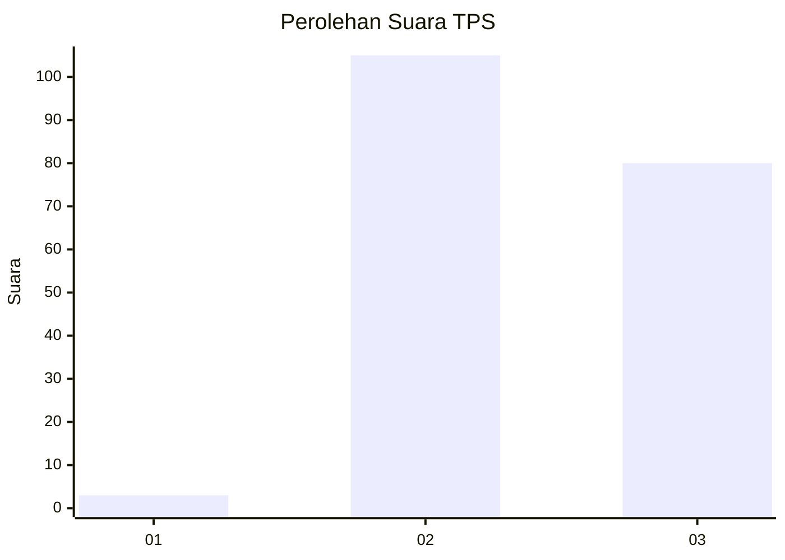
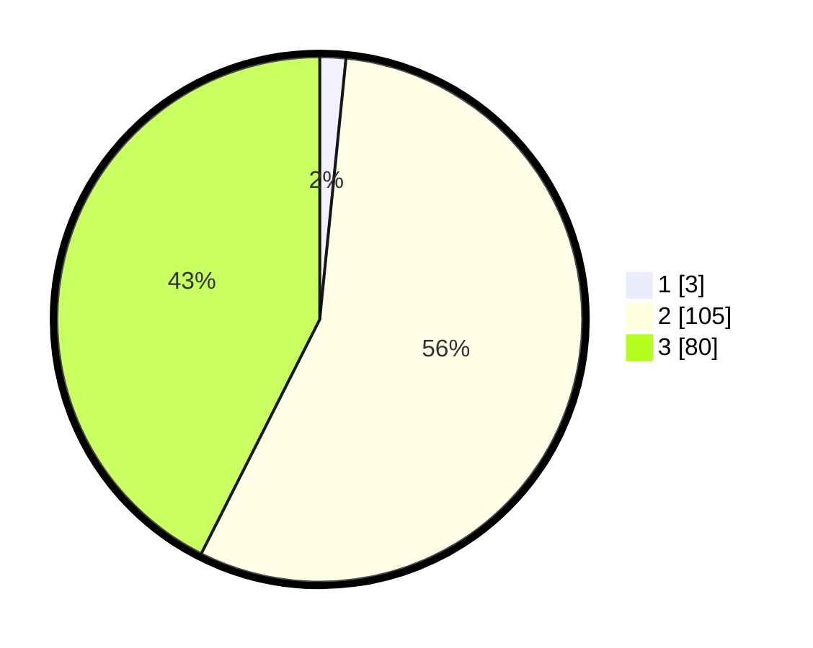

# Hasil

## Grafik

## Tabel

| No. | Nama Paslon    | Suara | Suara (raw) | Persentase |
|:--- |:-------------- | -----:| -----------:| ----------:|
| 1   | ANIES MUHAIMIN | 3     | [3][p-1]    | 1,60       |
| 2   | PRABOWO GIBRAN | 105   | [105][p-2]  | 55,85      |
| 3   | GANJAR MAHFUD  | 80    | [80][p-3]   | 42,55      |

[p-1]: https://github.com/gigit-pemilu/pemilu-2024-51-bali/blob/main/pilpres/hitung-suara/sub/51-bali/sub/08-buleleng/sub/09-tejakula/sub/2005-bondalem/sub/025-tps/sub/paslon-1.txt
[p-2]: https://github.com/gigit-pemilu/pemilu-2024-51-bali/blob/main/pilpres/hitung-suara/sub/51-bali/sub/08-buleleng/sub/09-tejakula/sub/2005-bondalem/sub/025-tps/sub/paslon-2.txt
[p-3]: https://github.com/gigit-pemilu/pemilu-2024-51-bali/blob/main/pilpres/hitung-suara/sub/51-bali/sub/08-buleleng/sub/09-tejakula/sub/2005-bondalem/sub/025-tps/sub/paslon-3.txt

## Foto C Plano

https://sirekap-obj-formc.kpu.go.id/e5e6/pemilu/ppwp/51/08/09/20/05/5108092005025-20240215-004117--9a8d4c40-cdda-4926-b3ed-4e0d018cb71c.jpg

https://sirekap-obj-formc.kpu.go.id/e5e6/pemilu/ppwp/51/08/09/20/05/5108092005025-20240215-004246--c4c11d8d-4084-497d-9c54-c4bed41d814d.jpg

https://sirekap-obj-formc.kpu.go.id/e5e6/pemilu/ppwp/51/08/09/20/05/5108092005025-20240215-004357--c36e4e4c-2964-4d27-a1b8-ee30fccbbb70.jpg

## Metadata

| Key        | Value               |
| ---------- | ------------------- |
| Time Stamp | 2024-02-24 22:31:28 |

