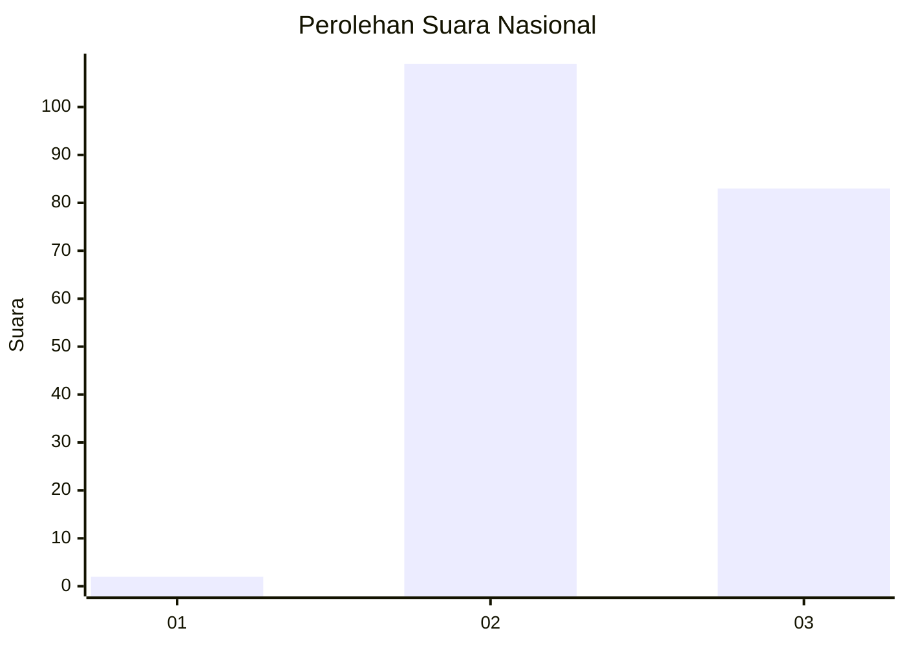
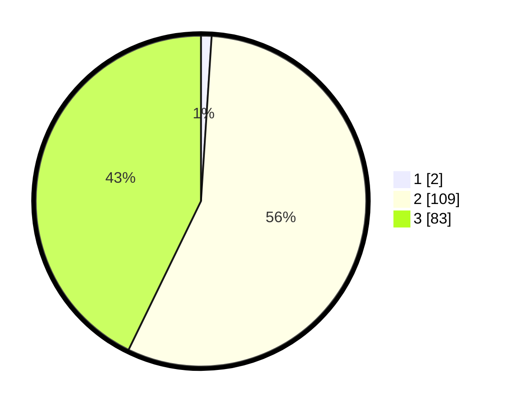

# Hasil

## Grafik

## Tabel

| No. | Nama Paslon    | Suara | Suara (raw) | Persentase |
|:--- |:-------------- | -----:| -----------:| ----------:|
| 1   | ANIES MUHAIMIN | 2     | [2][p-1]    | 1,03       |
| 2   | PRABOWO GIBRAN | 109   | [109][p-2]  | 56,19      |
| 3   | GANJAR MAHFUD  | 83    | [83][p-3]   | 42,78      |

[p-1]: https://github.com/gigit-pemilu/pemilu-2024/blob/main/pilpres/hitung-suara/sub/51-bali/sub/08-buleleng/sub/09-tejakula/sub/2005-bondalem/sub/026-tps/sub/paslon-1.txt
[p-2]: https://github.com/gigit-pemilu/pemilu-2024/blob/main/pilpres/hitung-suara/sub/51-bali/sub/08-buleleng/sub/09-tejakula/sub/2005-bondalem/sub/026-tps/sub/paslon-2.txt
[p-3]: https://github.com/gigit-pemilu/pemilu-2024/blob/main/pilpres/hitung-suara/sub/51-bali/sub/08-buleleng/sub/09-tejakula/sub/2005-bondalem/sub/026-tps/sub/paslon-3.txt

## Foto C Plano

https://sirekap-obj-formc.kpu.go.id/1ee2/pemilu/ppwp/51/08/09/20/05/5108092005026-20240214-232646--a9076031-1b04-42ad-86d1-dffa9bbf94fd.jpg

https://sirekap-obj-formc.kpu.go.id/1ee2/pemilu/ppwp/51/08/09/20/05/5108092005026-20240214-233038--66f38380-7ab9-4bad-b3ce-d1090da21746.jpg

https://sirekap-obj-formc.kpu.go.id/1ee2/pemilu/ppwp/51/08/09/20/05/5108092005026-20240214-233213--0add5313-1cde-4f3e-bcfc-6ec87e494944.jpg

## Metadata

| Key        | Value               |
| ---------- | ------------------- |
| Time Stamp | 2024-02-24 22:31:28 |

