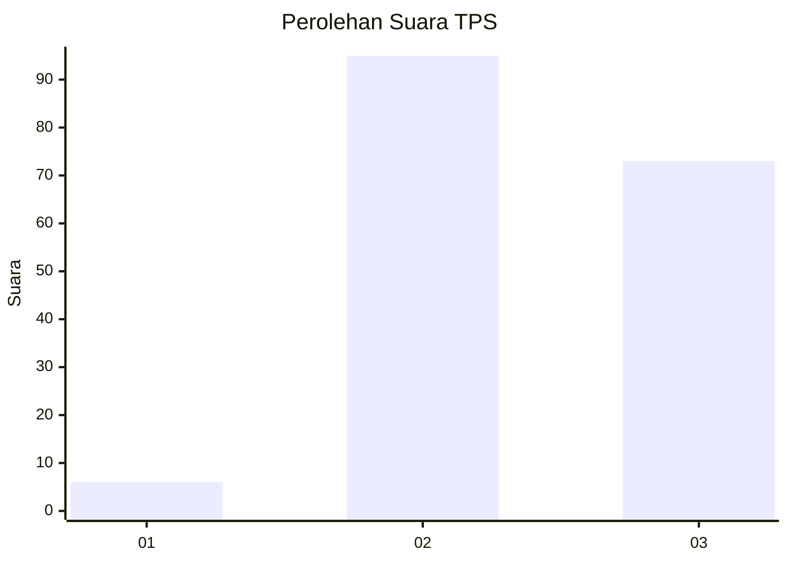
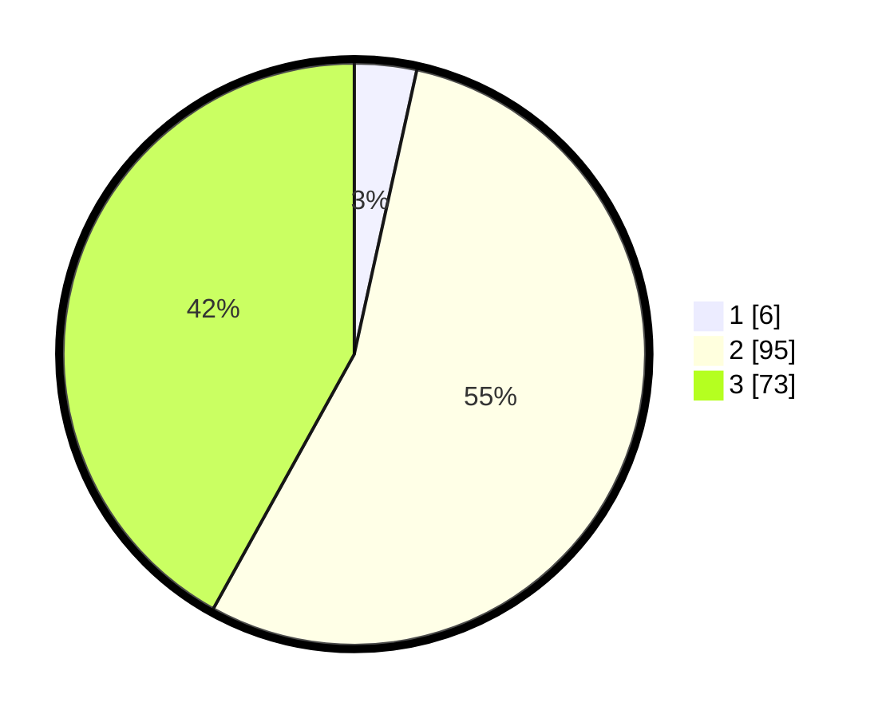

# Hasil

## Grafik

## Tabel

| No. | Nama Paslon    | Suara | Suara (raw) | Persentase |
|:--- |:-------------- | -----:| -----------:| ----------:|
| 1   | ANIES MUHAIMIN | 6     | [6][p-1]    | 3,45       |
| 2   | PRABOWO GIBRAN | 95    | [95][p-2]   | 54,60      |
| 3   | GANJAR MAHFUD  | 73    | [73][p-3]   | 41,95      |

[p-1]: https://github.com/gigit-pemilu/pemilu-2024-51-bali/blob/main/pilpres/hitung-suara/sub/51-bali/sub/08-buleleng/sub/09-tejakula/sub/2005-bondalem/sub/028-tps/sub/paslon-1.txt
[p-2]: https://github.com/gigit-pemilu/pemilu-2024-51-bali/blob/main/pilpres/hitung-suara/sub/51-bali/sub/08-buleleng/sub/09-tejakula/sub/2005-bondalem/sub/028-tps/sub/paslon-2.txt
[p-3]: https://github.com/gigit-pemilu/pemilu-2024-51-bali/blob/main/pilpres/hitung-suara/sub/51-bali/sub/08-buleleng/sub/09-tejakula/sub/2005-bondalem/sub/028-tps/sub/paslon-3.txt

## Foto C Plano

https://sirekap-obj-formc.kpu.go.id/ab84/pemilu/ppwp/51/08/09/20/05/5108092005028-20240214-233014--d1171d07-0315-42a8-a298-bfcb82108fae.jpg

https://sirekap-obj-formc.kpu.go.id/ab84/pemilu/ppwp/51/08/09/20/05/5108092005028-20240214-233123--f3a7f3a0-8419-4e48-95b6-2b36c08a9823.jpg

https://sirekap-obj-formc.kpu.go.id/ab84/pemilu/ppwp/51/08/09/20/05/5108092005028-20240214-233216--f6ab9543-2a8d-48d9-a74e-d7900b671da2.jpg

## Metadata

| Key        | Value               |
| ---------- | ------------------- |
| Time Stamp | 2024-02-24 22:31:28 |

