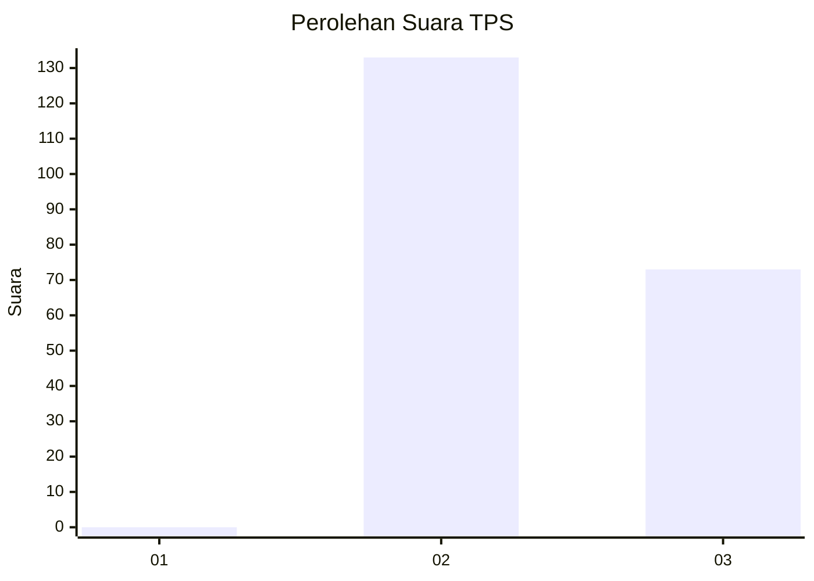
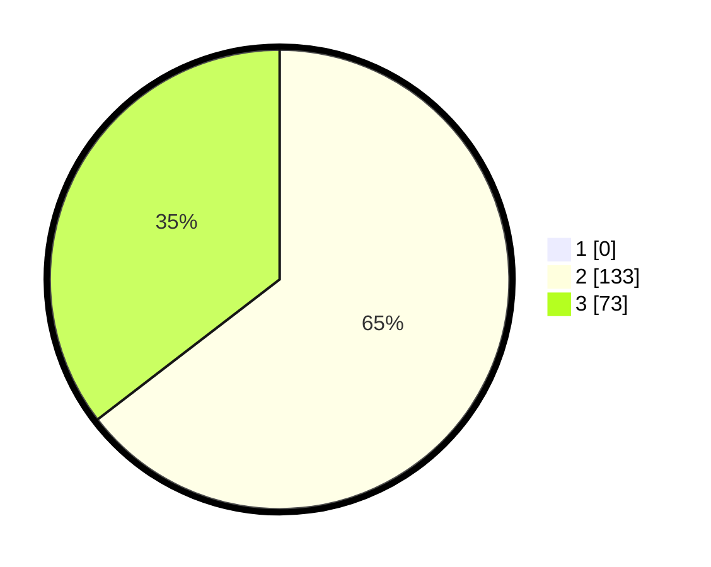

# Hasil

## Grafik

## Tabel

| No. | Nama Paslon    | Suara | Suara (raw) | Persentase |
|:--- |:-------------- | -----:| -----------:| ----------:|
| 1   | ANIES MUHAIMIN | 0     | [0][p-1]    | 0,00       |
| 2   | PRABOWO GIBRAN | 133   | [133][p-2]  | 64,56      |
| 3   | GANJAR MAHFUD  | 73    | [73][p-3]   | 35,44      |

[p-1]: https://github.com/gigit-pemilu/pemilu-2024-51-bali/blob/main/pilpres/hitung-suara/sub/51-bali/sub/08-buleleng/sub/09-tejakula/sub/2005-bondalem/sub/029-tps/sub/paslon-1.txt
[p-2]: https://github.com/gigit-pemilu/pemilu-2024-51-bali/blob/main/pilpres/hitung-suara/sub/51-bali/sub/08-buleleng/sub/09-tejakula/sub/2005-bondalem/sub/029-tps/sub/paslon-2.txt
[p-3]: https://github.com/gigit-pemilu/pemilu-2024-51-bali/blob/main/pilpres/hitung-suara/sub/51-bali/sub/08-buleleng/sub/09-tejakula/sub/2005-bondalem/sub/029-tps/sub/paslon-3.txt

## Foto C Plano

https://sirekap-obj-formc.kpu.go.id/a175/pemilu/ppwp/51/08/09/20/05/5108092005029-20240214-221559--1e924b4b-14aa-49da-a1c9-0096766ee2be.jpg

https://sirekap-obj-formc.kpu.go.id/a175/pemilu/ppwp/51/08/09/20/05/5108092005029-20240214-221726--6e513923-701b-4030-90c0-898c94fcc905.jpg

https://sirekap-obj-formc.kpu.go.id/a175/pemilu/ppwp/51/08/09/20/05/5108092005029-20240214-221831--629940d5-0caf-4d71-bf28-151237ab413f.jpg

## Metadata

| Key        | Value               |
| ---------- | ------------------- |
| Time Stamp | 2024-02-24 22:31:28 |

