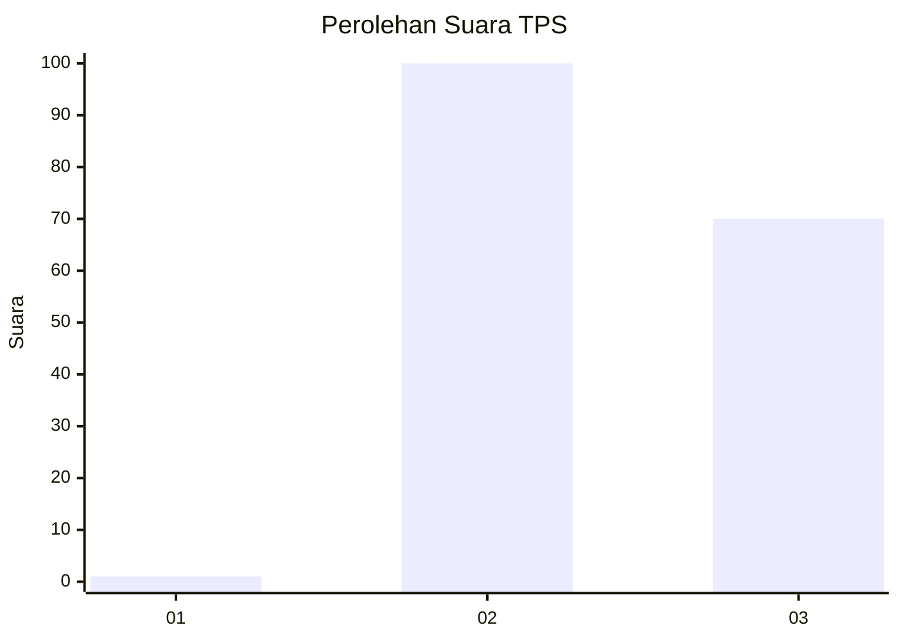
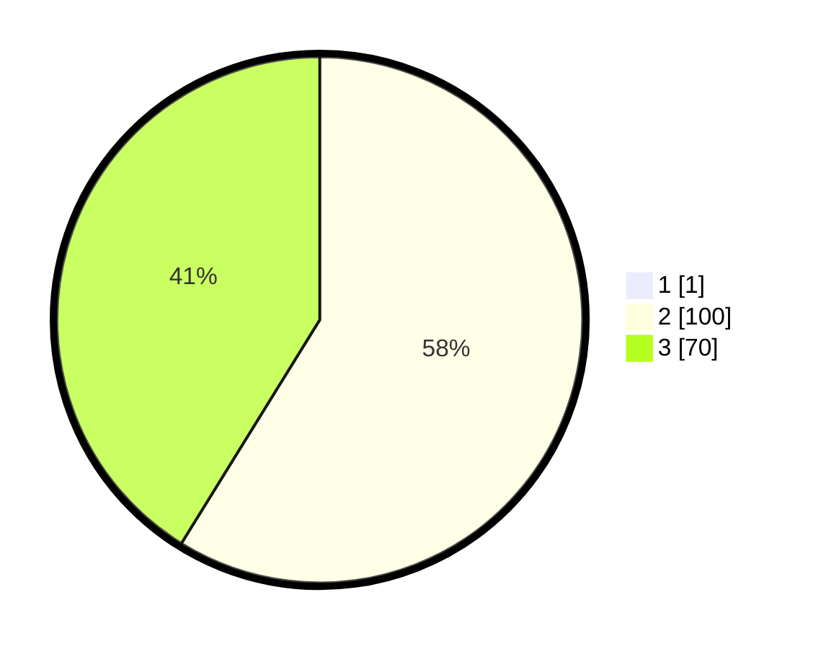

# Hasil

## Grafik

## Tabel

| No. | Nama Paslon    | Suara | Suara (raw) | Persentase |
|:--- |:-------------- | -----:| -----------:| ----------:|
| 1   | ANIES MUHAIMIN | 1     | [1][p-1]    | 0,58       |
| 2   | PRABOWO GIBRAN | 100   | [100][p-2]  | 58,48      |
| 3   | GANJAR MAHFUD  | 70    | [70][p-3]   | 40,94      |

[p-1]: https://github.com/gigit-pemilu/pemilu-2024-51-bali/blob/main/pilpres/hitung-suara/sub/51-bali/sub/08-buleleng/sub/09-tejakula/sub/2005-bondalem/sub/030-tps/sub/paslon-1.txt
[p-2]: https://github.com/gigit-pemilu/pemilu-2024-51-bali/blob/main/pilpres/hitung-suara/sub/51-bali/sub/08-buleleng/sub/09-tejakula/sub/2005-bondalem/sub/030-tps/sub/paslon-2.txt
[p-3]: https://github.com/gigit-pemilu/pemilu-2024-51-bali/blob/main/pilpres/hitung-suara/sub/51-bali/sub/08-buleleng/sub/09-tejakula/sub/2005-bondalem/sub/030-tps/sub/paslon-3.txt

## Foto C Plano

https://sirekap-obj-formc.kpu.go.id/8033/pemilu/ppwp/51/08/09/20/05/5108092005030-20240214-222801--2f111bcb-a6a8-4409-86a8-452330c64871.jpg

https://sirekap-obj-formc.kpu.go.id/8033/pemilu/ppwp/51/08/09/20/05/5108092005030-20240214-222915--653adbd5-b1d5-4bed-a5e3-220d68815eaf.jpg

https://sirekap-obj-formc.kpu.go.id/8033/pemilu/ppwp/51/08/09/20/05/5108092005030-20240214-223010--68b6d62a-2255-4212-8210-4322926aed36.jpg

## Metadata

| Key        | Value               |
| ---------- | ------------------- |
| Time Stamp | 2024-02-24 22:31:28 |

