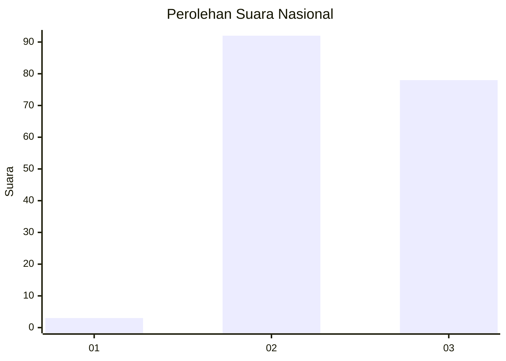
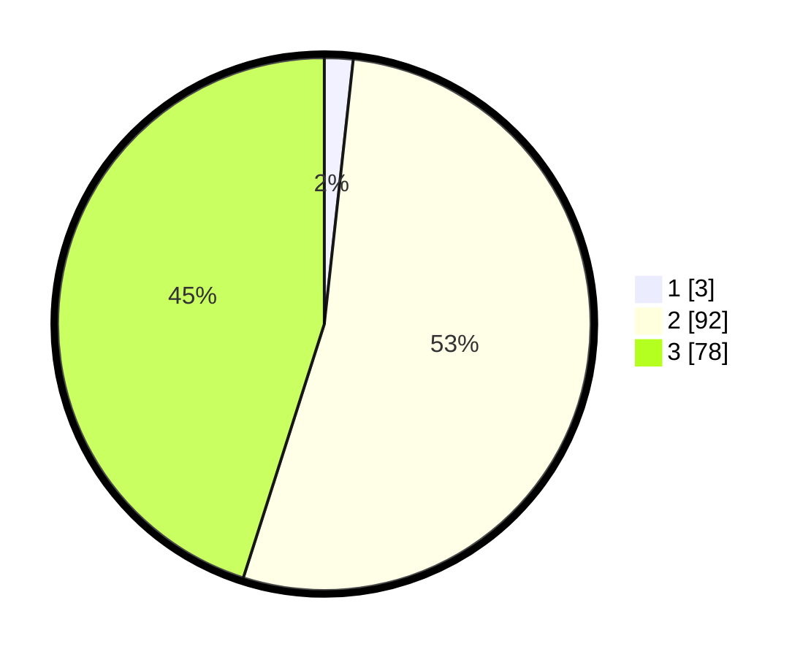

# Hasil

## Grafik

## Tabel

| No. | Nama Paslon    | Suara | Suara (raw) | Persentase |
|:--- |:-------------- | -----:| -----------:| ----------:|
| 1   | ANIES MUHAIMIN | 3     | [3][p-1]    | 1,73       |
| 2   | PRABOWO GIBRAN | 92    | [92][p-2]   | 53,18      |
| 3   | GANJAR MAHFUD  | 78    | [78][p-3]   | 45,09      |

[p-1]: https://github.com/gigit-pemilu/pemilu-2024/blob/main/pilpres/hitung-suara/sub/51-bali/sub/08-buleleng/sub/09-tejakula/sub/2005-bondalem/sub/031-tps/sub/paslon-1.txt
[p-2]: https://github.com/gigit-pemilu/pemilu-2024/blob/main/pilpres/hitung-suara/sub/51-bali/sub/08-buleleng/sub/09-tejakula/sub/2005-bondalem/sub/031-tps/sub/paslon-2.txt
[p-3]: https://github.com/gigit-pemilu/pemilu-2024/blob/main/pilpres/hitung-suara/sub/51-bali/sub/08-buleleng/sub/09-tejakula/sub/2005-bondalem/sub/031-tps/sub/paslon-3.txt

## Foto C Plano

https://sirekap-obj-formc.kpu.go.id/0314/pemilu/ppwp/51/08/09/20/05/5108092005031-20240214-225431--96b741bd-9181-49a3-9bc8-24e616487fd2.jpg

https://sirekap-obj-formc.kpu.go.id/0314/pemilu/ppwp/51/08/09/20/05/5108092005031-20240214-225441--55a80ae7-d8a0-4288-94ba-a35ec1d723bc.jpg

https://sirekap-obj-formc.kpu.go.id/0314/pemilu/ppwp/51/08/09/20/05/5108092005031-20240214-225541--53c870b2-eba4-4ac9-826d-3daf45786ffd.jpg

## Metadata

| Key        | Value               |
| ---------- | ------------------- |
| Time Stamp | 2024-02-24 22:31:28 |

