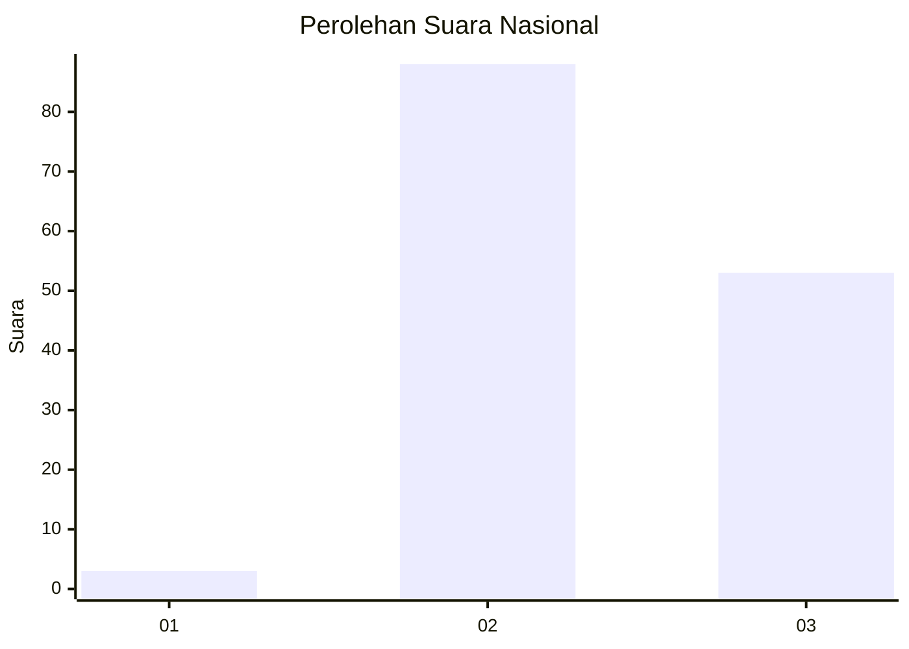
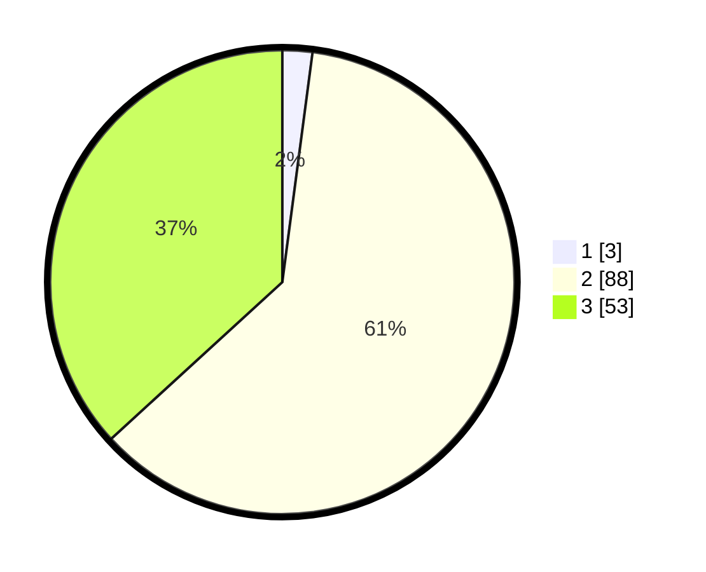

# Hasil

## Grafik

## Tabel

| No. | Nama Paslon    | Suara | Suara (raw) | Persentase |
|:--- |:-------------- | -----:| -----------:| ----------:|
| 1   | ANIES MUHAIMIN | 3     | [3][p-1]    | 2,08       |
| 2   | PRABOWO GIBRAN | 88    | [88][p-2]   | 61,11      |
| 3   | GANJAR MAHFUD  | 53    | [53][p-3]   | 36,81      |

[p-1]: https://github.com/gigit-pemilu/pemilu-2024/blob/main/pilpres/hitung-suara/sub/51-bali/sub/08-buleleng/sub/09-tejakula/sub/2005-bondalem/sub/035-tps/sub/paslon-1.txt
[p-2]: https://github.com/gigit-pemilu/pemilu-2024/blob/main/pilpres/hitung-suara/sub/51-bali/sub/08-buleleng/sub/09-tejakula/sub/2005-bondalem/sub/035-tps/sub/paslon-2.txt
[p-3]: https://github.com/gigit-pemilu/pemilu-2024/blob/main/pilpres/hitung-suara/sub/51-bali/sub/08-buleleng/sub/09-tejakula/sub/2005-bondalem/sub/035-tps/sub/paslon-3.txt

## Foto C Plano

https://sirekap-obj-formc.kpu.go.id/c5cc/pemilu/ppwp/51/08/09/20/05/5108092005035-20240214-201801--6c0b8b49-6814-47a9-99e2-1e660bf465cb.jpg

https://sirekap-obj-formc.kpu.go.id/c5cc/pemilu/ppwp/51/08/09/20/05/5108092005035-20240214-201911--3c69d833-6dcb-43ea-a960-67d2eb4e60c6.jpg

https://sirekap-obj-formc.kpu.go.id/c5cc/pemilu/ppwp/51/08/09/20/05/5108092005035-20240214-202007--21bd0539-3a64-4ef3-9008-e386d4cf8df9.jpg

## Metadata

| Key        | Value               |
| ---------- | ------------------- |
| Time Stamp | 2024-02-24 22:31:28 |

