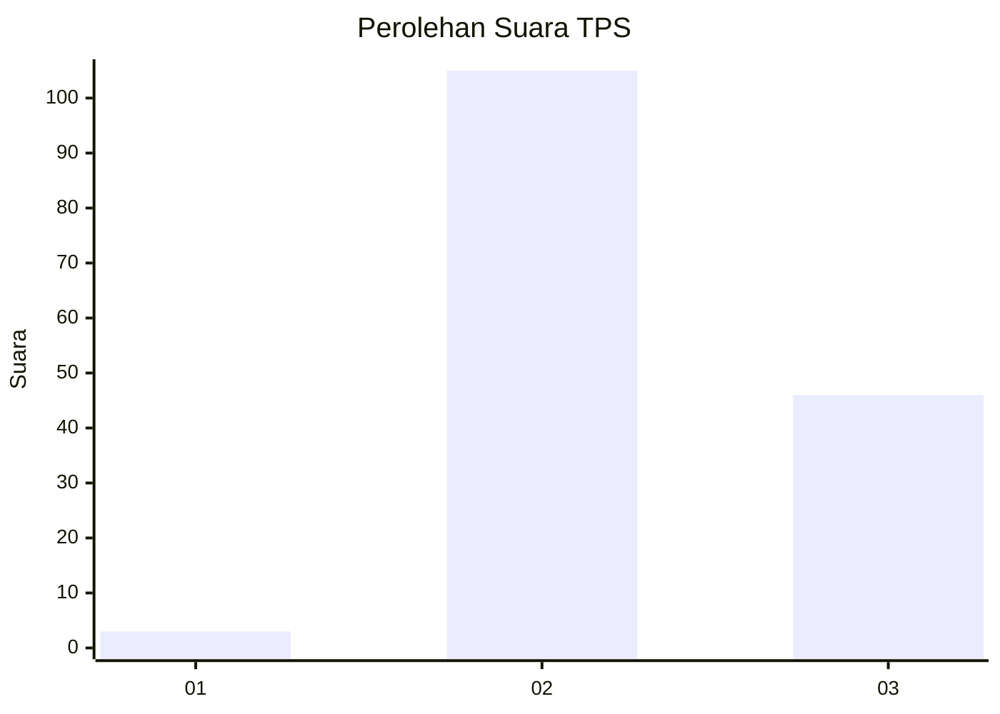

# Hasil

## Grafik

## Tabel

| No. | Nama Paslon    | Suara | Suara (raw) | Persentase |
|:--- |:-------------- | -----:| -----------:| ----------:|
| 1   | ANIES MUHAIMIN | 3     | [3][p-1]    | 1,95       |
| 2   | PRABOWO GIBRAN | 105   | [105][p-2]  | 68,18      |
| 3   | GANJAR MAHFUD  | 46    | [46][p-3]   | 29,87      |

[p-1]: https://github.com/gigit-pemilu/pemilu-2024-51-bali/blob/main/pilpres/hitung-suara/sub/51-bali/sub/08-buleleng/sub/09-tejakula/sub/2005-bondalem/sub/039-tps/sub/paslon-1.txt
[p-2]: https://github.com/gigit-pemilu/pemilu-2024-51-bali/blob/main/pilpres/hitung-suara/sub/51-bali/sub/08-buleleng/sub/09-tejakula/sub/2005-bondalem/sub/039-tps/sub/paslon-2.txt
[p-3]: https://github.com/gigit-pemilu/pemilu-2024-51-bali/blob/main/pilpres/hitung-suara/sub/51-bali/sub/08-buleleng/sub/09-tejakula/sub/2005-bondalem/sub/039-tps/sub/paslon-3.txt

## Foto C Plano

https://sirekap-obj-formc.kpu.go.id/3b5c/pemilu/ppwp/51/08/09/20/05/5108092005039-20240214-210118--5836824c-bffa-474e-8c48-a2e259bf5da0.jpg

https://sirekap-obj-formc.kpu.go.id/3b5c/pemilu/ppwp/51/08/09/20/05/5108092005039-20240214-210258--04619dbd-cfb9-4def-bcbe-b4e2cbfad5e2.jpg

https://sirekap-obj-formc.kpu.go.id/3b5c/pemilu/ppwp/51/08/09/20/05/5108092005039-20240214-210356--321c88bc-86f8-4183-bf96-0863d04be524.jpg

## Metadata

| Key        | Value               |
| ---------- | ------------------- |
| Time Stamp | 2024-02-24 22:31:28 |

