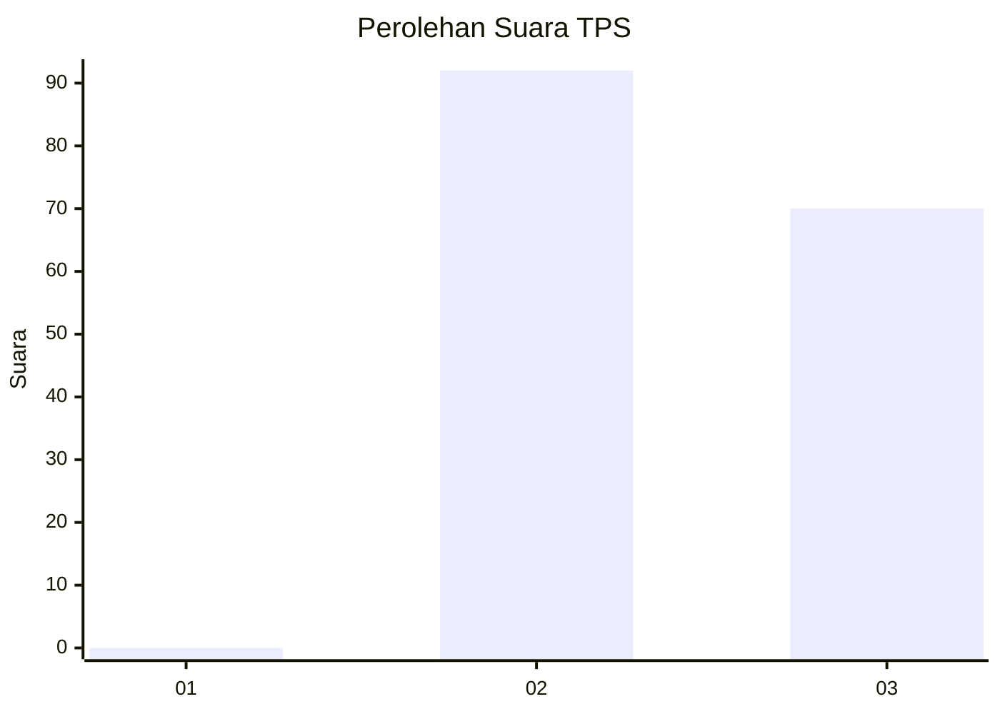
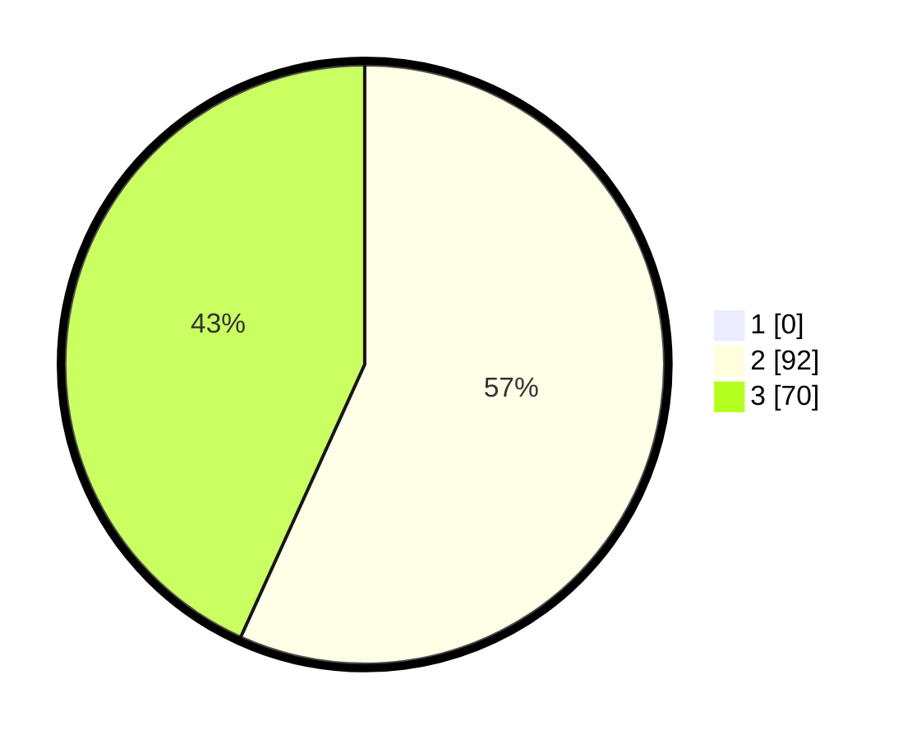

# Hasil

## Grafik

## Tabel

| No. | Nama Paslon    | Suara | Suara (raw) | Persentase |
|:--- |:-------------- | -----:| -----------:| ----------:|
| 1   | ANIES MUHAIMIN | 0     | [0][p-1]    | 0,00       |
| 2   | PRABOWO GIBRAN | 92    | [92][p-2]   | 56,79      |
| 3   | GANJAR MAHFUD  | 70    | [70][p-3]   | 43,21      |

[p-1]: https://github.com/gigit-pemilu/pemilu-2024-51-bali/blob/main/pilpres/hitung-suara/sub/51-bali/sub/08-buleleng/sub/09-tejakula/sub/2005-bondalem/sub/040-tps/sub/paslon-1.txt
[p-2]: https://github.com/gigit-pemilu/pemilu-2024-51-bali/blob/main/pilpres/hitung-suara/sub/51-bali/sub/08-buleleng/sub/09-tejakula/sub/2005-bondalem/sub/040-tps/sub/paslon-2.txt
[p-3]: https://github.com/gigit-pemilu/pemilu-2024-51-bali/blob/main/pilpres/hitung-suara/sub/51-bali/sub/08-buleleng/sub/09-tejakula/sub/2005-bondalem/sub/040-tps/sub/paslon-3.txt

## Foto C Plano

https://sirekap-obj-formc.kpu.go.id/a812/pemilu/ppwp/51/08/09/20/05/5108092005040-20240214-203439--24c72df6-a402-4cc8-b802-fc53632dc96e.jpg

https://sirekap-obj-formc.kpu.go.id/a812/pemilu/ppwp/51/08/09/20/05/5108092005040-20240214-203551--3cdf83fe-dd7f-4324-93f5-8b867bf5a715.jpg

https://sirekap-obj-formc.kpu.go.id/a812/pemilu/ppwp/51/08/09/20/05/5108092005040-20240214-203702--f764c438-ae7a-45ad-bbdc-46516bddfc2b.jpg

## Metadata

| Key        | Value               |
| ---------- | ------------------- |
| Time Stamp | 2024-02-15 19:00:26 |

