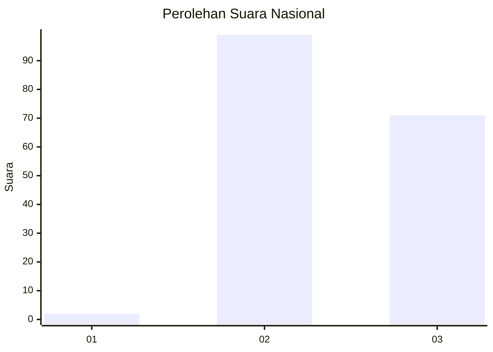
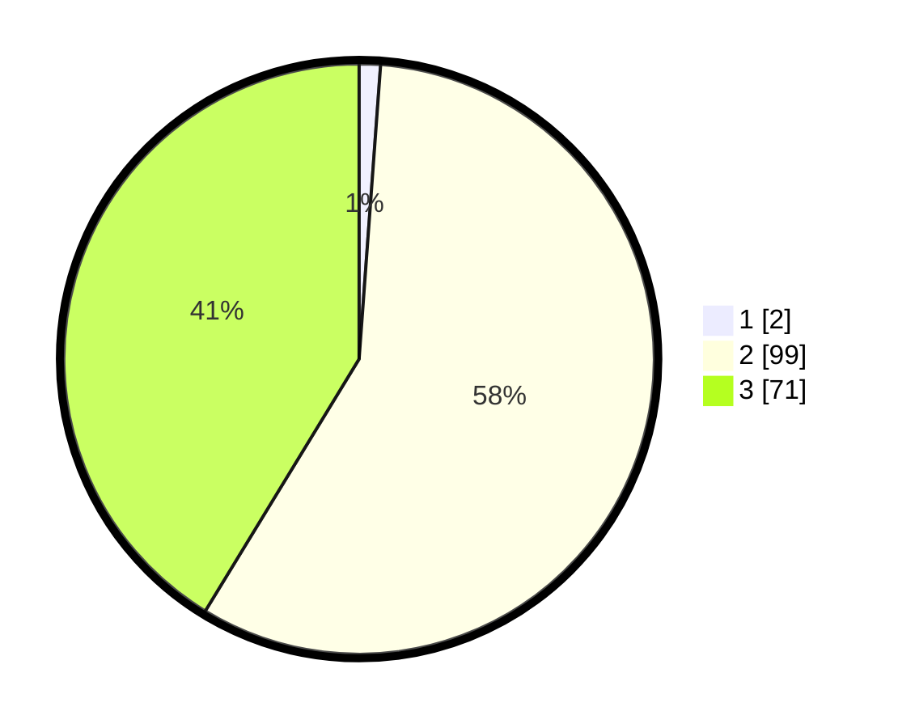

# Hasil

## Grafik

## Tabel

| No. | Nama Paslon    | Suara | Suara (raw) | Persentase |
|:--- |:-------------- | -----:| -----------:| ----------:|
| 1   | ANIES MUHAIMIN | 2     | [2][p-1]    | 1,16       |
| 2   | PRABOWO GIBRAN | 99    | [99][p-2]   | 57,56      |
| 3   | GANJAR MAHFUD  | 71    | [71][p-3]   | 41,28      |

[p-1]: https://github.com/gigit-pemilu/pemilu-2024/blob/main/pilpres/hitung-suara/sub/51-bali/sub/08-buleleng/sub/09-tejakula/sub/2005-bondalem/sub/041-tps/sub/paslon-1.txt
[p-2]: https://github.com/gigit-pemilu/pemilu-2024/blob/main/pilpres/hitung-suara/sub/51-bali/sub/08-buleleng/sub/09-tejakula/sub/2005-bondalem/sub/041-tps/sub/paslon-2.txt
[p-3]: https://github.com/gigit-pemilu/pemilu-2024/blob/main/pilpres/hitung-suara/sub/51-bali/sub/08-buleleng/sub/09-tejakula/sub/2005-bondalem/sub/041-tps/sub/paslon-3.txt

## Foto C Plano

https://sirekap-obj-formc.kpu.go.id/0034/pemilu/ppwp/51/08/09/20/05/5108092005041-20240214-221149--6ca0a42a-0d11-4318-ab67-328806c03c07.jpg

https://sirekap-obj-formc.kpu.go.id/0034/pemilu/ppwp/51/08/09/20/05/5108092005041-20240214-221205--457660c3-9419-45b3-bcb9-fe4ba0da09ad.jpg

https://sirekap-obj-formc.kpu.go.id/0034/pemilu/ppwp/51/08/09/20/05/5108092005041-20240214-221224--664349ad-4eca-4d8d-8c9e-2418be8ede63.jpg

## Metadata

| Key        | Value               |
| ---------- | ------------------- |
| Time Stamp | 2024-02-15 09:00:24 |

