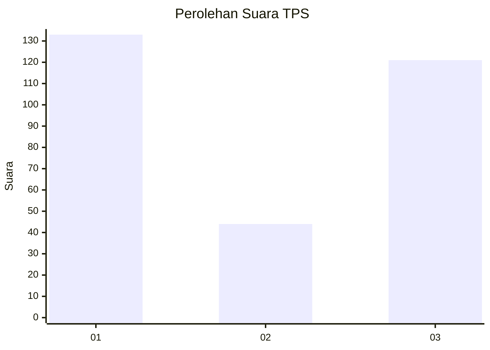
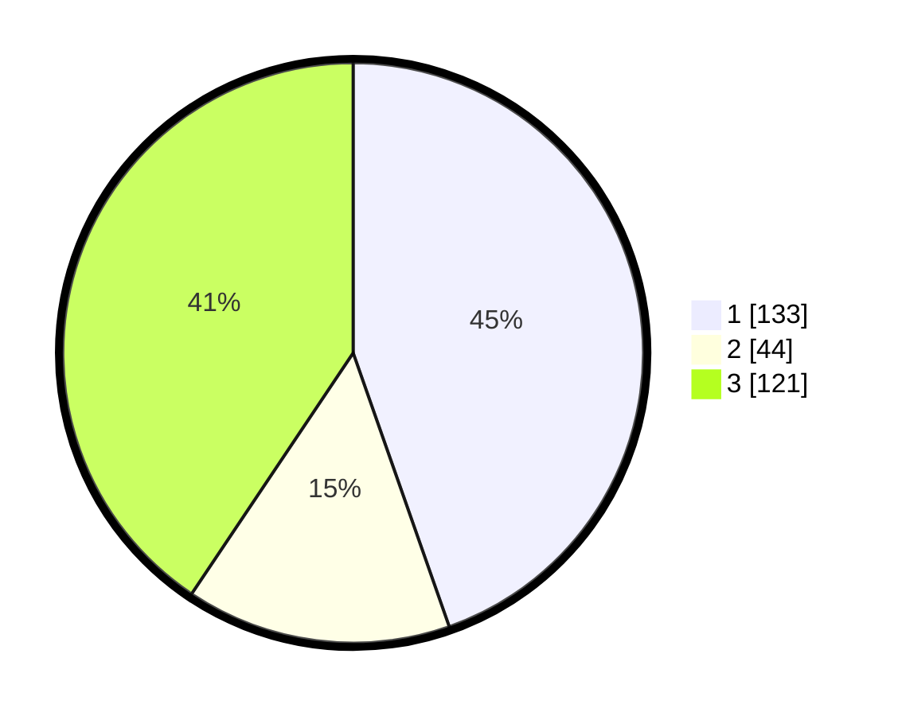

# Hasil

## Grafik

## Tabel

| No. | Nama Paslon    | Suara | Suara (raw) | Persentase |
|:--- |:-------------- | -----:| -----------:| ----------:|
| 1   | ANIES MUHAIMIN | 133   | [133][p-1]  | 44,63      |
| 2   | PRABOWO GIBRAN | 44    | [44][p-2]   | 14,77      |
| 3   | GANJAR MAHFUD  | 121   | [121][p-3]  | 40,60      |

[p-1]: https://github.com/gigit-pemilu/pemilu-2024-51-bali/blob/main/pilpres/hitung-suara/sub/51-bali/sub/08-buleleng/sub/09-tejakula/sub/2006-tejakula/sub/006-tps/sub/paslon-1.txt
[p-2]: https://github.com/gigit-pemilu/pemilu-2024-51-bali/blob/main/pilpres/hitung-suara/sub/51-bali/sub/08-buleleng/sub/09-tejakula/sub/2006-tejakula/sub/006-tps/sub/paslon-2.txt
[p-3]: https://github.com/gigit-pemilu/pemilu-2024-51-bali/blob/main/pilpres/hitung-suara/sub/51-bali/sub/08-buleleng/sub/09-tejakula/sub/2006-tejakula/sub/006-tps/sub/paslon-3.txt

## Foto C Plano

https://sirekap-obj-formc.kpu.go.id/598e/pemilu/ppwp/51/08/09/20/06/5108092006006-20240214-200233--e76f247c-f11c-4dfc-b963-b8ba92254ce2.jpg

https://sirekap-obj-formc.kpu.go.id/598e/pemilu/ppwp/51/08/09/20/06/5108092006006-20240214-195742--a91d11ca-057b-4ece-9e1b-2f201d12cdf3.jpg

https://sirekap-obj-formc.kpu.go.id/598e/pemilu/ppwp/51/08/09/20/06/5108092006006-20240214-195810--ce6f261a-e7d6-429b-9444-82b5fa5d39cd.jpg

## Metadata

| Key        | Value               |
| ---------- | ------------------- |
| Time Stamp | 2024-02-14 21:46:01 |

## DATA PEMILIH TETAP

Jumlah pemilih dalam DPT: **230**.
 * L: **117**.
 * P: **113**.

## DATA PENGGUNA HAK PILIH

Jumlah pengguna hak pilih dalam DPT: **158**.
 * L: **83**.
 * P: **75**.

Jumlah pengguna hak pilih dalam DPTb: **13**.
 * L: **8**.
 * P: **5**.

Jumlah pengguna hak pilih dalam DPK: **1**.
 * L: **0**.
 * P: **1**.

Jumlah pengguna hak pilih: **172**.
 * L: **91**.
 * P: **81**.

## JUMLAH SUARA SAH DAN TIDAK SAH

JUMLAH SELURUH SUARA SAH: **166**.

JUMLAH SUARA TIDAK SAH: **6**.

JUMLAH SELURUH SUARA SAH DAN SUARA TIDAK SAH: **172**.

