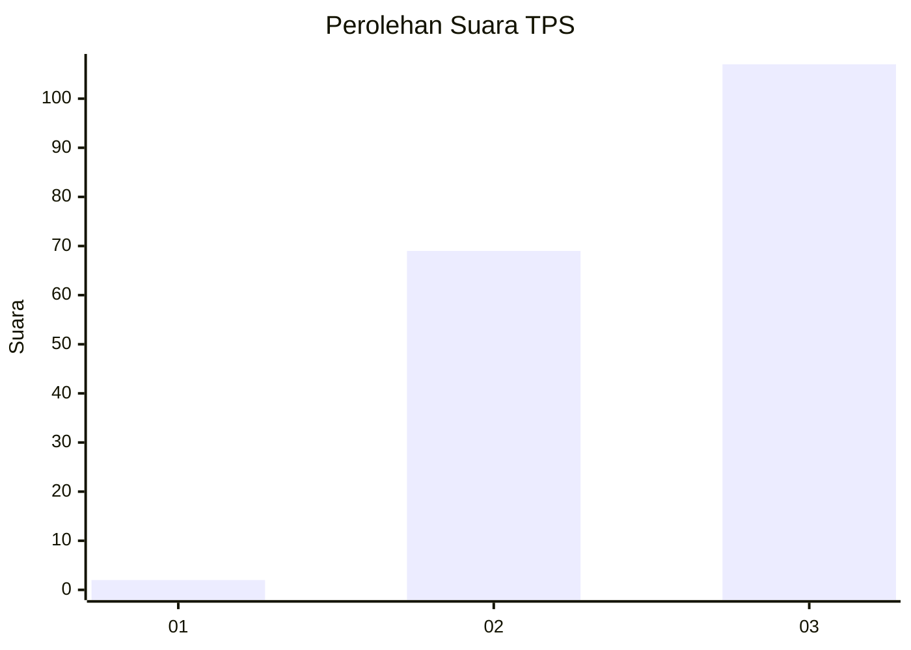
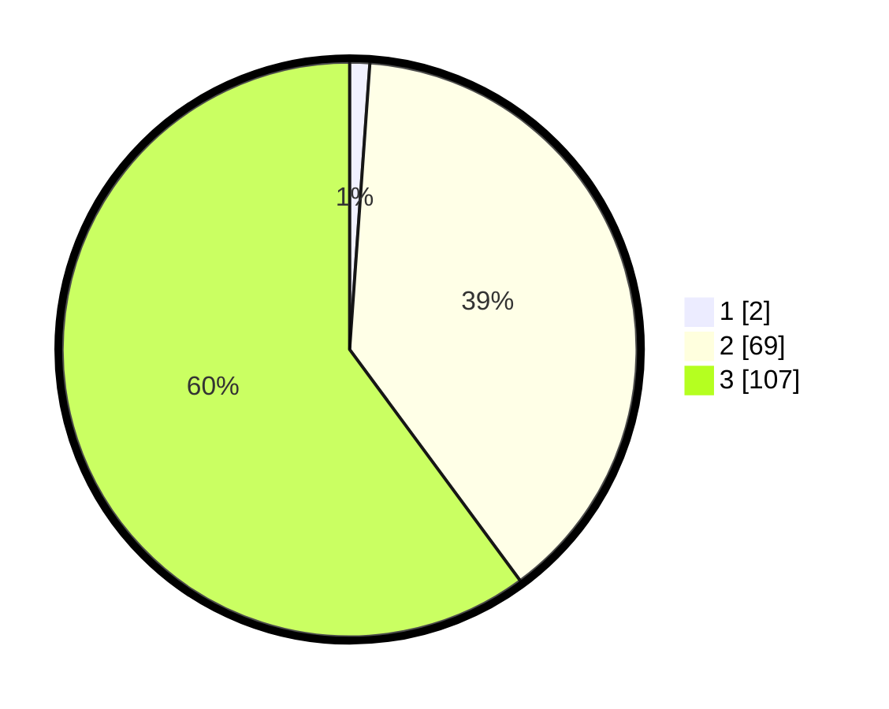

# Hasil

## Grafik

## Tabel

| No. | Nama Paslon    | Suara | Suara (raw) | Persentase |
|:--- |:-------------- | -----:| -----------:| ----------:|
| 1   | ANIES MUHAIMIN | 2     | [2][p-1]    | 1,12       |
| 2   | PRABOWO GIBRAN | 69    | [69][p-2]   | 38,76      |
| 3   | GANJAR MAHFUD  | 107   | [107][p-3]  | 60,11      |

[p-1]: https://github.com/gigit-pemilu/pemilu-2024-51-bali/blob/main/pilpres/hitung-suara/sub/51-bali/sub/08-buleleng/sub/09-tejakula/sub/2006-tejakula/sub/017-tps/sub/paslon-1.txt
[p-2]: https://github.com/gigit-pemilu/pemilu-2024-51-bali/blob/main/pilpres/hitung-suara/sub/51-bali/sub/08-buleleng/sub/09-tejakula/sub/2006-tejakula/sub/017-tps/sub/paslon-2.txt
[p-3]: https://github.com/gigit-pemilu/pemilu-2024-51-bali/blob/main/pilpres/hitung-suara/sub/51-bali/sub/08-buleleng/sub/09-tejakula/sub/2006-tejakula/sub/017-tps/sub/paslon-3.txt

## Foto C Plano

https://sirekap-obj-formc.kpu.go.id/53b3/pemilu/ppwp/51/08/09/20/06/5108092006017-20240214-202543--4a5b9207-dc4b-4f8f-b974-72321ededcb2.jpg

https://sirekap-obj-formc.kpu.go.id/53b3/pemilu/ppwp/51/08/09/20/06/5108092006017-20240214-203244--5a49edad-1824-472c-8617-1400c8e685b6.jpg

https://sirekap-obj-formc.kpu.go.id/53b3/pemilu/ppwp/51/08/09/20/06/5108092006017-20240214-203440--cf34a819-5301-4e97-90bf-5b3444b765ae.jpg

## Metadata

| Key        | Value               |
| ---------- | ------------------- |
| Time Stamp | 2024-02-24 22:31:28 |

