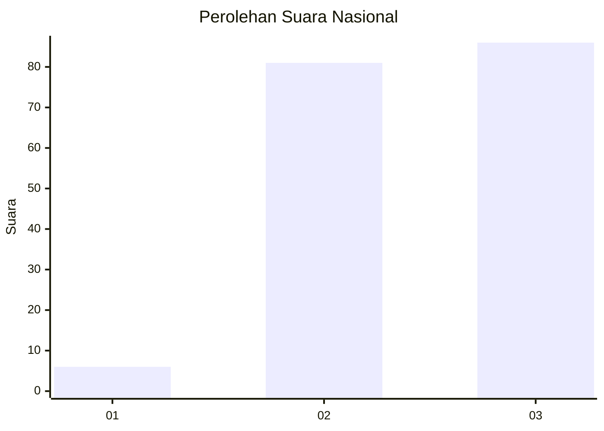
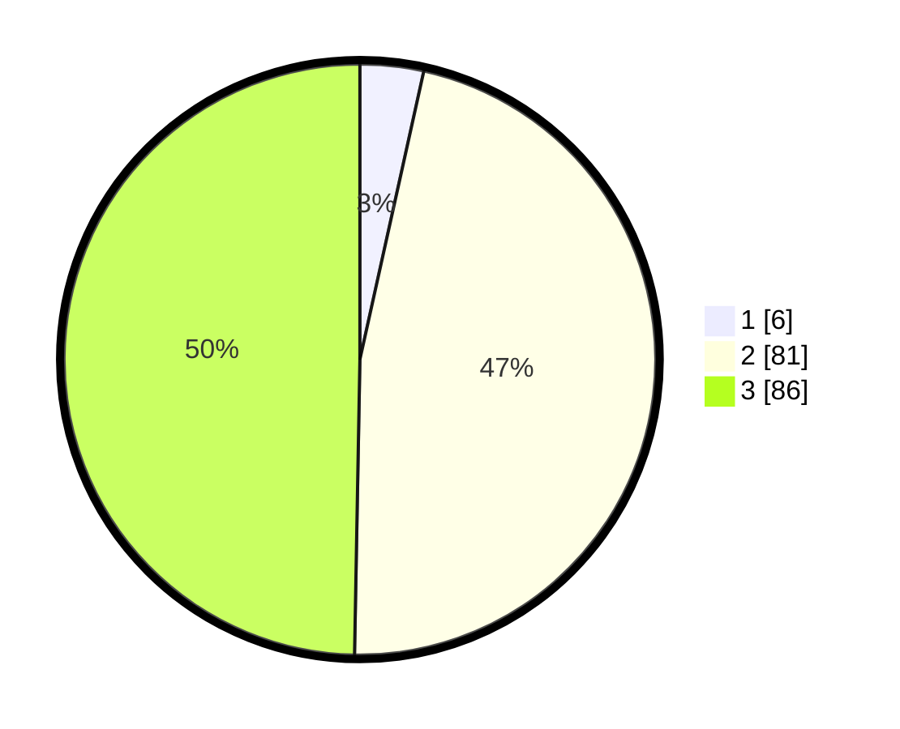

# Hasil

## Grafik

## Tabel

| No. | Nama Paslon    | Suara | Suara (raw) | Persentase |
|:--- |:-------------- | -----:| -----------:| ----------:|
| 1   | ANIES MUHAIMIN | 6     | [6][p-1]    | 3,47       |
| 2   | PRABOWO GIBRAN | 81    | [81][p-2]   | 46,82      |
| 3   | GANJAR MAHFUD  | 86    | [86][p-3]   | 49,71      |

[p-1]: https://github.com/gigit-pemilu/pemilu-2024/blob/main/pilpres/hitung-suara/sub/51-bali/sub/08-buleleng/sub/09-tejakula/sub/2006-tejakula/sub/018-tps/sub/paslon-1.txt
[p-2]: https://github.com/gigit-pemilu/pemilu-2024/blob/main/pilpres/hitung-suara/sub/51-bali/sub/08-buleleng/sub/09-tejakula/sub/2006-tejakula/sub/018-tps/sub/paslon-2.txt
[p-3]: https://github.com/gigit-pemilu/pemilu-2024/blob/main/pilpres/hitung-suara/sub/51-bali/sub/08-buleleng/sub/09-tejakula/sub/2006-tejakula/sub/018-tps/sub/paslon-3.txt

## Foto C Plano

https://sirekap-obj-formc.kpu.go.id/5ce3/pemilu/ppwp/51/08/09/20/06/5108092006018-20240214-223028--7b3a7c4f-8f6a-4b9a-948b-7ba29e398212.jpg

https://sirekap-obj-formc.kpu.go.id/5ce3/pemilu/ppwp/51/08/09/20/06/5108092006018-20240214-223103--af58d715-77e8-4b7a-a6b0-4ffb77bcfe34.jpg

https://sirekap-obj-formc.kpu.go.id/5ce3/pemilu/ppwp/51/08/09/20/06/5108092006018-20240214-231705--3966b36b-b20a-4324-9277-0a42da6f009d.jpg

## Metadata

| Key        | Value               |
| ---------- | ------------------- |
| Time Stamp | 2024-02-24 22:31:28 |

