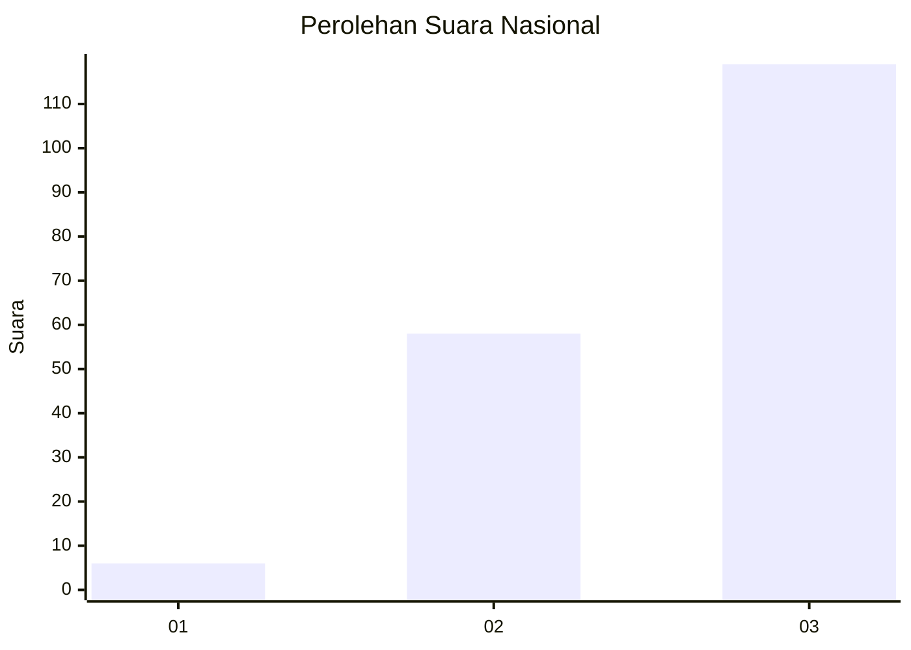
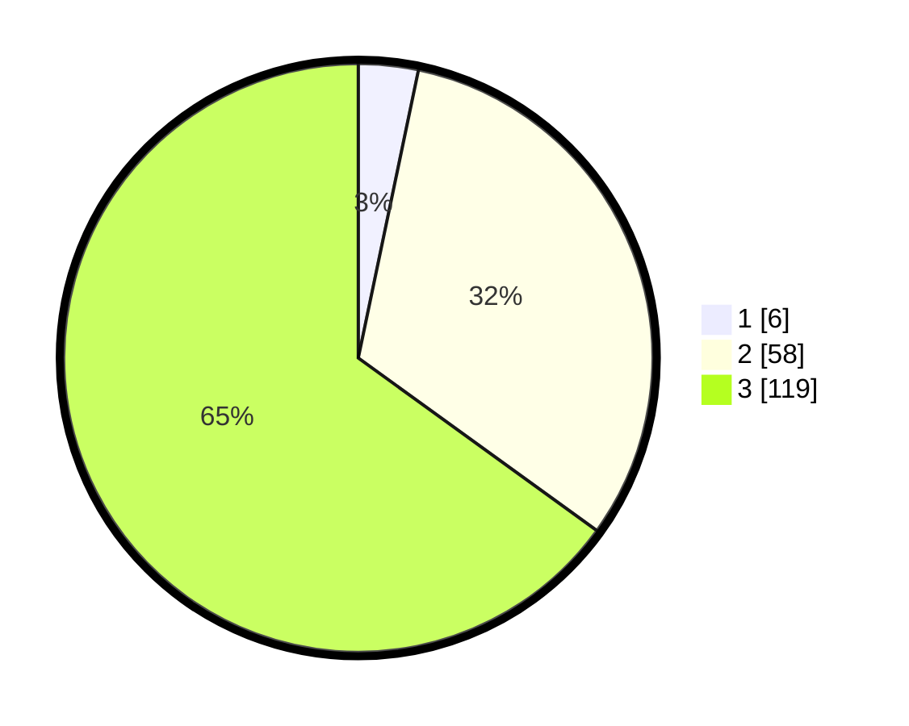

# Hasil

## Grafik

## Tabel

| No. | Nama Paslon    | Suara | Suara (raw) | Persentase |
|:--- |:-------------- | -----:| -----------:| ----------:|
| 1   | ANIES MUHAIMIN | 6     | [6][p-1]    | 3,28       |
| 2   | PRABOWO GIBRAN | 58    | [58][p-2]   | 31,69      |
| 3   | GANJAR MAHFUD  | 119   | [119][p-3]  | 65,03      |

[p-1]: https://github.com/gigit-pemilu/pemilu-2024/blob/main/pilpres/hitung-suara/sub/51-bali/sub/08-buleleng/sub/09-tejakula/sub/2006-tejakula/sub/021-tps/sub/paslon-1.txt
[p-2]: https://github.com/gigit-pemilu/pemilu-2024/blob/main/pilpres/hitung-suara/sub/51-bali/sub/08-buleleng/sub/09-tejakula/sub/2006-tejakula/sub/021-tps/sub/paslon-2.txt
[p-3]: https://github.com/gigit-pemilu/pemilu-2024/blob/main/pilpres/hitung-suara/sub/51-bali/sub/08-buleleng/sub/09-tejakula/sub/2006-tejakula/sub/021-tps/sub/paslon-3.txt

## Foto C Plano

https://sirekap-obj-formc.kpu.go.id/0660/pemilu/ppwp/51/08/09/20/06/5108092006021-20240214-221204--931202ac-f080-4894-b786-3e2e328f27c9.jpg

https://sirekap-obj-formc.kpu.go.id/0660/pemilu/ppwp/51/08/09/20/06/5108092006021-20240214-221430--617c4333-20a5-4dc0-bb2c-cf04d7ae057a.jpg

https://sirekap-obj-formc.kpu.go.id/0660/pemilu/ppwp/51/08/09/20/06/5108092006021-20240214-221528--47944c97-d268-493c-8d14-45bac1cd4126.jpg

## Metadata

| Key        | Value               |
| ---------- | ------------------- |
| Time Stamp | 2024-02-26 10:00:00 |

