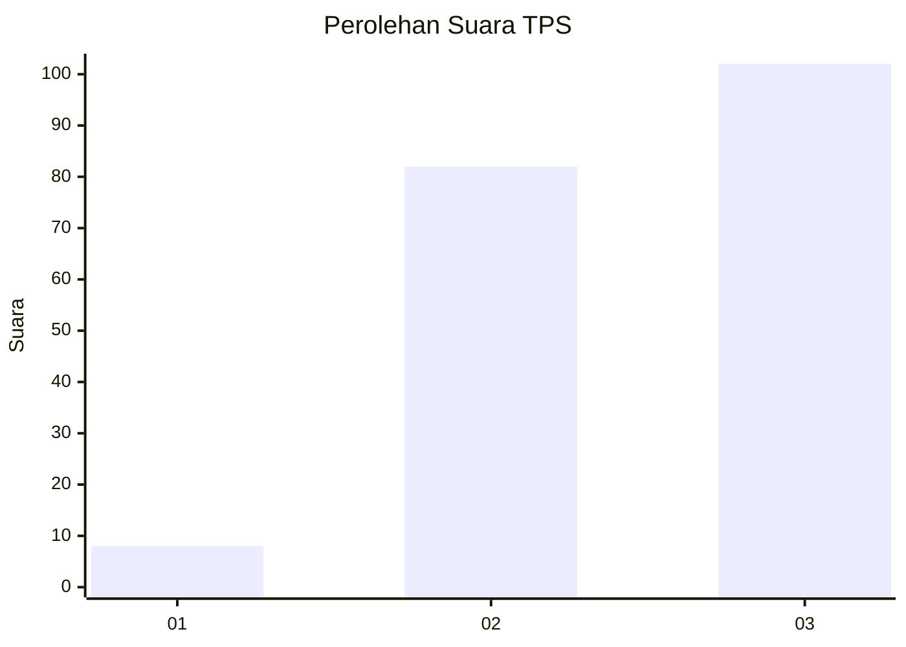
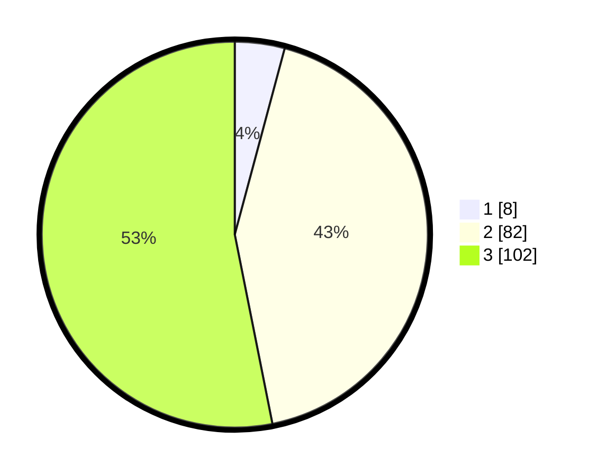

# Hasil

## Grafik

## Tabel

| No. | Nama Paslon    | Suara | Suara (raw) | Persentase |
|:--- |:-------------- | -----:| -----------:| ----------:|
| 1   | ANIES MUHAIMIN | 8     | [8][p-1]    | 4,17       |
| 2   | PRABOWO GIBRAN | 82    | [82][p-2]   | 42,71      |
| 3   | GANJAR MAHFUD  | 102   | [102][p-3]  | 53,13      |

[p-1]: https://github.com/gigit-pemilu/pemilu-2024-51-bali/blob/main/pilpres/hitung-suara/sub/51-bali/sub/08-buleleng/sub/09-tejakula/sub/2006-tejakula/sub/026-tps/sub/paslon-1.txt
[p-2]: https://github.com/gigit-pemilu/pemilu-2024-51-bali/blob/main/pilpres/hitung-suara/sub/51-bali/sub/08-buleleng/sub/09-tejakula/sub/2006-tejakula/sub/026-tps/sub/paslon-2.txt
[p-3]: https://github.com/gigit-pemilu/pemilu-2024-51-bali/blob/main/pilpres/hitung-suara/sub/51-bali/sub/08-buleleng/sub/09-tejakula/sub/2006-tejakula/sub/026-tps/sub/paslon-3.txt

## Foto C Plano

https://sirekap-obj-formc.kpu.go.id/20e9/pemilu/ppwp/51/08/09/20/06/5108092006026-20240214-213122--64396f60-9151-45da-9dfc-96c5dc84e4d5.jpg

https://sirekap-obj-formc.kpu.go.id/20e9/pemilu/ppwp/51/08/09/20/06/5108092006026-20240214-213331--c854129f-17a7-44ed-a490-16d1bf516d4d.jpg

https://sirekap-obj-formc.kpu.go.id/20e9/pemilu/ppwp/51/08/09/20/06/5108092006026-20240214-213528--d5ecb9dd-bec5-4a64-986b-672a978527b9.jpg

## Metadata

| Key        | Value               |
| ---------- | ------------------- |
| Time Stamp | 2024-02-24 22:31:28 |

